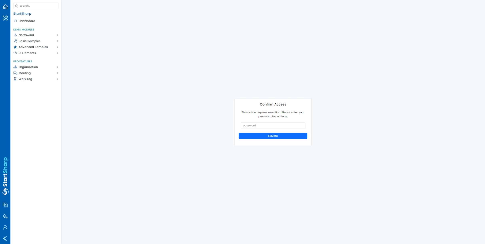
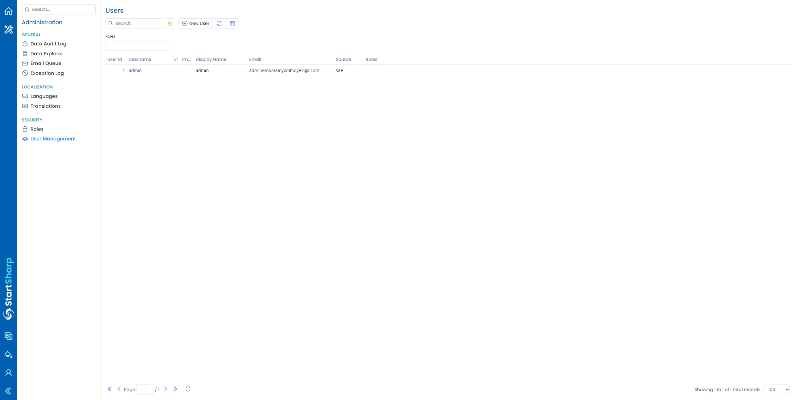

# Account Elevation

An **elevation requirement** adds an extra security check for critical operations — for example, account linking/unlinking, enabling two-factor authentication, or managing users. When a user attempts such an operation, they are asked to confirm their password before it runs, even if they are already signed in.

## How It Works

- Elevation is enforced with the [RequiresElevation](../api/dotnet/Serenity.Extensions/Serenity.Web/RequiresElevationAttribute.md) attribute.
- When a protected action is invoked and there is no valid elevation token, the user is sent to the elevation page to re-enter their password.
- On success, a short-lived token is stored in a cookie, and the user is returned to the original page.
- If the user doesn't have a password set yet, they're redirected to the set-password page instead.

## Using It in StartSharp

StartSharp ships an `AccountElevationPage` that derives from `AccountElevationPageBase`, so the elevation page (`~/Account/Elevate`) is already available. You just opt-in the operations you want to protect. On a StartSharp project, the elevation handler is registered automatically in `Startup.cs` with:

```cs
services.AddElevationHandler();
```

> If you created your project from an **older template**, the elevation feature may not be fully wired up. Check two things:

- `services.AddElevationHandler();` is called in `Startup.ConfigureServices`, otherwise `[RequiresElevation]` will fail because the `IElevationHandler` service isn't registered.
- An `AccountElevationPage` class (deriving from `AccountElevationPageBase`) exists, so the elevation page at `~/Account/Elevate` is available. If it doesn't, add a controller in the `Modules/Membership/Account` folder that derives from `AccountElevationPageBase` — otherwise the redirect sent by `[RequiresElevation]` won't have a page to land on.

### Protecting a Page

Add `[RequiresElevation]` to the page action:

```csharp
public class UserPage : Controller
{
    [Route("Administration/User"), RequiresElevation]
    public ActionResult Index()
    {
        return this.GridPage(ESM.Modules.Administration.User.UserPage,
            UserRow.Fields.PageTitle());
    }
}
```

### Protecting the Endpoint

To prevent direct calls to the service API without a token, add `[RequiresElevation]` to the endpoint class:

```csharp
[RequiresElevation]
public class UserEndpoint : ServiceEndpoint
{
}
```

## What the User Sees

After navigating to a protected page, the user is redirected to a page asking them to confirm their password:



Once confirmed, they can access the protected page:



The elevation token is short-lived, so the user may be asked to confirm again after it expires.

> This feature is implemented in the `Serenity.Pro.Extensions` **AccountElevation** module. The base types ([IElevationHandler](../api/dotnet/Serenity.Extensions/Serenity.Abstractions/IElevationHandler.md), [RequiresElevationAttribute](../api/dotnet/Serenity.Extensions/Serenity.Web/RequiresElevationAttribute.md), [DefaultElevationHandler](../api/dotnet/Serenity.Extensions/Serenity.Extensions/DefaultElevationHandler.md), `AccountElevationPageBase`) are described in [Authorization](../../framework/authorization.md#account-elevation).
