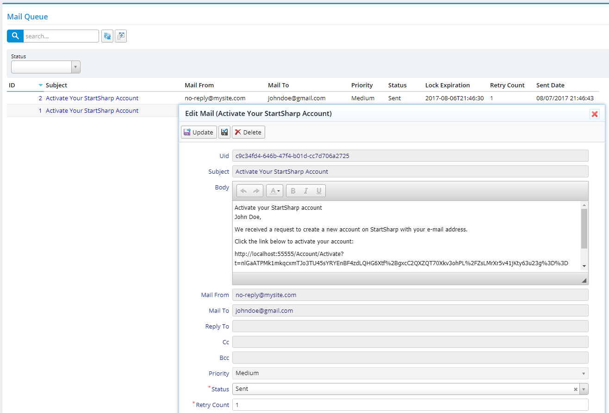

# Batch Mail Queue

Sometimes you might want to sent lots of e-mails, like bulletins. Sending thousands of e-mails might take considerable amount time, and the user, who tries to publish these e-mails, might get timeouts or have to wait a long long time.

Even though you need to send one or two e-mails, if your SMTP server is having problems, your users might get application errors.

Our mail queue lets you to send e-mails in background, retry sending in case of an error and see status of every individual message in a reporting page.

