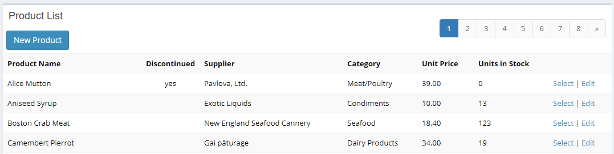
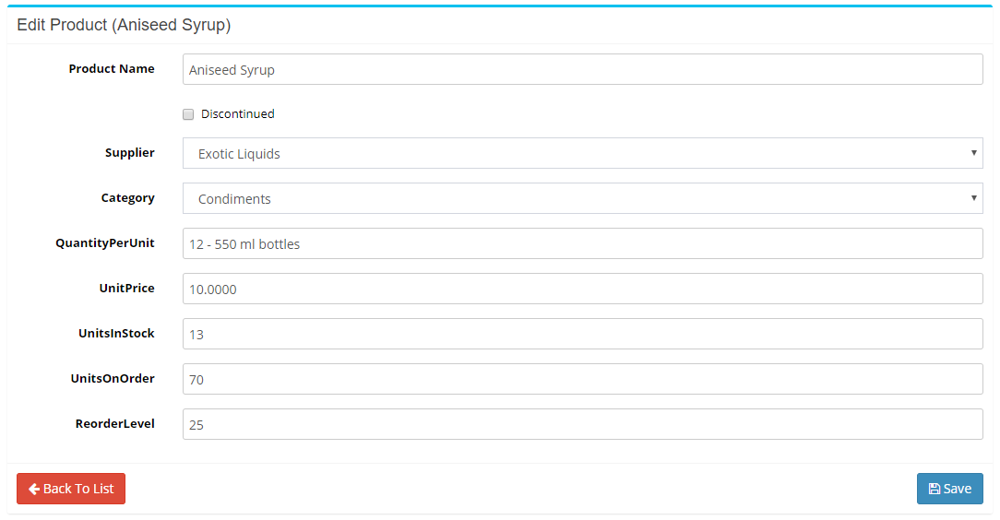

# Bootstrap Table / Form

Sergen generates a standardized listing / editing interface and services for your tables, with minimal code possible.

In some cases, you might want to use good old methods like a pure Bootstrap table / form with basic HTTP POST and no AJAX / web services.

This sample is implemented in a way very similar to Entity Framework tutorial you can find on MSDN, whilst using Bootstrap instead of raw HTML tables / forms and Serenity data layer instead of EF.

