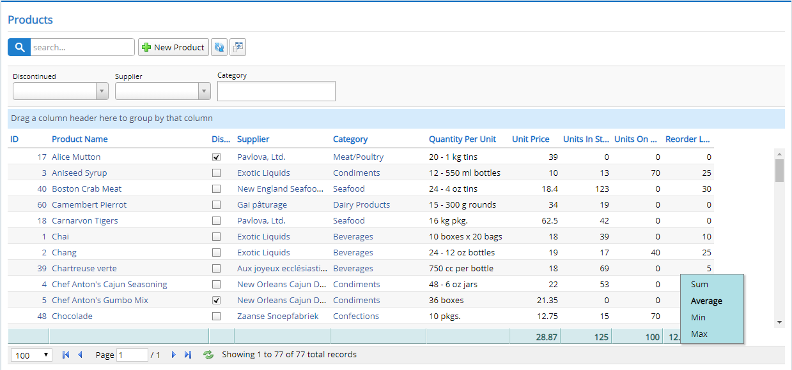

# Customizable Summaries

CustomSummaryMixin lets user to click on a column footer and change summary type to Avg, Min, Max or Sum.

Default summary type is determined by column data type and can be changed by adding a [SummaryType] attribute to the related property in Columns.cs

Summary customization also works along with draggable grouping mixin, so group based aggregates are also available.



To enable this feature add lines below to your grid class:

```ts
protected createToolbarExtensions() {
    super.createToolbarExtensions();

    new Serenity.CustomSummaryMixin({
        grid: this
    });
}
```