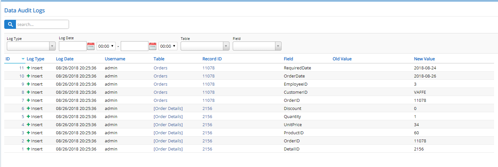

# Data Audit Log

StartSharp provides a zero configuration data logging system that allows auditing changes made to an entity by simply adding a [DataAuditLog] attribute. Make any change to such an entity and you'll see that its details are logged in the data audit log table without writing a single line of code:



Here is how it is enabled for Order and Order Details tables:

```cs
[DataAuditLog]
public sealed class OrderRow : Row, IIdRow, INameRow
{
```

```cs
[DataAuditLog]
public sealed class OrderDetailRow : Row, IIdRow
{
```