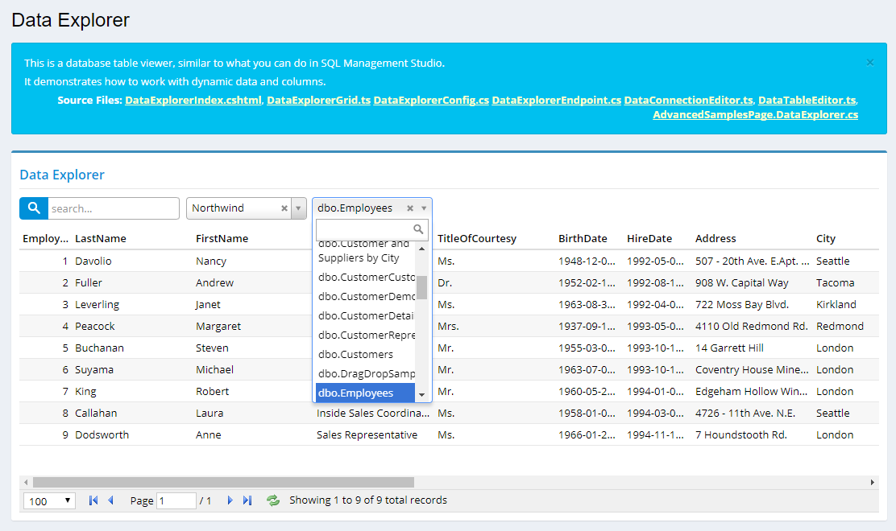

# Dynamic Data Explorer

This is a table explorer, similar to view data in SQL Management Studio.

Its main purpose is to demonstrate how you could manage to work with dynamic data sources and columns in Serenity, 
without having to generate code with Sergen for them.

