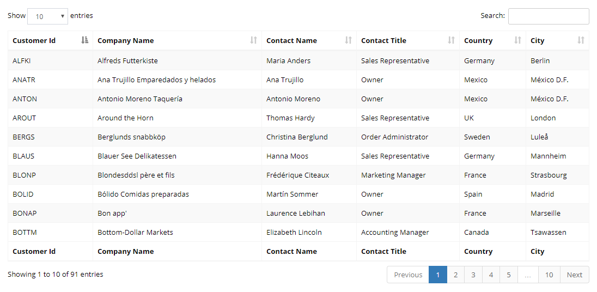

## Data Tables Integration

Serenity uses *SlickGrid* under the hood for your listing pages. It is possible to use another grid / table component for some pages if required.

In this sample we demonstrate how you could integrate popular DataTables plugin, in both client side / server side data source mode, while still making use of Serenity services.

