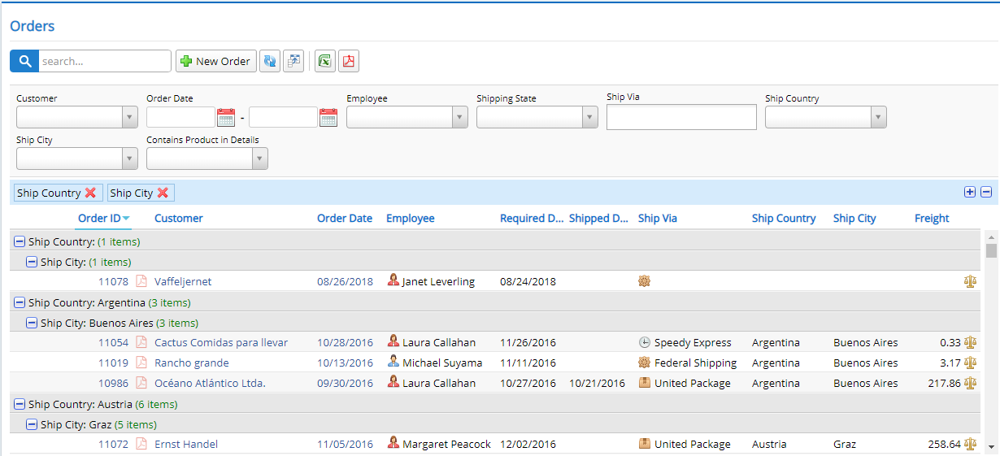

# Drag & Drop Grouping

Draggable grouping mixin allows you to group by any column by dragging its header into the target (blue) area.

You may also set which columns should be grouped initially by adding [GroupOrder] attributes to them in your Columns.cs



Here is how this sample is implemented:

````ts
export class DragDropGroupingGrid extends Northwind.OrderGrid {

    protected createToolbarExtensions() {
        super.createToolbarExtensions();

        this.slickGrid.registerPlugin(new Slick.Data.GroupItemMetadataProvider());
            
        var groupingMixin = new Serenity.DraggableGroupingMixin({
            grid: this
        });

        // setting ShipCountry, ShipCity columns as initially grouped for this sample
        // you could add [GroupOrder(1)] to ShipCountry, and [GroupOrder(2)] to ShipCity
        // in OrderColumns.cs instead (recommended way)
        groupingMixin.plugin.setDroppedGroups(["ShipCountry", "ShipCity"]);
    }

    protected getSlickOptions() {
        var opt = super.getSlickOptions();
        // need to turn grouping panel ON for drag drop grouping to work properly
        opt.groupingPanel = true;
        return opt;
    }

    protected markupReady() {
        super.markupReady();

        // expanding all level 0 (Country) and level 1 (City) groups initially
        this.view.expandAllGroups(0);
        this.view.expandAllGroups(1);
    }
}
```

