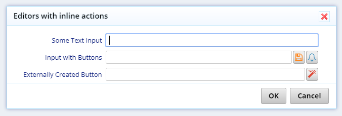

# Editors with Inline Buttons

One of our premium customers asked us how to add inline action buttons next to editors. Instead of helping him in private, we choose to add this sample to *StartSharp*, so that other members can make use of it. 

> Many samples in *StartSharp* are implemented based on customer requests and feedback.

