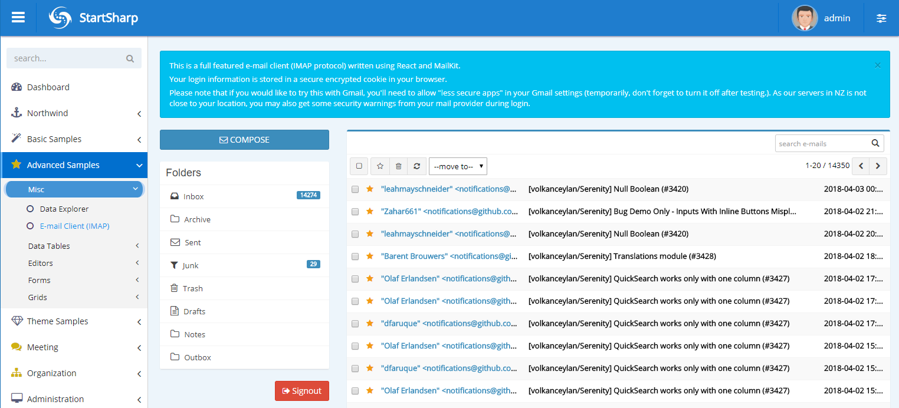
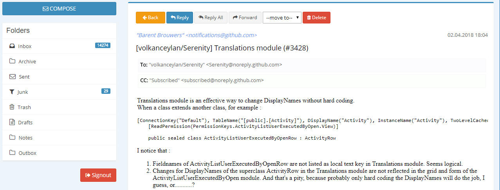

# Email Client (React Based)

StartSharp comes with a full-featured IMAP based e-mail client written with React. 

It can connect to any e-mail account supporting IMAP protocol, like Gmail, Hotmail, Yandex, Yahoo in addition to your local mail server.

We use MailKit for connecting to servers.

Here are some screenshots from the new sample:

