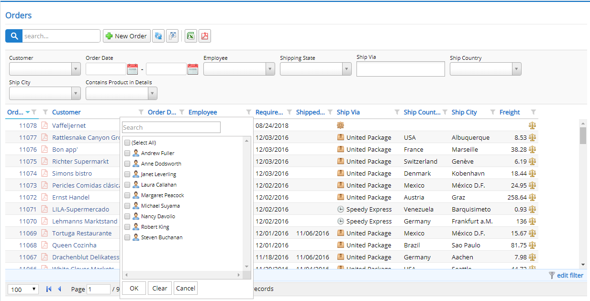

# Excel Style Filtering

HeaderFiltersMixin lets you easily use Excel style column filtering on any of your grids. 

Just click on a filter icon next to column headers and distinct column values are fetched from server side, so it displays all values even when data is paged.

This feature also works on in-memory grids unlike quick filters.



To enable this feature, just add a few lines to your grid constructor:

```ts
constructor(container: JQuery) {
    super(container);

    new Serenity.HeaderFiltersMixin({
        grid: this
    });
}
```