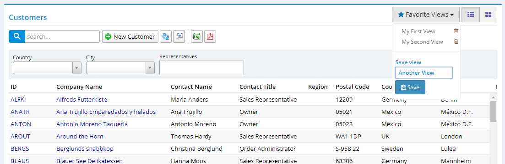

# Favorite Views

Serenity supports persisting grid settings like visible columns, widths, sort orders. It remembers the latest settings and restores them next time you enter that page. 

Sometimes you might want to save a view and restore it at a later time. This is also useful for dynamic reporting / data export purposes.



This is also implemeted as a grid mixin so it can be easily applied to any grid. As a bonus, it is also compatible with card view feature, so it remembers if grid is in card/list view mode and restores that state.

You just need to add a few lines to your Grid.ts file to enable this feature:

```ts
protected createToolbarExtensions() {
    super.createToolbarExtensions();

    new Serenity.FavoriteViewsMixin({
        grid: this
    });
}
```