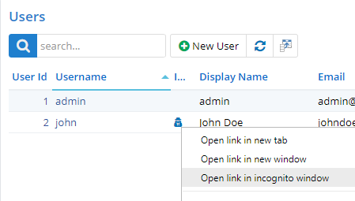
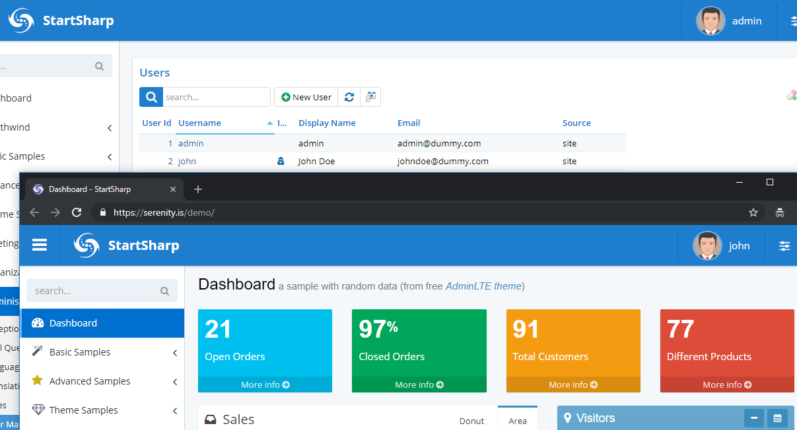

# Login (Impersonate) As User

Usually during development, and sometimes in production, it is useful to quickly login as another user.

StartSharp allows you to impersonate as another user by right clicking a symbol in Users page, and choosing *Open link in incognito window*.

We preferred to open these links in an incognito window, so that the *admin* wouldn't lose his session. Otherwise, after testing, you would have to signout and login with admin again. Anyway, you may remove this check if you prefer to open in same window.

This is implemented in a very secure way so that these impersonation links and their relevant tokens expire within a short interval and can't be reused by somebody that has the URL. The system also validates that tokens are used by same IP / browser who actually opened the Users page.