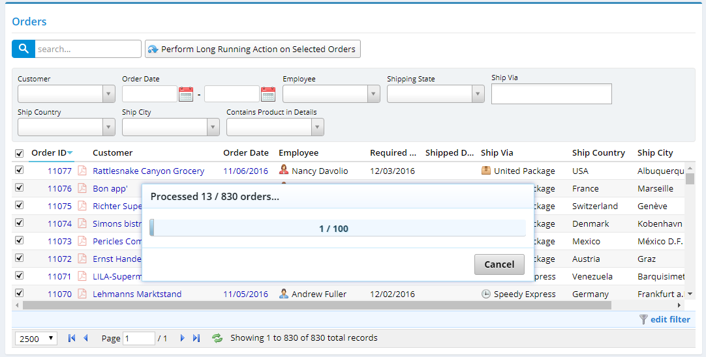

# Long Running Action with Progress

Even though *Cancellable Bulk Action* sample in Serene is fine for work that you can split into chunks, sometimes you may want to handle a long running operation in one transaction / request.

This sample demonstrates how we could execute a task at server side, possibly in a background thread, return immediately from service action, while still reporting status / progress and allowing user to cancel it if possible.

