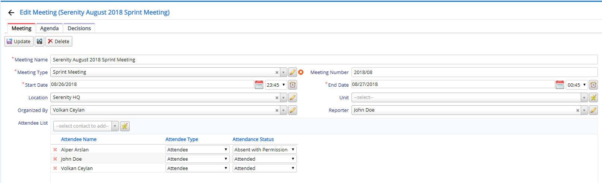

# Meeting Module

StartSharp comes with a full featured meeting management system module, which you can use as is, or take as a sample to develop your own customized version.

Meetings can have agendas/topics (issues to discuss in meeting), and decisions (notes taken during the meeting) that are optionally linked to relevant agendas.

It is possible to inline add / edit attendees and their attendance status inline in the grid at bottom.