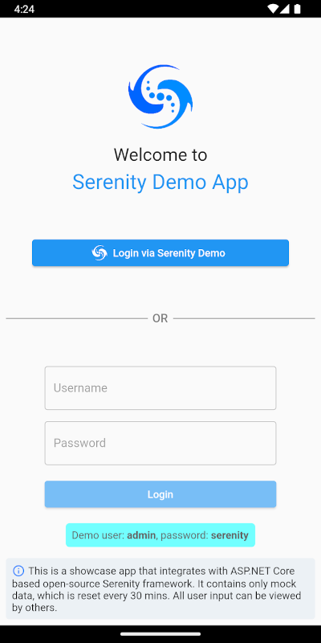
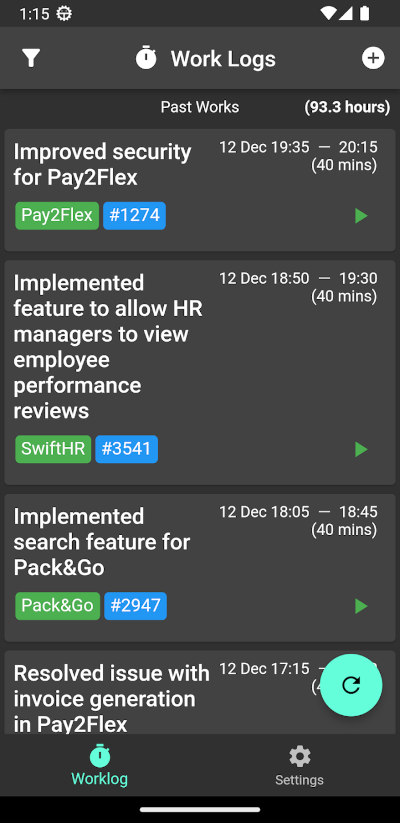

# Flutter Application - Enterprise

We are providing an example Flutter application that is integrating with Serenity Framework.

We are using our [Serenity.Pro.OpenIddict package](./openid-integration.md) to access our services.

We are showing example about how to call API's to get services, lookups and
integrate authorization code flow which is an interactive flow that you can try at [this](./openid-integration.md) page.

[Android](https://play.google.com/store/apps/details?id=com.serenity.demoapp), [IOS](https://apps.apple.com/app/serenity-demo/id1661650380)

