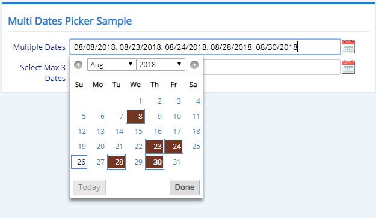

# Multi Dates Picker Widget

This is a sample of how you could integrate third party controls and create your own Serenity widgets when needed. It allows you to select multiple dates by making use of the functionality provided by an external javascript module.

