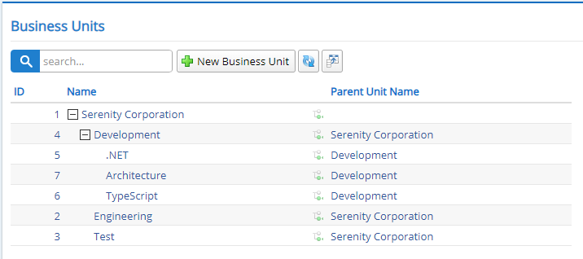

# Organization and Contacts Module

All businesses has some kind of hierarchical organization structure. Also most applications requires internal (e.g. users) and external contacts that might not be an actual user of the application.

StartSharp comes with a basic organizaton tree and contacts system that you can build and customize your application on.

It also contains useful code that show how to validate and avoid cyclic links (e.g. infinite loops) in a tree structure, in addition to sampling Select2 editor with hierarchical view for parent unit selection.