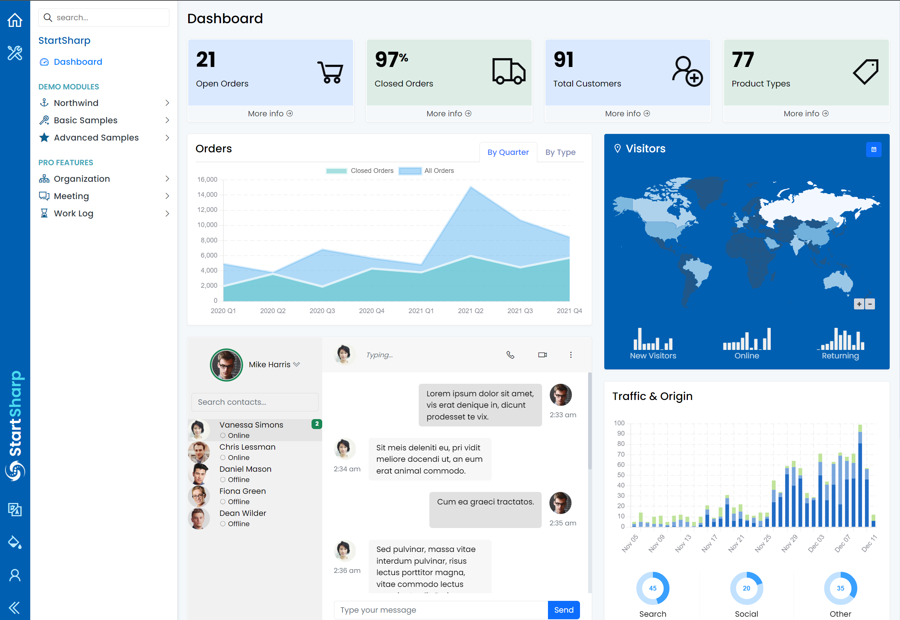
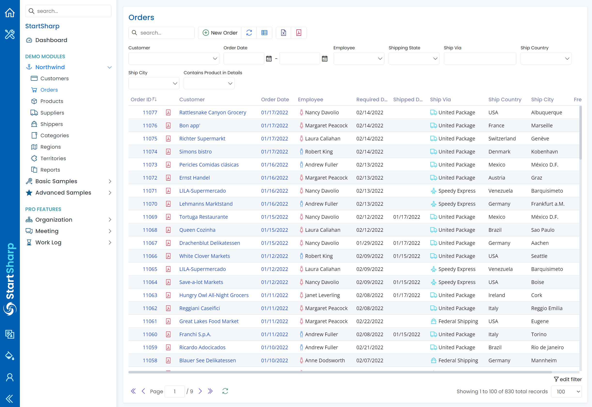
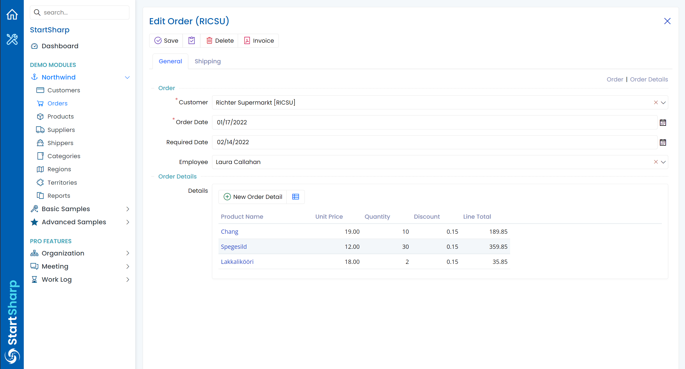
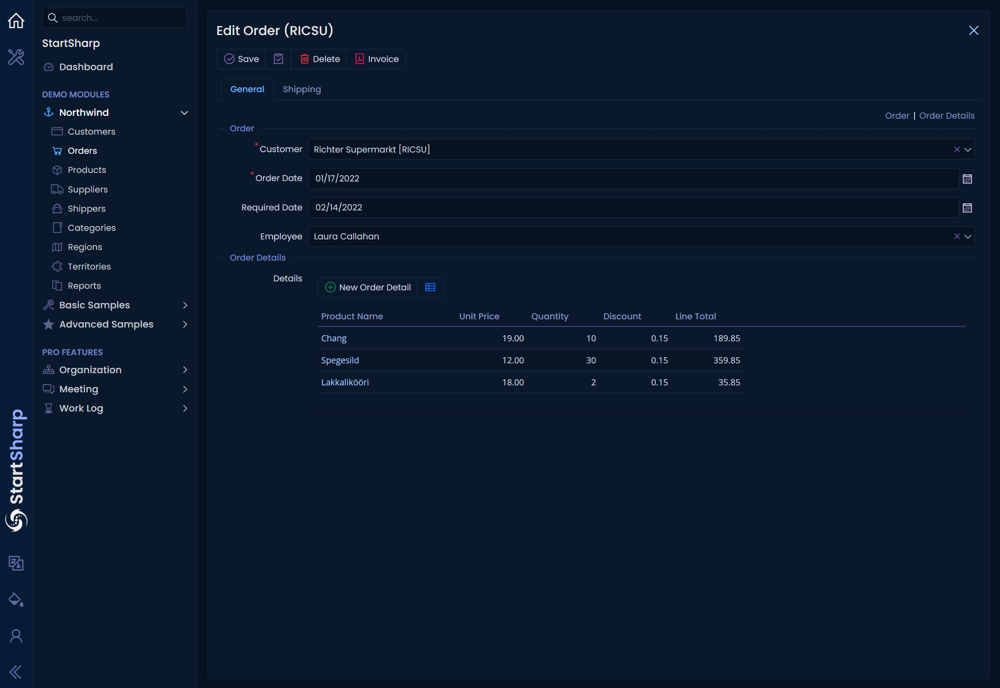
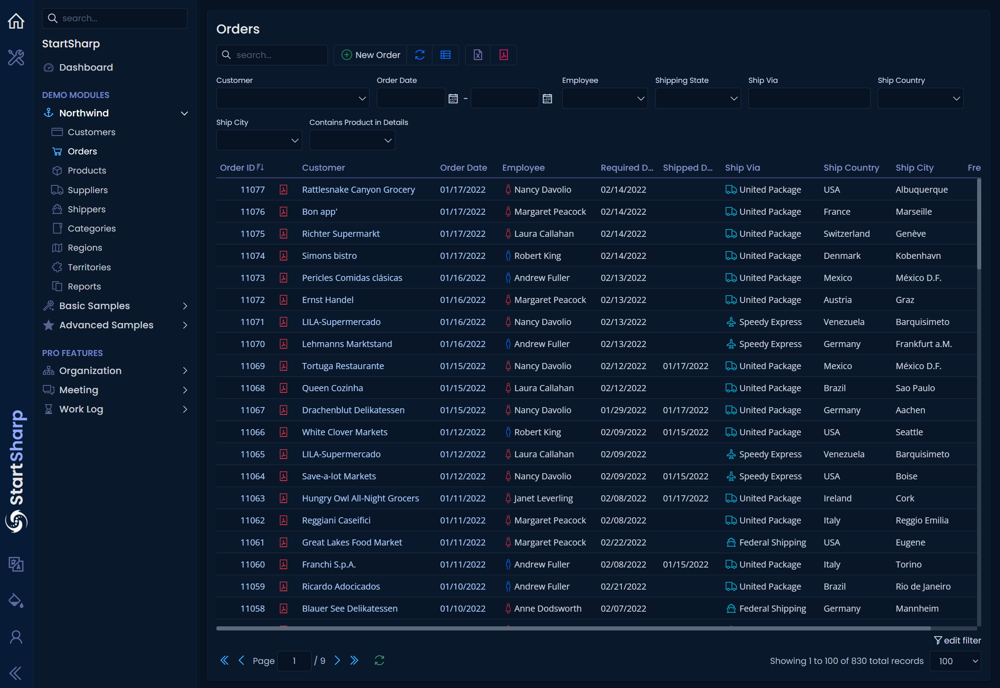
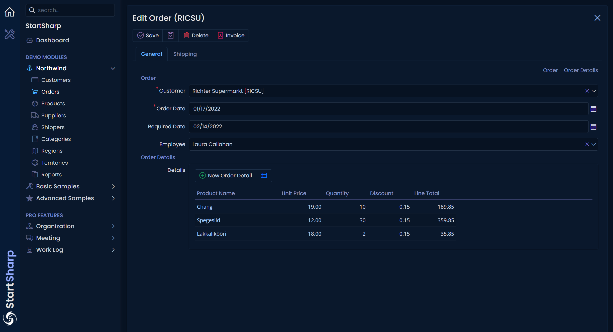
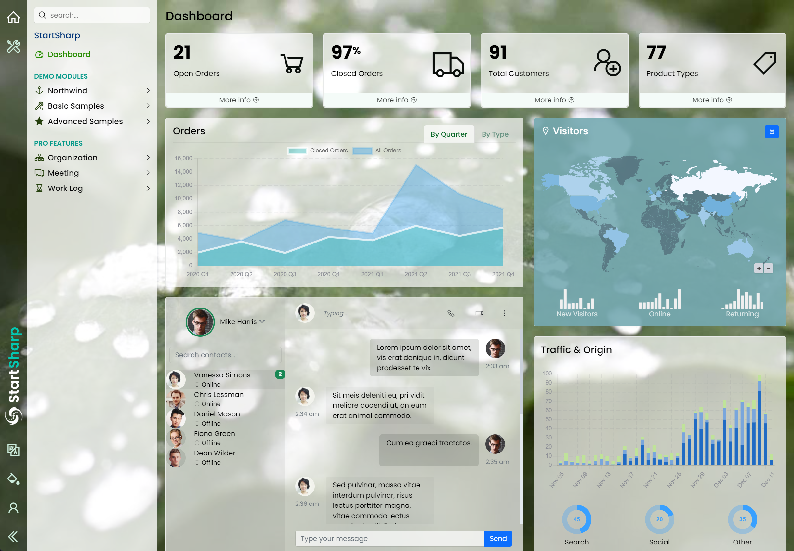
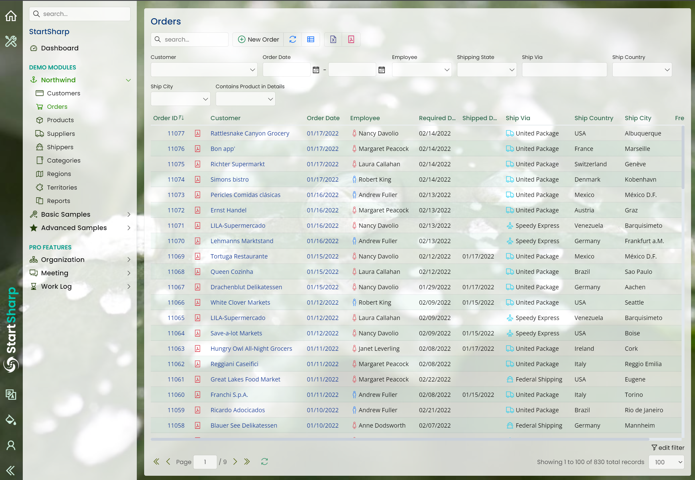
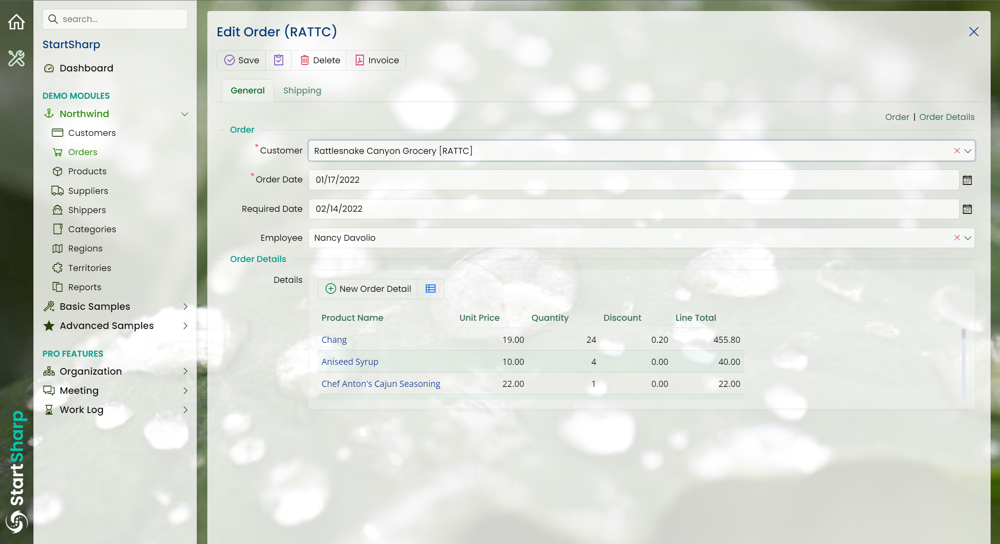
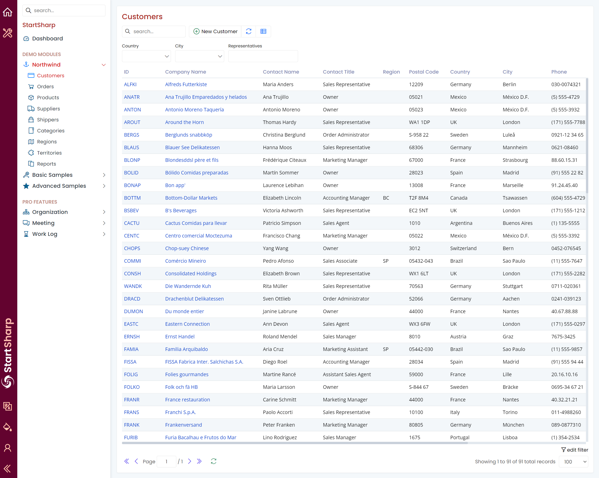

# Premium Themes

StartSharp contains 3 premium themes:

* Azure (Light)
* Cosmos (Dark)
* Glassy (Light)

You might have a look at our premium themes in our demo at https://demo.serenity.is

Here are some screenshots

## Azure Light (default theme for StartSharp)







## Cosmos Dark







## Glassy Light (translucent theme)





## Creating A New Theme

All themes are based on Bootstrap, and creating a new custom theme or modifying an existing one is possible by just defining or overriding a few CSS variables:

```cs
:root.theme-mycustomred { 
    --s-card-title: #aa2519;
    --s-category-title: #c18e85;
    --s-sidebar-band-bg: #63032f;
    --s-sidebar-band-link: #ffc3b0;
    --s-sidebar-link-active: #d30a0a;
    //...other variables copied from azure light theme
}
```

