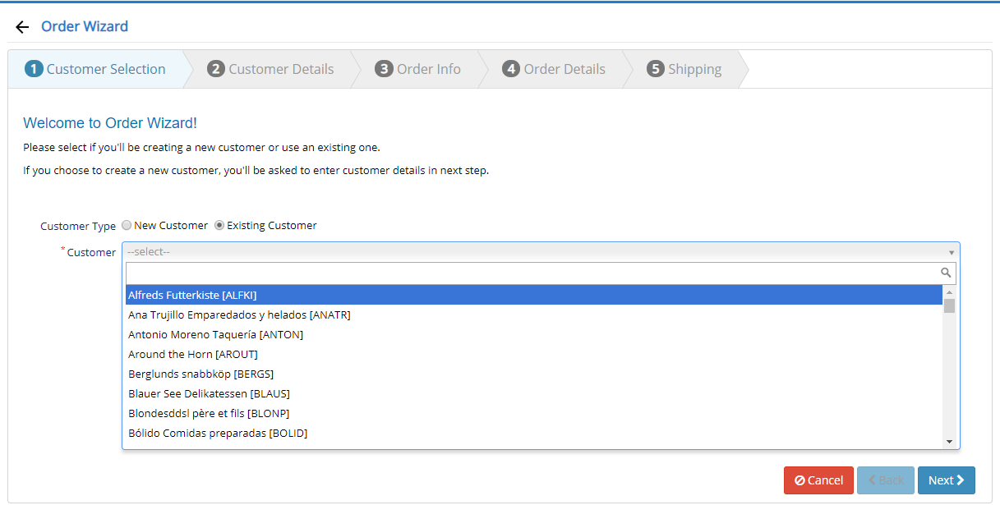

# Step by Step Wizard

This is a wizard component that lets you easily create a step by step interfaces, for example to create an order.

Wizard allows you to choose an existing customer or create a new one on the fly.

This sample is based on our WizardDialog premium widget, which simply uses Tab attributes defined on a Form class, to auto create steps.



It is pretty easy to apply validation between steps, skip some steps based on user selection, or add dynamic intermediate steps when required.

## Defining Steps

Wizard content is based on ordinary Serenity form definitions and tabs are used as steps, so creating new wizards are simple and intuitive.

Here is an excerpt from the source code for the Order wizard:

```cs
[FormScript("AdvancedSamples.OrderWizard")]
[BasedOnRow(typeof(OrderRow))]
public class OrderWizardForm
{
    [Tab("Customer Selection")]

    [StaticTextBlock(HideLabel = true, IsHtml = true, 
		Text = "<h4 class='text-blue'>Welcome to Order Wizard!</h4>" + 
        "<p>Please select..."]
    public string WelcomeMessage { get; set; }

    [DisplayName("Customer Type"), DefaultValue(OrderWizardCustomerType.New)]
    [RadioButtonEditor(typeof(OrderWizardCustomerType))]
    public OrderWizardCustomerType CustomerType { get; set; }
    [DisplayName("Customer"), ReadOnly(true), CustomerEditor]
    public String ExistingCustomerID { get; set; }

    [Tab("Customer Details")]
    [Category("Basic Info")]
    [DisplayName("Customer ID"), StringEditor, MaxLength(5), Required, OneThirdWidth]
    public String CustomerID { get; set; }
    [DisplayName("Company Name"), MaxLength(40), Required, TwoThirdWidth]
    public String CompanyName { get; set; }
```

## Controlling / Validating Steps

Here is the TypeScript source from the part that controls moving between steps:

```ts
/**
* next method is called when user tries to go forward
* @param toStep the step user is trying to move to, usually one step ahead
*/
protected next(toStep: number) {
    if (toStep == OrderWizardSteps.CustomerDetails) {
        // if user is trying to move forward to custom details step and 
        // we are using an existing customer, skip the customer details step
        if (!this.isNewCustomer)
            toStep = OrderWizardSteps.OrderInfo;
    }
    else if (this.step == OrderWizardSteps.OrderDetails) {
        // validate that details list not empty before moving 
        // away from details step
        if (!this.form.DetailList.value.length) {
            Q.notifyWarning("Please enter at least one detail!");
            return;
        }
    }
    else if (toStep == OrderWizardSteps.OrderDetails) {
        // when moving into details step, if details are empty, 
        // auto open add detail dialog
        if (!this.form.DetailList.value.length) {
            this.step = toStep;
            this.form.DetailList.element.find('.add-button').click();
            return;
        }
    }

    // you should call setStep after validating / modifying target step (toStep)
    this.step = toStep;
}
```