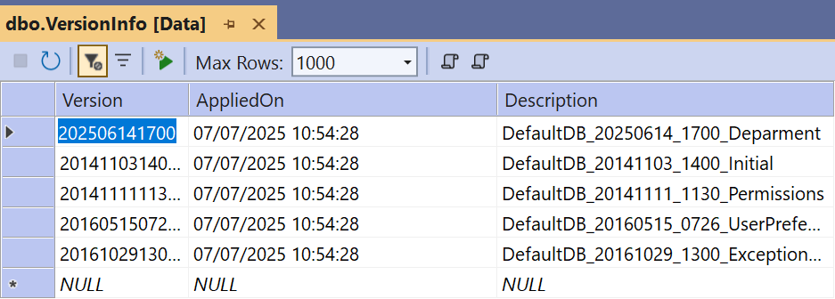
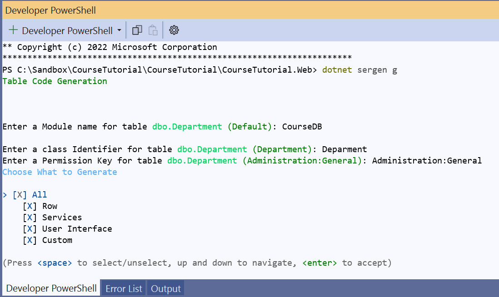
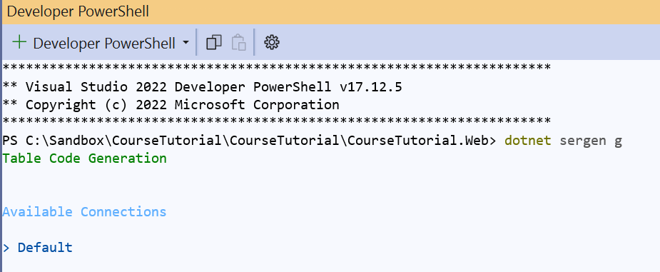
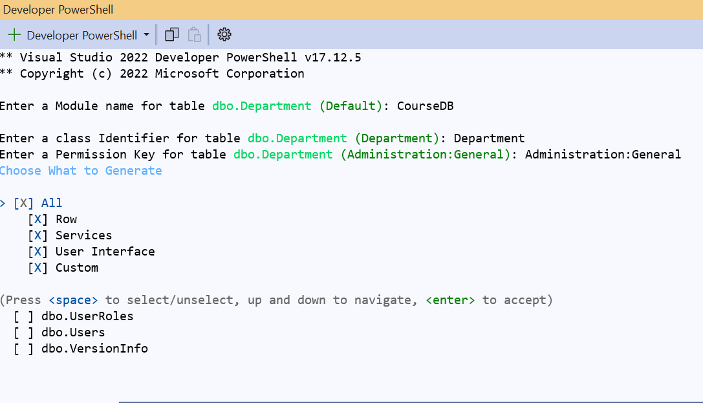
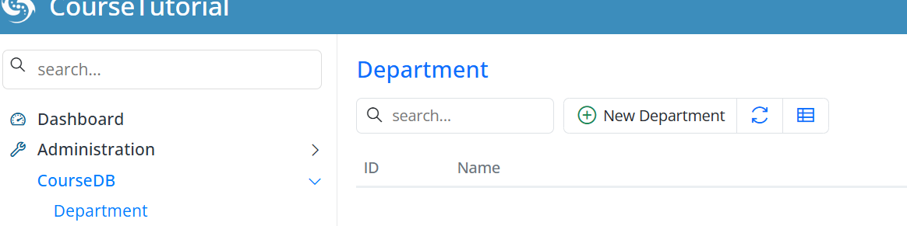

# The Department Table

## Create the Department Table with a Migration

Our system starts with the tables that everything else hangs off of, so let's begin with `Department` — every course, student, and teacher will belong to one.

We'll create it with a migration. The name carries a timestamp (`20250614_1700`), which keeps migrations in a clear order and avoids clashes when several people work on the same project.

The `Department` table only needs two columns for now:

- An auto-incrementing `Id` column as the primary key
- A `Name` column to store the department name, marked as unique

We're using `AutoReversingMigration`, which means FluentMigrator can roll the table back automatically if we ever need to undo it during development.

```csharp
using FluentMigrator;
namespace CourseTutorial.Migrations.DefaultDB;

[DefaultDB, MigrationKey(20250614_1700)]
public class DefaultDB_20250614_1700_Department : AutoReversingMigration
{
    public override void Up()
    {
        Create.Table("Department")
            .WithColumn("Id").AsInt32().IdentityKey(this)
            .WithColumn("Name").AsString(100).NotNullable().Unique();
    }
}
```

> **Note:** `IdentityKey(this)` is a Serenity/FluentMigrator helper that marks the column as both an auto-incrementing **identity** and the **primary key** in a single call. Every `Id` column in this tutorial uses it so the primary-key setup stays consistent.

## Verify the Migration Worked

Serenity runs pending migrations automatically when the application starts, so the table should already exist. Let's confirm.

In **SQL Server Management Studio (SSMS)** or **Visual Studio**:

- Connect to the database used by the Serenity application
- Expand the **Tables** node under the target database
- Locate the `[dbo].[Department]` table

> **Tip:** If you don't have SSMS or Visual Studio handy, you can verify from the command line. The default Serene/StartSharp template uses a SQL Server LocalDB database named `<YourProjectName>_Default_v1`:
>
> ```
> sqlcmd -S "(localdb)\MsSqlLocalDB" -d <YourProjectName>_Default_v1 -Q "SELECT * FROM dbo.Department; SELECT Version FROM dbo.VersionInfo ORDER BY Version;"
> ```
>
> Replace `<YourProjectName>` with your project's name, e.g. `CourseTutorial_Default_v1`.

Every applied migration is recorded in the `[dbo].[VersionInfo]` table, so Serenity knows what has already run and never applies the same migration twice.



## Generate the Code with Sergen

The table exists, but the application doesn't know about it yet. That's where **Sergen**, Serenity's code generator, comes in — it creates the row, page, grid, dialog, and service code for us.

Run it from the terminal:

```
> dotnet sergen g
```



When prompted, select the `Default` database connection.



Sergen then lists the available tables. Select `dbo.Department` with the Space key and press Enter to continue.

When asked for a module name, enter `CourseDB`.



Leave the default `All` option selected — it generates the complete set of files (row, service, page, grid, dialog), so you get a working edit screen with no extra effort.

Once generation finishes, start the application and you'll see **Department** under the new **CourseDB** menu in the sidebar.



## Add Some Sample Departments

The table and its screen are ready, so let's put a few rows in — the rest of the tutorial will refer back to them.

Open **CourseDB → Department** and add:

- Computer Science
- Mathematics
- Physics

These are the departments you'll pick from when you create courses, students, and teachers later on, so realistic names will make testing much nicer.

## What's Next

Now that `Department` is in place, we'll create migrations for the rest of the core entities:

- Terms
- Courses
- Student and StudentCourses
- Other related tables

A few simple rules keep things tidy as we go:

- Consistent naming conventions
- Migrations in chronological order
- Proper foreign key definitions so the data stays consistent
