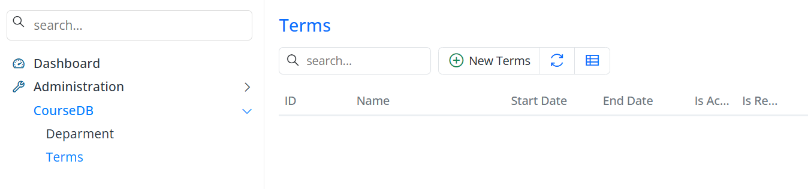

# Academic Terms

## Create the Terms Table with a Migration

Next up is the `Terms` table, which stores academic terms like *Spring 2027* and *Fall 2026*.

Like before, we'll create it with a timestamped migration. The `Terms` table has these columns:

- An auto-incrementing primary key  
- A required and unique `Name` column  
- `StartDate` and `EndDate` columns defining the academic period  
- An `IsActive` boolean (default `false`) — is this the current term?  
- An `IsRegistrationOpen` boolean (default `false`) — can students register for courses?  

We're using `AutoReversingMigration` again so the migration can be rolled back cleanly while we develop.

```csharp
using FluentMigrator;
namespace CourseTutorial.Migrations.DefaultDB;

[DefaultDB, MigrationKey(20250614_1706)]
public class DefaultDB_20250614_1706_Terms : AutoReversingMigration
{
    public override void Up()
    {
        Create.Table("Terms")
            .WithColumn("Id").AsInt32().IdentityKey(this)
            .WithColumn("Name").AsString(50).NotNullable().Unique()
            .WithColumn("StartDate").AsDateTime().NotNullable()
            .WithColumn("EndDate").AsDateTime().NotNullable()
            .WithColumn("IsActive").AsBoolean().NotNullable().WithDefaultValue(false)
            .WithColumn("IsRegistrationOpen").AsBoolean().NotNullable().WithDefaultValue(false);
    }
}
```

## Generate the Code with Sergen

Now let's generate the application code for `Terms`, just like we did for `Department`:

 - Select the `dbo.Terms` table  
 - Enter `CourseDB` as the module name  
 - Keep the default `All` option selected  

Once it's done, start the application and **Terms** will appear under the **CourseDB** menu.



## Add Some Sample Terms

Let's add a couple of terms — enrollments and grades later in the tutorial will reference them.

Open the CourseDB → Terms screen and create:

| Term        | Start Date | End Date   | Is Active | Is Registration Open |
| ----------- | ---------- | ---------- | --------- | -------------------- |
| Fall 2026   | 2026-09-01 | 2026-12-31 | True      | True                 |
| Spring 2027 | 2027-02-01 | 2027-06-15 | False     | False                |

These are the terms you'll pick from when you register students for courses.

> **Note:** Dates in this tutorial are written in ISO format (`YYYY-MM-DD`) so they're unambiguous regardless of the reader's culture. When you enter dates, Serenity's date editor uses your browser/application culture's format (e.g., `MM/DD/YYYY` for English/US), so you may need to type them in that culture's format.
