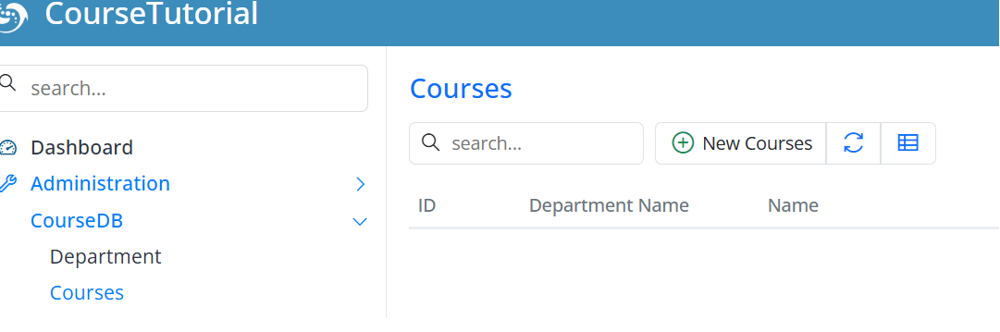

# Courses

## Create the Courses Table with a Migration

Next, the `Courses` table. Every course belongs to a department, has a name and a unique code, and carries a number of credits:

- Auto-incrementing primary key `Id`  
- `DepartmentId` — a foreign key to the `Department` table  
- Required `Name` column (max 100 characters)  
- Required and unique `Code` column (max 20 characters)  
- Required `Credit` column  

The foreign key is what keeps each course tied to its department.
```csharp
using FluentMigrator;
namespace CourseTutorial.Migrations.DefaultDB;

[DefaultDB, MigrationKey(20250615_1220)]
public class DefaultDB_20250615_1220_Courses : AutoReversingMigration
{
    public override void Up()
    {
        Create.Table("Courses")
            .WithColumn("Id").AsInt32().IdentityKey(this)
            .WithColumn("DepartmentId").AsInt32().NotNullable()
                .ForeignKey("FK_Courses_DepartmentId", "Department", "Id")
            .WithColumn("Name").AsString(100).NotNullable()
            .WithColumn("Code").AsString(20).NotNullable().Unique()
            .WithColumn("Credit").AsInt32().NotNullable();
    }
}
```

## Verify the Migration Worked

Let's make sure the migration did what we expect:

- Locate the `Courses` table in SQL Server Management Studio (SSMS) or Visual Studio  
- Check the migration history in the `[dbo].[VersionInfo]` table  
- Confirm the foreign key between `Courses.DepartmentId` and `Department.Id` exists  

> **Tip:** You can also verify these from the command line, as shown in the Department migration section:
>
> ```
> sqlcmd -S "(localdb)\MsSqlLocalDB" -d <YourProjectName>_Default_v1 -Q "EXEC sp_help 'dbo.Courses'; SELECT Version FROM dbo.VersionInfo ORDER BY Version;"
> ```

If all three check out, the schema matches the design.

## Generate the Code with Sergen

Time to generate the `Courses` code:

 - Select the `dbo.Courses` table  
 - Specify `CourseDB` as the module name  
 - Retain the default `All` option  

After generation, start the app and you'll see **Courses** in the navigation, ready for full CRUD.



## Add Some Sample Courses

Add a few courses now — you'll use them when creating enrollments in the next section.

Open the CourseDB → Courses screen and create:

| Department       | Course                      | Code    | Credit |
| ---------------- | --------------------------- | ------- | ------ |
| Computer Science | Introduction to Programming | CS101   | 4      |
| Computer Science | Data Structures             | CS201   | 4      |
| Mathematics      | Calculus I                  | MATH101 | 3      |
| Physics          | Physics I                   | PHYS101 | 3      |

Keep these course codes handy — we'll reference them when we build the student–course relationships.

Next, we'll create the `Students` and `StudentCourses` tables to model that relationship.
