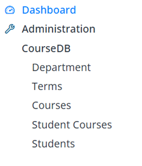

# Students and Enrollments

## Create the Students and StudentCourses Tables

Students and their course enrollments go hand in hand, so we'll create both tables in one migration — `Students` for the personal info, `StudentCourses` to link a student to a course (and optionally a term). Putting them together means the relationships exist from the very start.
```csharp
using FluentMigrator;

namespace CourseTutorial.Migrations.DefaultDB
{
    [DefaultDB, MigrationKey(20250616_1000)]
    public class DefaultDB_20250616_1000_StudentsAndStudentCourses : AutoReversingMigration
    {
        public override void Up()
        {
            Create.Table("Students")
                .WithColumn("Id").AsInt32().IdentityKey(this)
                .WithColumn("FirstName").AsString(100).NotNullable()
                .WithColumn("LastName").AsString(100).NotNullable()
                .WithColumn("FullName").AsString(201).NotNullable()
                .WithColumn("BirthDate").AsDateTime().Nullable()
                .WithColumn("DepartmentId").AsInt32().NotNullable()
                    .ForeignKey("FK_Students_DepartmentId", "Department", "Id");

            Create.Table("StudentCourses")
                .WithColumn("Id").AsInt32().IdentityKey(this)
                .WithColumn("StudentId").AsInt32().NotNullable()
                    .ForeignKey("FK_StudentCourses_StudentId", "Students", "Id")
                .WithColumn("CourseId").AsInt32().NotNullable()
                    .ForeignKey("FK_StudentCourses_CourseId", "Courses", "Id")
                .WithColumn("TermId").AsInt32().Nullable()
                    .ForeignKey("FK_StudentCourses_TermId", "Terms", "Id");

            Create.UniqueConstraint("UQ_Student_Course_Term")
                .OnTable("StudentCourses")
                .Columns("StudentId", "CourseId", "TermId");
        }
    }
}
```

Once the migration is applied, build the project and run Sergen for both the `Students` and `StudentCourses` tables.

Start the application and you'll have working CRUD screens for both.



## Add Some Sample Students

Let's add a few students so the master–detail screen has something to show.

Open the CourseDB → Students screen and create:

| Full Name     | Birth Date | Department       |
| ------------- | ---------- | ---------------- |
| John Smith    | 2004-03-15 | Computer Science |
| Emily Johnson | 2003-07-22 | Mathematics      |
| Michael Brown | 2004-11-05 | Physics          |
| Sarah Davis   | 2003-05-18 | Computer Science |

> **Note:** Enter the birth dates using the same date format described for the Terms records.

The `StudentCourses` table is already in place from the migration, but we won't use it as a standalone screen. Instead, we'll manage enrollments inside the Student dialog using a master–detail structure:

- Students are the master records
- StudentCourses are the detail records
- Course assignments happen inside the Student dialog
