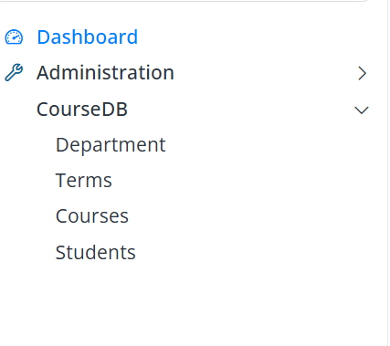
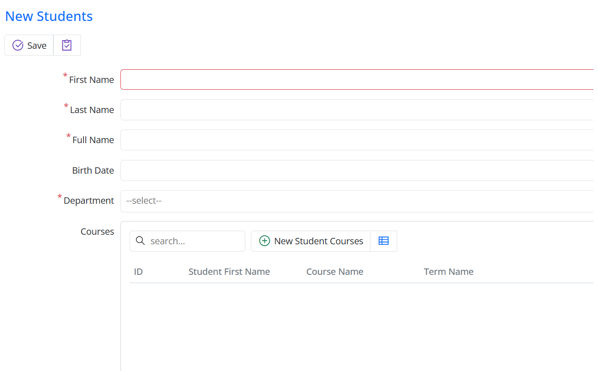
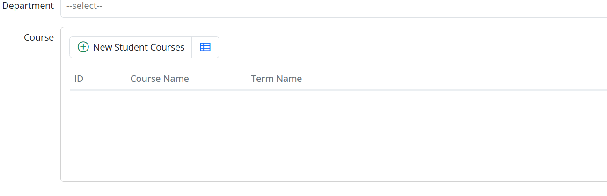
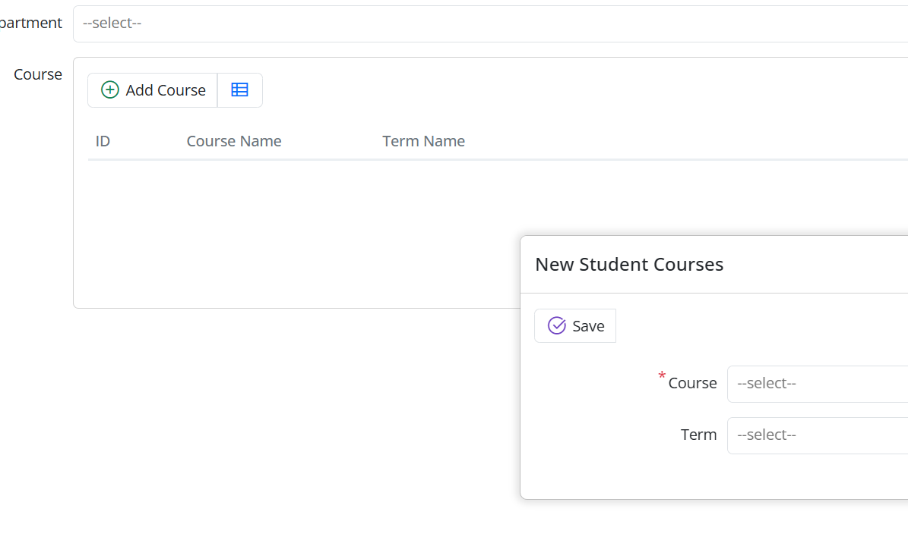

# Managing Enrollments with a Master–Detail

## Student ↔ StudentCourses as a Master–Detail

The idea is simple: an enrollment only makes sense in the context of a student, so instead of giving StudentCourses its own page, we'll manage each student's enrollments inside their dialog.

If StudentCourses had a standalone page, anyone could create enrollments without knowing which student they belong to — that makes it easy to end up with orphaned or inconsistent records. In practice, a course registration always belongs to a specific student, so we'll manage it within that relationship.

After this change:

- There is no standalone menu or page for StudentCourses
- Course records are viewed and edited only within the Student dialog
- Each course record is stored against its student
- Detail records are managed within the master record

## Remove the Standalone StudentCourses Page

When Sergen generates a Page class for an entity, Serenity also creates a standalone list screen and adds it to the navigation menu. In a master–detail design the detail table doesn't need its own page, so we'll remove it.

Delete these files:

- `StudentCoursesPage.cs`
- `StudentCoursesPage.tsx`

Also, if there is a menu item defined for StudentCourses in the navigation file (Sergen generates one in `CourseDBNavigation.cs`), remove that line.

> **Note:** After you rename `StudentCoursesGrid.tsx` to `StudentCoursesEditor.tsx` in the next step, the old `StudentCoursesDialog.tsx` is no longer referenced and can also be deleted.

Rebuild the project afterwards. StudentCourses will no longer appear in the menu or work as a standalone screen — enrollments are managed only within the Student dialog.



## Turn StudentCoursesGrid into a Grid Editor

To edit detail records inside the master dialog, Serenity provides `GridEditorBase`. Instead of the EntityGrid-based structure Sergen created, we'll use that for StudentCourses.

Rename `StudentCoursesGrid.tsx` to `StudentCoursesEditor.tsx` and give it these contents:

StudentCoursesEditor.tsx
```typescript
import { StudentCoursesColumns, StudentCoursesRow } from '../../ServerTypes/CourseDB';
import { GridEditorBase } from '@serenity-is/extensions';

export class StudentCoursesEditor<P = {}> extends GridEditorBase<StudentCoursesRow, P> {
    static override [Symbol.typeInfo] = this.registerEditor('CourseTutorial.CourseDB.StudentCoursesEditor');

    protected override getColumnsKey() { return StudentCoursesColumns.columnsKey; }
    protected override getLocalTextPrefix() { return StudentCoursesRow.localTextPrefix; }
}
```
This grid editor:

- Lives only inside the Student dialog and manages detail records together with the master record.
- Lets you add, edit, and delete detail rows right inside the dialog.
- Is never used as a standalone list screen.

Now build the project.

## Add the CourseList Field to StudentsForm.cs

To show the editor in the Student dialog, add this property to `StudentsForm.cs`:
```csharp
[DisplayName("Courses"), StudentCoursesEditor, SkipNameCheck]
public List<StudentCoursesRow> CourseList { get; set; }
```
The `StudentCoursesEditor` attribute tells Serenity which grid editor to use for this field, and `SkipNameCheck` stops Serenity from looking for a physical column for it in the `StudentsRow` table — this field represents the detail side of the relationship.

> **Note:** The `StudentCoursesEditor` attribute is generated from the TypeScript editor class by Serenity's client-types transform (`sergen t`, which also runs during `dotnet build`). If the attribute isn't found when you build, rebuild the project so the generated attribute file is picked up.

After this, the Student dialog will show a grid editor for the student's courses.



## Hide the StudentId Field

`StudentId` is the foreign key that ties a detail record to its student, so the user shouldn't have to edit it. Mark it with the `Hidden` attribute in `StudentCoursesForm.cs`:

```csharp
[FormScript("CourseDB.StudentCourses")]
[BasedOnRow(typeof(StudentCoursesRow), CheckNames = true)]
public class StudentCoursesForm
{
    [Hidden]
    public int StudentId { get; set; }
    public int CourseId { get; set; }
    public int TermId { get; set; }
}
```
The master–detail relationship fills in `StudentId` for us, so hiding it in the dialog is all we need.

> **Tip:** Because `CourseId` and `TermId` are plain `int` properties, the dialog renders them as numeric input boxes — you type the numeric ID (e.g., `1`) rather than picking from a list. To show dropdowns instead, add a lookup editor attribute, e.g. `[ServiceLookupEditor(typeof(CoursesRow))]` on `CourseId` and `[ServiceLookupEditor(typeof(TermsRow))]` on `TermId`.

We'll also drop the student column from `StudentCoursesColumns.cs`:
```csharp

namespace CourseTutorial.CourseDB.Columns;
[ColumnsScript("CourseDB.StudentCourses")]
[BasedOnRow(typeof(StudentCoursesRow), CheckNames = true)]
public class StudentCoursesColumns
{
    [EditLink, DisplayName("Db.Shared.RecordId"), AlignRight]
    public int Id { get; set; }
    public string CourseName { get; set; }
    public string TermName { get; set; }
}
```
Since detail rows are only shown inside the Student dialog, showing the student's name again in the grid would be redundant. The grid editor now displays just the course information.



## Create the Detail Dialog

Adding and editing detail rows happens through a popup dialog. In a master–detail design that dialog should derive from `GridEditorDialog` (not `EntityDialog`), and it's only used by the grid editor — never as a standalone page.

Create a new file named `StudentCoursesEditDialog.tsx`:
StudentCoursesEditDialog.tsx

```typescript
import { GridEditorDialog } from "@serenity-is/extensions";
import { StudentCoursesForm, StudentCoursesRow } from "../../ServerTypes/CourseDB";

export class StudentCoursesEditDialog extends GridEditorDialog<StudentCoursesRow> {
    static override [Symbol.typeInfo] = this.registerClass("CourseTutorial.CourseDB.StudentCoursesEditDialog");

    protected override getFormKey() { return StudentCoursesForm.formKey; }
    protected override getLocalTextPrefix() { return StudentCoursesRow.localTextPrefix; }
    protected form = new StudentCoursesForm(this.idPrefix);
}
```
`GridEditorDialog` is the base class for the add/edit dialog that a grid editor opens, so it's exactly what we need for detail rows.

## Wire the Editor to the Dialog

Now we tell the grid editor which dialog to open when the user adds or edits a row. Update `StudentCoursesEditor.tsx`:

```typescript
import { GridEditorBase } from "@serenity-is/extensions";
import { StudentCoursesColumns, StudentCoursesRow } from "../../ServerTypes/CourseDB";
import { StudentCoursesEditDialog } from "./StudentCoursesEditDialog";

export class StudentCoursesEditor extends GridEditorBase<StudentCoursesRow> {
    static override [Symbol.typeInfo] = this.registerEditor("CourseTutorial.CourseDB.StudentCoursesEditor");

    protected override getColumnsKey() { return StudentCoursesColumns.columnsKey; }
    protected override getDialogType() { return StudentCoursesEditDialog; }
    protected override getAddButtonCaption() { return "Add"; }
}
```

`getDialogType` tells the editor which dialog to open. We'll also override `getAddButtonCaption` so the add button reads "Add" instead of the default:

```ts
protected override getAddButtonCaption() {
    return "Add";
}
```



Clicking **Add** opens the `StudentCoursesEditDialog`, where you can create and edit detail records.

## Tell the Server About the Relationship

The server side of the relationship is declared with the `MasterDetailRelation` attribute on `StudentsRow.cs`. Add a list field that holds the student's StudentCourses records:
```csharp
[MasterDetailRelation(foreignKey: nameof(StudentCoursesRow.StudentId), ColumnsType = typeof(Columns.StudentCoursesColumns))]
[DisplayName("Course List"), NotMapped]
public List<StudentCoursesRow> CourseList { get => fields.CourseList[this]; set => fields.CourseList[this] = value; }

public class RowFields : RowFieldsBase
{
    public RowListField<StudentCoursesRow> CourseList;
}
```
`MasterDetailRelation` ties the StudentCourses records to their student; the foreign key it uses is `StudentCoursesRow.StudentId`.

> **Note:** `StudentCoursesColumns` lives in the `CourseTutorial.CourseDB.Columns` namespace. From inside `StudentsRow.cs` you must refer to it as `Columns.StudentCoursesColumns` (the child namespace), otherwise the code won't compile.

`NotMapped` tells Serenity this field isn't a physical column in the `Students` table — it only represents the detail list.

With this in place:

- Loading a Student automatically loads their enrollments.
- New detail rows get `StudentId` filled in automatically.
- Detail rows are added, updated, and deleted together with the master row.

## What You'll See in the Dialog

Because we put the editor on `StudentsForm`, there's nothing else to add to the dialog. When it opens:

- The student's fields appear at the top.
- Their enrollments show in the grid editor.
- Add/edit/delete of enrollments happens through the popup dialog.

Serenity takes care of the rest: detail rows are saved automatically when you save the master, you don't have to write an extra service, and the framework keeps the data consistent.
