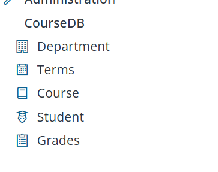
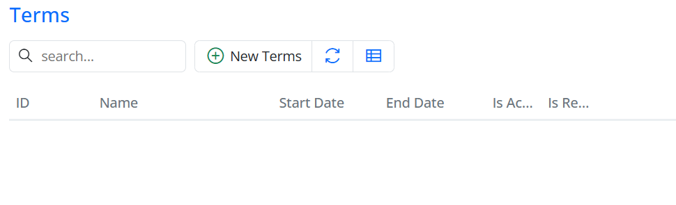
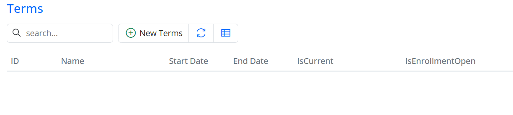

# Navigation Icons and Column Headers

## Give the Navigation Menu Icons

A little icon next to each menu item makes the sidebar much easier to scan. Serenity templates like Serene and StartSharp ship with the **Line Awesome** icon library, a modern alternative to Font Awesome. It's largely compatible with Font Awesome 4.7 class names, so you can use classes like `fa-book` or `fa-user-graduate` in your `NavigationLink` attributes.

Open the navigation file for your module (e.g., `Modules/CourseDB/CourseDBNavigation.cs`).

> **Note:** Sergen may have already added `NavigationLink` attributes for your pages in this file. In that case, **edit the existing lines** to add icons rather than adding duplicate attributes — otherwise you'll end up with multiple menu entries for the same page.

Below are the NavigationLink declarations for each page, each with a section name, title, and an icon. You can find the full list of available icons and their CSS classes on [this page](https://demo.serenity.is/UIElements/Icons).

```csharp
using Serenity.Navigation;
using MyPages = CourseTutorial.CourseDB.Pages;

[assembly: NavigationLink(int.MaxValue, "CourseDB/Department", typeof(MyPages.DepartmentPage), icon: "fas fa-building")]
[assembly: NavigationLink(int.MaxValue, "CourseDB/Terms", typeof(MyPages.TermsPage), icon: "fas fa-calendar-alt")]
[assembly: NavigationLink(int.MaxValue, "CourseDB/Courses", typeof(MyPages.CoursesPage), icon: "fas fa-book")]
[assembly: NavigationLink(int.MaxValue, "CourseDB/Students", typeof(MyPages.StudentsPage), icon: "fas fa-user-graduate")]
[assembly: NavigationLink(int.MaxValue, "CourseDB/Grades", typeof(MyPages.GradesPage), icon: "fas fa-clipboard-list")]
```

> **Note:** The path in each link (e.g., `CourseDB/Courses`) should match the actual page/table name. Use `Courses` and `Students` (plural) to match the page names, otherwise the menu item text or links will be inconsistent.


## Rename a Column Header (and Set a Width)

To show a different header — or adjust the width — of a column, do it in the columns definition file (typically `TermsColumns.cs`) instead of editing the row class (`TermsRow.cs`).



The generated `TermsColumns.cs` already contains every field from the row:

```csharp
namespace CourseTutorial.CourseDB.Columns;

[ColumnsScript("CourseDB.Terms")]
[BasedOnRow(typeof(TermsRow), CheckNames = true)]
public class TermsColumns
{
    [EditLink, DisplayName("Db.Shared.RecordId"), AlignRight]
    public int Id { get; set; }
    [EditLink]
    public string Name { get; set; }
    public DateTime StartDate { get; set; }
    public DateTime EndDate { get; set; }
    public bool IsActive { get; set; }
    public bool IsRegistrationOpen { get; set; }
}
```

The attributes you add on a property here override what's on the row entity. To customize the two boolean columns, add `[DisplayName]`, width, and alignment attributes **to those properties**, leaving the other columns alone:

```csharp
namespace CourseTutorial.CourseDB.Columns;

[ColumnsScript("CourseDB.Terms")]
[BasedOnRow(typeof(TermsRow), CheckNames = true)]
public class TermsColumns
{
    [EditLink, DisplayName("Db.Shared.RecordId"), AlignRight]
    public int Id { get; set; }
    [EditLink]
    public string Name { get; set; }
    public DateTime StartDate { get; set; }
    public DateTime EndDate { get; set; }

    [DisplayName("IsCurrent"), Width(150), AlignRight]
    public bool IsActive { get; set; }

    [DisplayName("IsEnrollmentOpen"), Width(150), AlignRight]
    public bool IsRegistrationOpen { get; set; }
}
```

> **Important:** If you replace the class with only the two boolean properties, the other columns (`Id`, `Name`, `StartDate`, `EndDate`) will disappear from the grid. Always keep the full set of columns and only modify the attributes.


