# Building a Student Information System

> This tutorial is contributed by `Burcu Canur`.

## Defining the Department Table with a Migration

Define a database table to store the departments that students belong to.
is entered
Add a new migration named `Department` using the timestamp-based naming convention. This approach helps maintain consistency and avoids conflicts in team environments.

In this migration, define the `Departments` table with the following fields:

- An auto-incrementing `Id` column as the primary key
- A `Name` column used to store the department name, marked as unique

The migration derives from Serenity’s `AutoReversingMigration`, allowing rollback operations to be handled automatically during database downgrades and simplifying the migration lifecycle.

```csharp
using FluentMigrator;
namespace CourseTutorial.Migrations.DefaultDB;

[DefaultDB, Migration(20250614_1700)]
public class DefaultDB_20250614_1700_Department : AutoReversingMigration
{
    public override void Up()
    {
        Create.Table("Department")
            .WithColumn("Id").AsInt32().IdentityKey(this)
            .WithColumn("Name").AsString(100).NotNullable().Unique();
    }
}
```

## Verifying the Migration

After running the migration, verify the applied schema changes.

Confirm that the `Departments` table has been created:

- Open **SQL Server Management Studio (SSMS)** or **Visual Studio**
- Connect to the database used by the Serenity application
- Expand the **Tables** node under the target database
- Locate the `[dbo].[Departments]` table

Executed migrations are tracked in the `[dbo].[VersionInfo]` table, which records version numbers and timestamps to ensure schema consistency across environments.

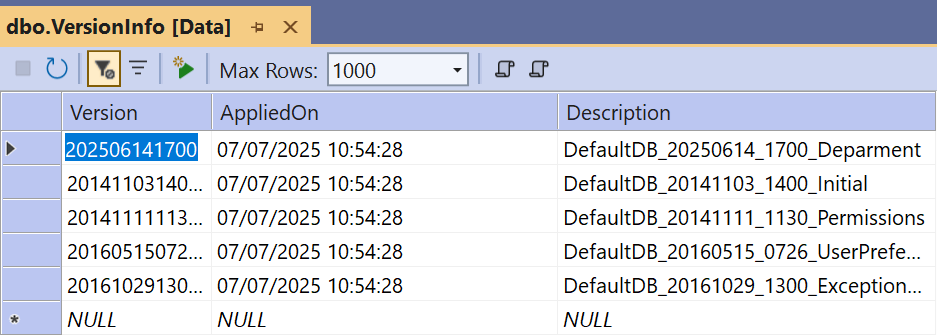

## Generating Code for the Department Table

With the database structure in place, generate the required application code using the **Serenity Code Generator (Sergen)**.

Execute the generator from the terminal:

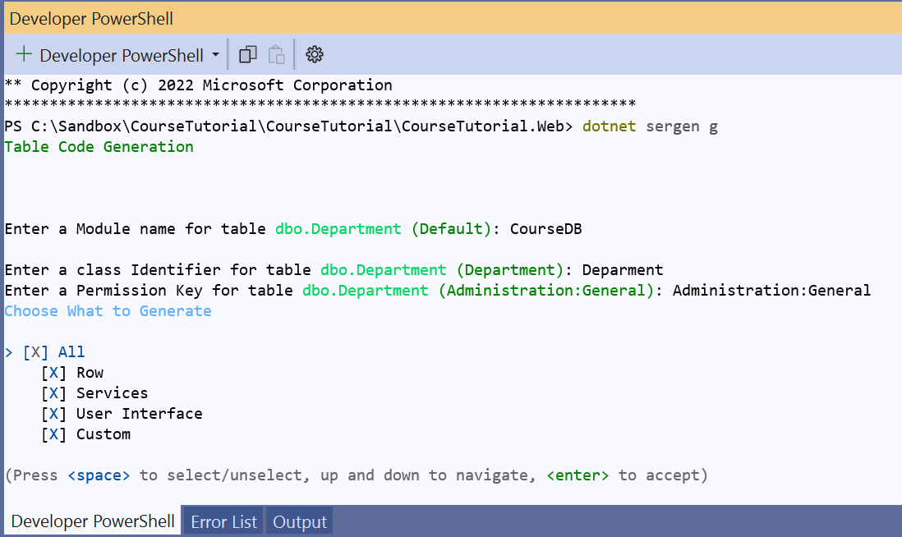

When prompted, select the `Default` database connection.

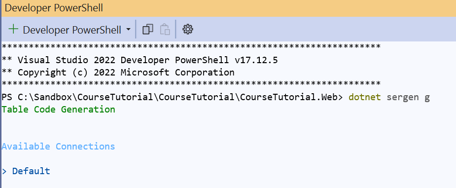

Sergen then displays the list of available tables.
Select the `dbo.Department` table using the Space key, and confirm the selection by pressing Enter.

When prompted for a module name, enter `CourseDB`.

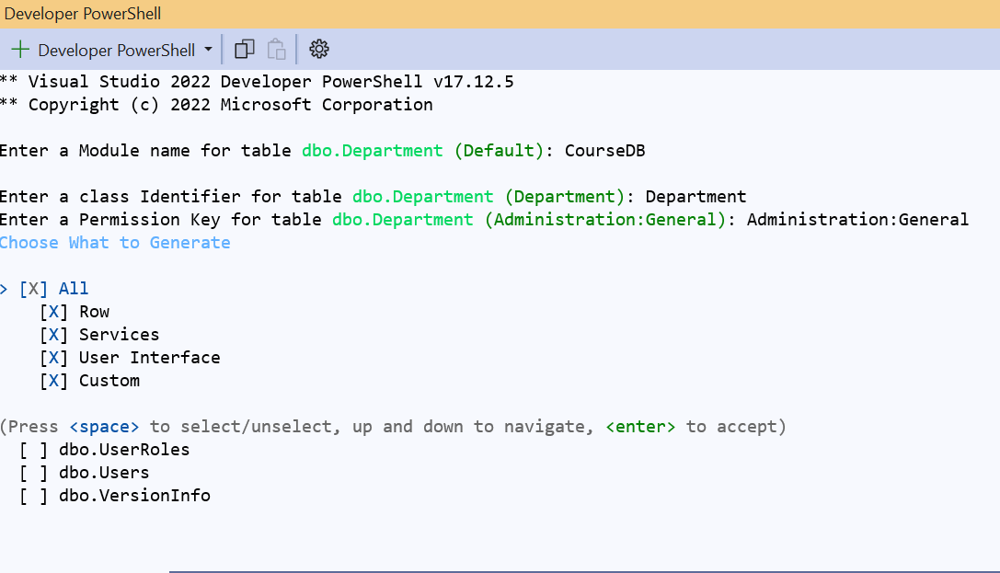

Sergen then displays the list of available tables. Select the `dbo.Department` table using the Space key, and press Enter to confirm.

Keep the default `All` option enabled; Sergen generates all required files, including repositories, services, and user interface components, resulting in a fully functional editing interface.

After code generation is complete, start the application; the `Department` entity becomes available under the `CourseDB` module in the navigation menu.

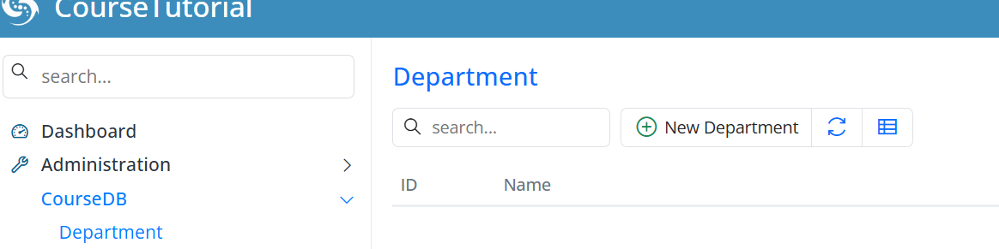

## Adding Sample Data for Department

At this stage, the Department table and its related user interface are ready.

To support upcoming relationships, add a few sample department records.

Using the CourseDB → Department screen, add the following records:

Computer Science

Mathematics

Physics

Reference these records later from tables such as `Courses`, `Students`, and `Teachers`.

Adding sample data at this stage will provide a more meaningful working environment when testing the rest of the application.

## Continuing the Student Information System Development

After defining the `Department` table, create migrations for the remaining core entities of the system:

Term

Courses

Student and StudentCourses

Other related tables

This approach ensures that the database schema is completed in a structured and consistent manner.

Throughout this process, the system is developed incrementally with a focus on clarity and maintainability. The following principles guide this stage of development:

Consistent naming conventions

Correct chronological ordering of migrations

Proper foreign key definitions to ensure data integrity


## Creating the Term Table Migration

Following the creation of the `Department` table, introduce a new migration for the `Term` table. This table stores academic terms such as *Spring 2027* and *Fall 2026*.

The migration, named `Term` according to the timestamp-based convention, defines the following fields:

- An auto-incrementing primary key  
- A required and unique `Name` column  
- `StartDate` and `EndDate` columns defining the academic period  
- An `IsActive` column defined as a non-nullable boolean with a default value of `false`, indicating whether the term is currently active  
- An `IsRegistrationOpen` column defined as a non-nullable boolean with a default value of `false`, indicating whether course registration is open  

The migration derives from `AutoReversingMigration`, allowing rollback operations to be handled automatically during iterative development.

```csharp
using FluentMigrator;
namespace CourseTutorial4.Migrations.DefaultDB;

[DefaultDB, Migration(20250614_1706)]
public class DefaultDB_20250614_1706_Term : AutoReversingMigration
{
    public override void Up()
    {
        Create.Table("Terms")
            .WithColumn("Id").AsInt32().Identity().PrimaryKey()
            .WithColumn("Name").AsString(50).NotNullable().Unique()
            .WithColumn("StartDate").AsDateTime().NotNullable()
            .WithColumn("EndDate").AsDateTime().NotNullable()
            .WithColumn("IsActive").AsBoolean().NotNullable().WithDefaultValue(false)
            .WithColumn("IsRegistrationOpen").AsBoolean().NotNullable().WithDefaultValue(false);
    }
}
```

## Generating Code for the Term Table

After applying the migration, generate the required application code using the **Serenity Code Generator (Sergen)**.

During code generation:

 - Select the `dbo.Term` table  
 - Enter `CourseDB` as the module name  
 - Keep the default `All` option selected to generate the complete set of files  

After code generation is complete, start the application; the `Term` table becomes available under the `CourseDB` module in the navigation menu.

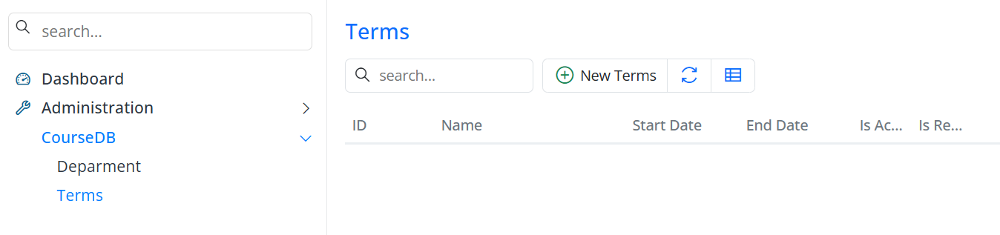

## Adding Sample Data for the Terms Table

After creating the `Terms` table and its UI, add sample term records to use in later stages of the application.

Open the CourseDB → Terms screen and create the following records:

| Term        | Start Date | End Date   | Is Active | Is Registration Open |
| ----------- | ---------- | ---------- | --------- | -------------------- |
| Fall 2026   | 09.01.2026 | 12.31.2026 | True      | True                 |
| Spring 2027 | 02.01.2027 | 06.15.2027 | False     | False                |

Use these term records as references during student course registrations and related operations.

## Creating the Courses Table Migration

After the Term table is in place, add a migration for the `Courses` table. The schema is designed with a focus on relational integrity and clarity:

- Auto-incrementing primary key `Id`  
- `DepartmentId` column defined as a foreign key referencing the `Department` table  
- Required `Name` column with a maximum length of 100 characters  
- Required and unique `Code` column with a maximum length of 20 characters  
- Required `Credit` column indicating course credits  

This structure ensures that courses are correctly associated with departments while enforcing uniqueness and consistency.
```csharp
using FluentMigrator;
namespace CourseTutorial4.Migrations.DefaultDB;

[DefaultDB, Migration(20250615_1220)]
public class DefaultDB_20250615_1220_Courses : AutoReversingMigration
{
    public override void Up()
    {
        Create.Table("Courses")
            .WithColumn("Id").AsInt32().PrimaryKey().IdentityKey(this)
            .WithColumn("DepartmentId").AsInt32().NotNullable()
                .ForeignKey("FK_Courses_DepartmentId", "Department", "Id")
            .WithColumn("Name").AsString(100).NotNullable()
            .WithColumn("Code").AsString(20).NotNullable().Unique()
            .WithColumn("Credit").AsInt32().NotNullable();
    }
}
```

## Verifying the Courses Migration

After applying the migration, verify the schema changes to ensure correctness.

Verification includes:

- Locating the `Courses` table in SQL Server Management Studio (SSMS) or Visual Studio  
- Reviewing migration history in the `[dbo].[VersionInfo]` table  
- Validating the foreign key constraint between `Courses.DepartmentId` and `Department.Id`  

This confirmation ensures that the database schema matches the intended design.

## Generating Code for the Courses Table

Generate application code for the `Courses` table using the Serenity Code Generator.

During this step:

 - Select the `dbo.Courses` table  
 - Specify `CourseDB` as the module name  
 - Retain the default `All` option to generate UI, repository, and service files  

After code generation, start the application; the `Courses` table appears under the `CourseDB` module in the navigation menu, confirming successful integration.

The generated user interface provides full CRUD functionality for managing course records.

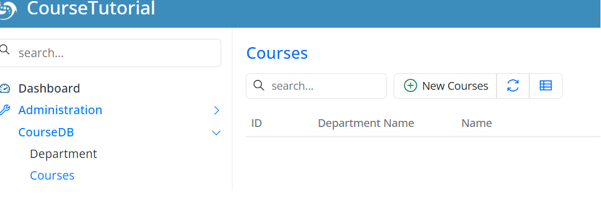

## Adding Sample Data for the Courses Table

After creating the `Courses` table and its UI, add sample course records for the upcoming steps.

Open the CourseDB → Courses screen and create the following records:

| Department       | Course                      | Code    | Credit |
| ---------------- | --------------------------- | ------- | ------ |
| Computer Science | Introduction to Programming | CS101   | 4      |
| Computer Science | Data Structures             | CS201   | 4      |
| Mathematics      | Calculus I                  | MATH101 | 3      |
| Physics          | Physics I                   | PHYS101 | 3      |

Use these course records as references when creating StudentCourses relationships in later stages.
Also create migrations for the `Students` and `StudentCourses` tables to model the master–detail relationship between students and courses.

## Student and StudentCourses Migration

Define the `Students` and `StudentCourses` tables within the same migration file to ensure relationships are created consistently from the start.
```csharp
using FluentMigrator;

namespace CourseTutorial.Migrations.DefaultDB
{
    [DefaultDB, Migration(20250616_1000)]
    public class DefaultDB_20250616_1000_StudentsAndStudentCourses : AutoReversingMigration
    {
        public override void Up()
        {
            Create.Table("Students")
                .WithColumn("Id").AsInt32().PrimaryKey().Identity()
                .WithColumn("FirstName").AsString(100).NotNullable()
                .WithColumn("LastName").AsString(100).NotNullable()
                .WithColumn("FullName").AsString(201).NotNullable()
                .WithColumn("BirthDate").AsDateTime().Nullable()
                .WithColumn("DepartmentId").AsInt32().NotNullable()
                    .ForeignKey("FK_Students_DepartmentId", "Department", "Id");

            Create.Table("StudentCourses")
                .WithColumn("Id").AsInt32().PrimaryKey().Identity()
                .WithColumn("StudentId").AsInt32().NotNullable()
                    .ForeignKey("FK_StudentCourses_StudentId", "Students", "Id")
                .WithColumn("CourseId").AsInt32().NotNullable()
                    .ForeignKey("FK_StudentCourses_CourseId", "Courses", "Id")
                .WithColumn("TermId").AsInt32().Nullable()
                    .ForeignKey("FK_StudentCourses_TermId", "Terms", "Id");

            Create.UniqueConstraint("UQ_Student_Course_Term")
                .OnTable("StudentCourses")
                .Columns("StudentId", "CourseId", "TermId");
        }
    }
}
```

After applying the migration, build the project and generate the `Students` and `StudentCourses` modules using the Serenity Code Generator.

Start the application; the new screens become available in the navigation menu, providing fully functional CRUD interfaces for managing students and their course enrollments.

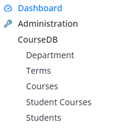

## Adding Sample Data for Students

After creating the Students and StudentCourses tables, let’s add a few sample student records to better demonstrate the master–detail relationship.

Open the CourseDB → Students screen and create the following records:

| Full Name     | Birth Date | Department       |
| ------------- | ---------- | ---------------- |
| John Smith    | 15.03.2004 | Computer Science |
| Emily Johnson | 22.07.2003 | Mathematics      |
| Michael Brown | 05.11.2004 | Physics          |
| Sarah Davis   | 18.05.2003 | Computer Science |

The StudentCourses table was already defined in the migration we created earlier. However, this table will not be used as a standalone screen.

Manage StudentCourses records within the Students dialog using a master–detail structure.

With this structure:

Students represent the master records

StudentCourses represent the detail records

Perform course assignment operations within the Students dialog.

## Establishing the Student – StudentCourses Master–Detail Relationship

In this section, define a master–detail relationship between the Student and StudentCourses tables.

With this approach, StudentCourses records are managed as part of the related Student record rather than through an independent screen.

If you use StudentCourses as a standalone page, course registrations can be created without student context, weakening relational integrity and complicating data management.

In a real-world scenario, a course registration is not used independently. Each course record belongs to a specific student and is managed within that relationship.

For this reason, the StudentCourses structure is configured according to the master–detail architecture, and its standalone page usage is removed.

After this adjustment:

There is no independent menu or page for StudentCourses

Course records are viewed and edited only within the Student dialog

Each course record is stored in relation to its corresponding Student record

Detail records are managed within the context of the master record

## Removing the StudentCourses Page Structure

When you create a Page class for an entity in Serenity, the framework provides a standalone list screen for its records and adds it to the navigation menu.

However, in a master–detail architecture, detail tables are not intended to be presented as independent pages. Instead, detail records are managed within the dialog of the master record.

For this reason, the page structure created for StudentCourses is removed.

Delete the following files:

StudentCoursesPage.cs

StudentCoursesPage.tsx

Also, if there is a menu item defined for StudentCourses in the Navigation.cs file, remove it.

After making these changes, rebuild the project.

As a result, StudentCourses no longer appears in the navigation menu and cannot be used as a standalone screen. Manage StudentCourses records only within the Student dialog.

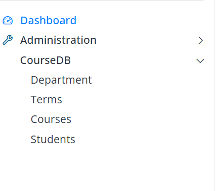

## Defining GridEditorBase for StudentCourses

In a master–detail architecture, use a grid editor to edit detail records within the master dialog. Serenity provides the `GridEditorBase` class for this purpose.

Therefore, define a GridEditorBase-based editor for StudentCourses instead of using the EntityGrid-based structure.

Rename the existing StudentCoursesGrid.tsx file to StudentCoursesEditor.tsx and update its contents as follows:

StudentCoursesEditor.tsx
```csharp
import { Decorators } from '@serenity-is/corelib';
import { StudentCoursesColumns, StudentCoursesRow } from '../../ServerTypes/CourseDB';
import { GridEditorBase } from '@serenity-is/extensions'

@Decorators.registerEditor('CourseTutorial.CourseDB.StudentCoursesEditor')
export class StudentCoursesEditor<P = {}> extends GridEditorBase<StudentCoursesRow, P> {
    protected override getColumnsKey() { return StudentCoursesColumns.columnsKey; }
    protected override getLocalTextPrefix() { return StudentCoursesRow.localTextPrefix; }
}
```
This definition creates a grid editor for managing StudentCourses records.

This editor:

It is used only within the Student dialog and manages detail records together with the master record.

Allows adding, editing, and deleting detail records directly within the dialog and is not used as a standalone list screen

This structure ensures that StudentCourses records are managed in accordance with the master–detail architecture.

Now, build the project.

## Adding the StudentCourses Field to StudentsForm.cs

To display the StudentCourses editor within the Student dialog, add the following property to `StudentsForm.cs`:
```csharp
[DisplayName("Courses"), StudentCoursesEditor, SkipNameCheck]
public List<StudentCoursesRow> CourseList { get; set; }
```
Use the `StudentCoursesEditor` attribute to specify the grid editor for this field.

The `SkipNameCheck` attribute prevents Serenity from looking for a physical column for this field in the `StudentsRow` table; this field represents the detail side of the master–detail relationship.

After this change, the Student dialog displays a grid editor to view and edit StudentCourses records.

Use this grid editor to manage course records belonging to the selected student directly within the dialog.

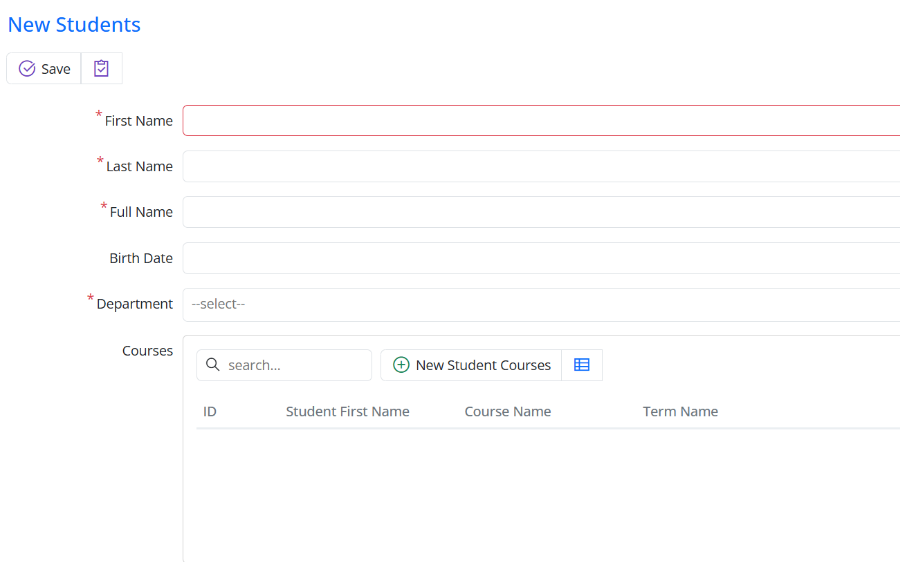

## Hiding the StudentId Field in StudentCoursesForm.cs

The `StudentId` field in `StudentCourses` is the foreign key for the master–detail relationship; it does not need to be edited by the user.

Therefore, the StudentId field in the StudentCoursesForm.cs file is hidden.

This is done by marking the related field with the Hidden attribute.

```csharp
[FormScript("CourseDB.StudentCourses")]
[BasedOnRow(typeof(StudentCoursesRow), CheckNames = true)]
public class StudentCoursesForm
{
    [Hidden]
    public int StudentId { get; set; }
    public int CourseId { get; set; }
    public int TermId { get; set; }
}
```
With this change, the StudentId field is no longer displayed in the dialog. The information about which Student record the detail belongs to is managed automatically by the master–detail relationship.

In addition, the column defined in the StudentCoursesColumns.cs file that displays the Student information is also removed.
```csharp

namespace CourseTutorial.CourseDB.Columns;
[ColumnsScript("CourseDB.StudentCourses")]
[BasedOnRow(typeof(StudentCoursesRow), CheckNames = true)]
public class StudentCoursesColumns
{
    [EditLink, DisplayName("Db.Shared.RecordId"), AlignRight]
    public int Id { get; set; }
    public string CourseName { get; set; }
    public string TermName { get; set; }
}
```
Since detail records are no longer displayed on a standalone screen and are only shown within the Student dialog, there is no need to display the Student information again in the grid.

After these changes, the StudentCourses editor displays a simplified view containing only the course information.

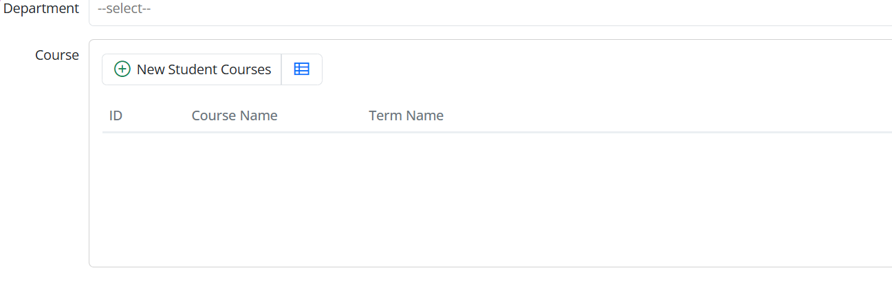

## Defining the Grid Editor Dialog for StudentCourses

In the grid editor, adding and editing detail records is performed through a dialog.

In the master–detail architecture, derive this dialog from `GridEditorDialog` instead of `EntityDialog`. Use it only within the grid editor; do not use it as a standalone page.

For this purpose, create a new file named StudentCoursesEditDialog.tsx and define its contents as follows:
StudentCoursesEditDialog.tsx

```csharp
import { Decorators } from "@serenity-is/corelib";
import { GridEditorDialog } from "@serenity-is/extensions";
import { StudentCoursesForm, StudentCoursesRow } from "../../ServerTypes/CourseDB";

@Decorators.registerClass("CourseTutorial.CourseDB.StudentCoursesEditDialog")
export class StudentCoursesEditDialog extends GridEditorDialog<StudentCoursesRow> {

    protected override getFormKey() { return StudentCoursesForm.formKey; }
    protected override getLocalTextPrefix() { return StudentCoursesRow.localTextPrefix; }
    protected form: StudentCoursesForm = new StudentCoursesForm(this.idPrefix);
}
```
The `GridEditorDialog` class provides the foundation for the add and edit dialogs used within a grid editor.

Add and edit `StudentCourses` records through this popup dialog.

This dialog is used only by the grid editor within the Student dialog and is not associated with any standalone list page.

Use this structure to manage detail records within the master dialog in accordance with the master–detail architecture.

## Defining the StudentCoursesEditor.tsx File

To enable adding and editing StudentCourses records within the grid editor, define a relationship between the editor and the dialog.

For this purpose, update the StudentCoursesEditor.tsx file as follows:

```csharp
import { Decorators } from "@serenity-is/corelib";
import { GridEditorBase } from "@serenity-is/extensions";
import { StudentCoursesColumns, StudentCoursesRow } from "../../ServerTypes/CourseDB";
import { StudentCoursesEditDialog } from "./StudentCoursesEditDialog";

@Decorators.registerEditor("CourseTutorial.CourseDB.StudentCoursesEditor")
export class StudentCoursesEditor extends GridEditorBase<StudentCoursesRow> {

    protected getColumnsKey() { return StudentCoursesColumns.columnsKey;}
    protected getDialogType() { return StudentCoursesEditDialog;}
    protected getAddButtonCaption() { return "Add"; }
}
```

The `getDialogType` method specifies the dialog type used by the grid editor.

```csharp
You can override it as follows:
protected getAddButtonCaption() {
        return "Add";}
```
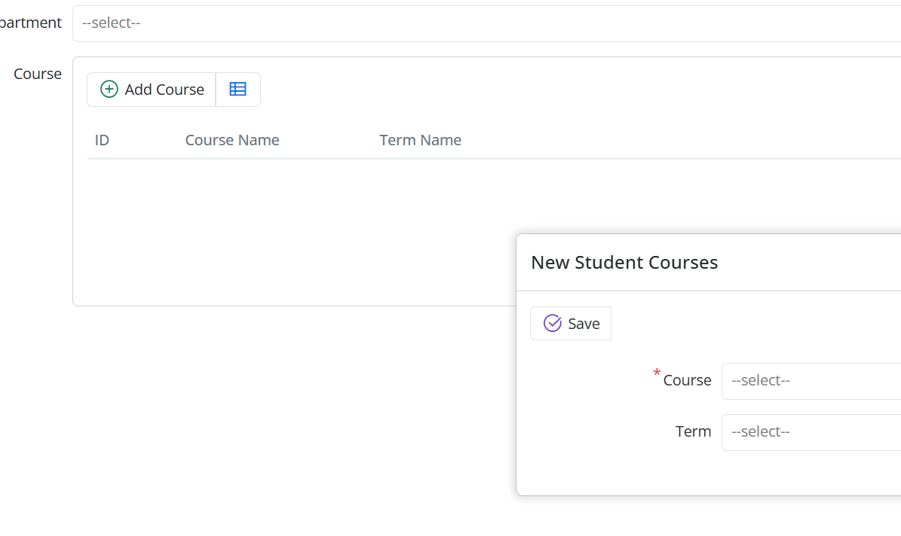

Click the Add button to open the StudentCoursesEditDialog popup dialog.

Add and edit detail records through the dialog.

Use this structure to manage detail records via a dialog in a master–detail architecture.

Defining the Master–Detail Relationship on StudentsRow

The server-side definition of the master–detail relationship is done using the MasterDetailRelation attribute.

Define a list field representing StudentCourses records in `StudentsRow.cs`.
```csharp
[MasterDetailRelation(foreignKey: nameof(StudentCoursesRow.StudentId), ColumnsType = typeof(StudentCoursesColumns))]
[DisplayName("Course List"), NotMapped]
public List<StudentCoursesRow> CourseList{get => fields.CourseList[this];set => fields.CourseList[this] = value;}

public class RowFields : RowFieldsBase
{
    public RowListField<StudentCoursesRow> CourseList;
}
```
The MasterDetailRelation attribute defines the relationship between records in the StudentCourses table and the Student record. In this relationship, the foreign key field used is StudentCoursesRow.StudentId.

The `NotMapped` attribute indicates that this field is not a physical column in the `Students` table; use it solely to manage the master–detail relationship.

With this definition:

When you load a Student record, the related StudentCourses records are retrieved automatically.

When you create new detail records, the `StudentId` field is assigned automatically.

Add, update, and delete detail records together with the master record.

This structure ensures that the master–detail relationship works fully on the server side.

## Usage Within the Student Dialog

Because you defined the editor on the `StudentsForm`, no additional action is required inside the Student dialog.

When the dialog opens:

The Student fields are displayed at the top of the dialog.

StudentCourses records are displayed within the grid editor.

The addition, editing, and deletion of detail records are carried out through a popup dialog.

## Conclusion

With these arrangements:

StudentCourses is not used as a standalone screen; detail records are managed only within the Student dialog.

Master and detail records are saved together, and the student–course relationship is structured according to the master–detail architecture.

## Advantages Provided by Serenity

This structure is achieved with minimal additional code, thanks to Serenity’s master–detail support.

Detail records are automatically managed during the master record’s save operation.

There is no need to define an additional service or custom record operation.

Data integrity is maintained by the framework.

## Creating the Teacher and TeacherCourses Tables

Create the `Teachers` and `TeacherCourse` tables to represent the relationship between teachers and the courses they teach.

Define the following migration:
```csharp
using FluentMigrator;

namespace CourseTutorial.Migrations.DefaultDB
{
    [DefaultDB, Migration(20250707_1015)]
    public class DefaultDB_20250707_1015_TeachersAndTeacherCourse : AutoReversingMigration
    {
        public override void Up()
        {
            Create.Table("Teachers")
                .WithColumn("Id").AsInt32().PrimaryKey().Identity()
                .WithColumn("FirstName").AsString(100).NotNullable()
                .WithColumn("LastName").AsString(100).NotNullable()
                .WithColumn("FullName").AsString(201).NotNullable()
                .WithColumn("Email").AsString(150).NotNullable().Unique()
                .WithColumn("DepartmentId").AsInt32().NotNullable()
                    .ForeignKey("FK_Teachers_DepartmentId", "Department", "Id");

            Create.Table("TeacherCourse")
                .WithColumn("Id").AsInt32().PrimaryKey().Identity()
                .WithColumn("TeacherId").AsInt32().NotNullable()
                    .ForeignKey("FK_TeacherCourse_TeacherId", "Teachers", "Id")
                .WithColumn("CourseId").AsInt32().NotNullable()
                    .ForeignKey("FK_TeacherCourse_CourseId", "Courses", "Id");

            Create.UniqueConstraint("UQ_Teacher_Course")
                .OnTable("TeacherCourse")
                .Columns("TeacherId", "CourseId");
        }
    }
}

```
## Creating the Grades Table

After creating the `Students` and `Courses` tables, add the `Grades` table to store the grades each student receives for each course.

Each grade record belongs to a student and corresponds to a specific course, containing the Midterm, Final, and Average values.

Define the following migration:

```csharp
using FluentMigrator;

namespace CourseTutorial.Migrations.DefaultDB;

[DefaultDB, Migration(20250616_1200)]
public class DefaultDB_20250616_1200_Grades : AutoReversingMigration
{
    public override void Up()
    {
using FluentMigrator;

namespace CourseTutorial.Migrations.DefaultDB;

[DefaultDB, Migration(20250616_1200)]
public class DefaultDB_20250616_1200_Grades : AutoReversingMigration
{
    public override void Up()
    {
        Create.Table("Grades")
      .WithColumn("Id").AsInt32().PrimaryKey().Identity()
      .WithColumn("StudentId").AsInt32().NotNullable()
          .ForeignKey("FK_Grades_StudentId", "Students", "Id")
      .WithColumn("CourseId").AsInt32().NotNullable()
          .ForeignKey("FK_Grades_CourseId", "Courses", "Id")
      .WithColumn("TermId").AsInt32().NotNullable()
          .ForeignKey("FK_Grades_TermId", "Terms", "Id")
      .WithColumn("Midterm").AsDecimal(5, 2).Nullable()
      .WithColumn("Final").AsDecimal(5, 2).Nullable()
      .WithColumn("Average").AsDecimal(5, 2).Nullable();

        Create.UniqueConstraint("UQ_Grades_StudentId_CourseId_TermId")
            .OnTable("Grades")
            .Columns("StudentId", "CourseId", "TermId");
    }
}
```
With this definition:

Each Grades record is associated with a Student and a Course, and the Midterm, Final, and Average fields store the grade information.

This prevents creating multiple grade records for the same student and course.

## Generating Serenity Code for the Grades Table

After applying the migration, generate Serenity code for the `Grades` table using Sergen.

Select the `dbo.Grades` table, use the `CourseDB` module, and retain the default `All` option.

After code generation, start the application to display the `Grades` screen under the `CourseDB` module.

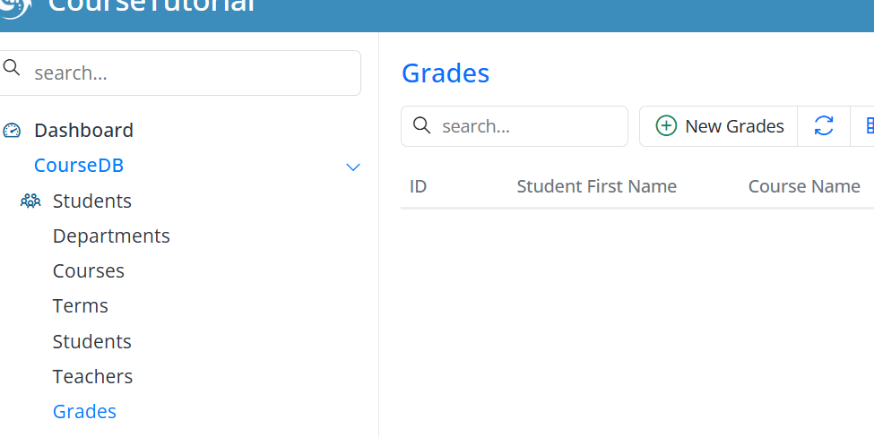

Use this screen to add students’ course grades, edit existing grades, and view grade records.

In this way, the Grades table becomes usable in an integrated manner with the Students and Courses structure.

## Automatic Calculation of the Average Field

Currently, the `Average` field can be entered manually; calculate it from `Midterm` and `Final` to prevent errors.

It may cause data inconsistencies, so the average value is calculated automatically on the server side.

## Step 1 — Removing the Average Field from the Form

GradesForm.cs:
```csharp
public decimal? Average { get; set; }
```
## Step 2 — Calculating Average in GradesRow
GradesRow.cs:
```csharp
public void CalculateAverage()
{
    if (Midterm != null && Final != null)
        Average = (Midterm + Final) / 2;
}

```
## Step 3 — Updating the SaveHandler

GradesSaveHandler.cs:
```csharp
protected override void BeforeSave()
{
    base.BeforeSave();

    Row.CalculateAverage();
}
```
## Result

With this adjustment, the Average is calculated automatically, user errors are prevented, and data consistency is ensured.

## Conclusion

Thanks to Serenity’s powerful framework, the grade calculation process becomes safer, more consistent, and user-friendly.

## Using Student FullName in the Grades Table

In the Grades screen, instead of displaying only the student's FirstName, the Full Name (First + Last Name) will be shown. To achieve this:

The FirstName field in GradesRow.cs will be removed.

The FullName field from StudentsRow will be linked to GradesRow.

GradesColumns.cs and the form fields will be updated accordingly.

## Updating GradesRow.cs

The unnecessary FirstName field in GradesRow is removed. Instead, a FullName field is added:
```csharp
[DisplayName("Full Name"), Origin(jStudent, nameof(StudentsRow.FullName))]
public string FullName 
{ 
    get => fields.FullName[this]; 
    set => fields.FullName[this] = value; 
}
```
```csharp
// Declaration in the Fields class
public StringField FullName;
```

Now, GradesRow can use the FullName field directly.

## Updating GradesColumns.cs

To display the FullName column in the grid, add the following property to the GradesColumns.cs file:
```csharp
public string FullName { get; set; }
```
This allows the student's first and last name to appear together in a single column.
StudentId and TextualField

The StudentId field in GradesRow is linked to FullName:
```csharp
[DisplayName("Student"), NotNull, ForeignKey(typeof(StudentsRow)), LeftJoin(jStudent), TextualField(nameof(FullName))]
[ServiceLookupEditor(typeof(StudentsRow), Service = "CourseDB/Students/List")]
public int? StudentId 
{ 
    get => fields.StudentId[this]; 
    set => fields.StudentId[this] = value; 
}
```

The Student column in the Grades screen now displays the FullName.

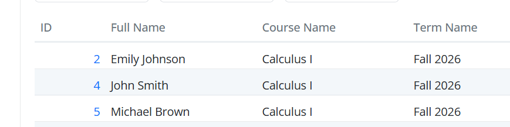

## Result
Previously, only the FirstName was visible.

Now, the full name (First + Last Name) is listed in a single column.

This allows the Grades screen to display a column named FullName containing the student’s full name:

Before adding Excel and PDF export buttons to the page, apply filtering using the QuickFilter feature. This will be useful for filtering data in the Excel and PDF exports.

## QuickFilter and Excel/PDF Export in the Grades Screen

Before generating Excel and PDF exports in the Grades screen, users are provided with quick filtering options. Using QuickFilter is particularly advantageous when you want to report on filtered data.

Additionally, with ColumnsPicker, users can select and display the fields they want, and export the same fields to Excel or PDF. This directly leverages Serenity’s powerful and flexible grid infrastructure.
```csharp
namespace CourseTutorial.CourseDB.Columns;

[ColumnsScript("CourseDB.Grades")]
[BasedOnRow(typeof(GradesRow), CheckNames = true)]
public class GradesColumns
{
    [EditLink, DisplayName("Db.Shared.RecordId"), AlignRight]
    public int Id { get; set; }

    [QuickFilter]
    public string FullName { get; set; }

    [QuickFilter]
    public string CourseName { get; set; }

    [QuickFilter]
    public string TermName { get; set; }

    public decimal Midterm { get; set; }
    public decimal Final { get; set; }
    public decimal Average { get; set; }
}
```
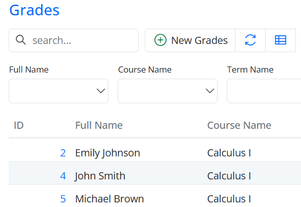

The combination of QuickFilter for filtering and ColumnsPicker for selecting fields stands out as one of Serenity’s most powerful features. The filtering and reporting process is both user-friendly and high-performing.


## GradesGrid: Adding Excel and PDF Export Buttons

In the Grades screen, users can export data to Excel or PDF by using buttons in the grid toolbar. Serenity provides a built-in, fully integrated infrastructure that handles both exports with minimal code.

## Defining the Grid Class

The GradesGrid class extends EntityGrid<GradesRow>:
```csharp
@Decorators.registerClass("CourseTutorial.CourseDB.GradesGrid")
export class GradesGrid extends EntityGrid<GradesRow, any> {
    protected override getColumnsKey() { return GradesColumns.columnsKey; }
    protected override getDialogType() { return GradesDialog; }
    protected override getRowDefinition() { return GradesRow; }
    protected override getService() { return GradesService.baseUrl; }
}
```
## Adding Excel and PDF Buttons

Override the getButtons() method to add export buttons:
```csharp
protected override getButtons() {
    let buttons = super.getButtons();

    // Excel export button
    buttons.push(ExcelExportHelper.createToolButton({
        grid: this,
        service: GradesService.baseUrl + '/ListExcel',
        separator: true
    }));

    // PDF export button
    buttons.push(PdfExportHelper.createToolButton({
        grid: this
    }));

    return buttons;
}
```

## Explanation:

ExcelExportHelper.createToolButton: Exports grid data to Excel. The service parameter points to the backend endpoint. separator: true adds a visual separator between buttons.

PdfExportHelper.createToolButton: Exports grid data to PDF on the frontend. Any applied filters or selected columns are automatically reflected in the PDF.

## Export Process Flow

When a user clicks an export button, the flow works as follows:

## Excel Export:

The grid sends a request to the backend endpoint (e.g., /ListExcel).

GradesListHandler.cs retrieves filtered, sorted, and paged records from the database.

IExcelExporter generates the Excel file from the retrieved data.

ExcelContentResult.Create(...) sends the Excel file to the user’s browser for download.

## PDF Export:

The grid triggers the export on the frontend.

PdfExportHelper reads the grid data, including any applied filters and column selections.

The PDF file is generated and sent to the browser for download.

Both Excel and PDF exports fully respect the grid’s filtering, sorting, and selected columns.

## How Filtering and Columns Work

Both Excel and PDF exports fully respect the grid’s state:

Quick filters, column filters, and sorting are applied automatically.

Columns selected via ColumnsPicker are included in the export.

Only the visible data is exported.

This ensures consistent and accurate reporting.

## Serenity Advantages

Minimal code: Developers only need to add the export buttons; no custom backend or frontend code is required.

Fully integrated: Export operations automatically respect the grid’s filters, sorting, and column selections.

Fast and reliable: Serenity uses built-in handler, exporter, and frontend helper services to generate Excel and PDF files.

User-friendly: Users can export exactly what they see in the grid, making reporting simple and intuitive.

Flexible column management: Using Serenity’s built-in **ColumnsPicker**, users can dynamically choose which columns should be visible in the grid. The export operations also respect these selections, meaning only the selected columns will be included in the Excel or PDF output.

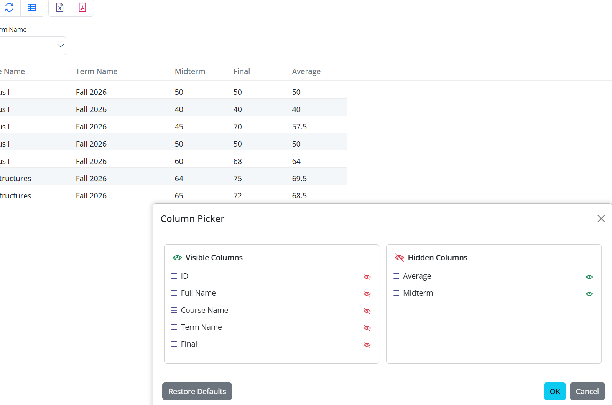

Excel and PDF buttons in the toolbar:

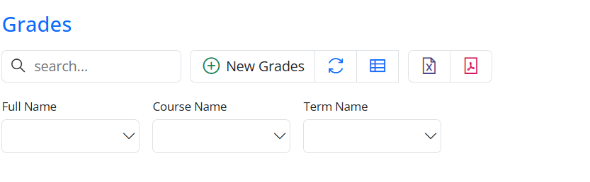

Excel output example:

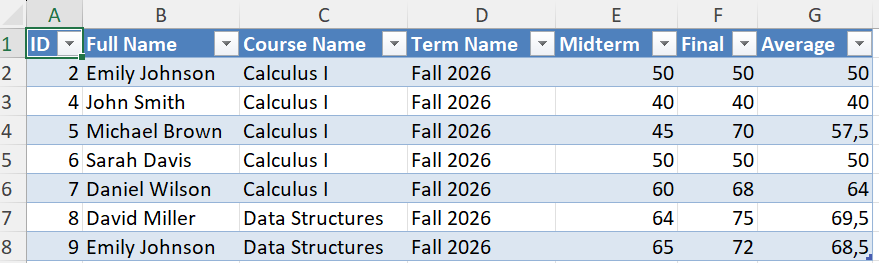

PDF output example:

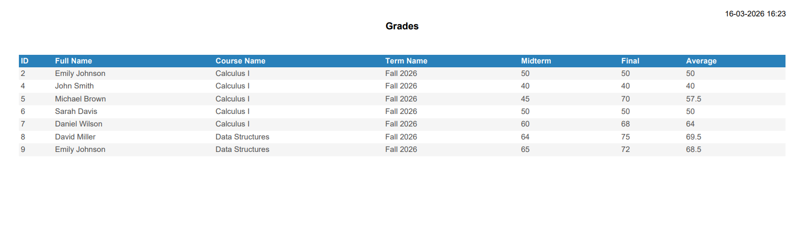

## Result

Users can now:

Export filtered and sorted data to Excel or PDF.

Select which columns to include via ColumnsPicker.

Generate reports quickly without writing any extra export logic.

Serenity’s helpers leverage the framework’s flexible and powerful grid infrastructure, making reporting fast, reliable, and user-friendly.

## Navigation Links and Icon Configuration
Purpose

Group pages under relevant sections and assign meaningful icons to each navigation item to make the sidebar menu more user-friendly and visually organized.
### Open the Navigation File

Open the navigation file located under your `CourseTutorial` module:

## Add NavigationLink Attributes

Below are example NavigationLink declarations for each page in your project. Each one includes a meaningful section name, page title, and an appropriate icon.

Icon Support

Serenity templates such as Serene and StartSharp include the Line Awesome icon library, which is a modern alternative to Font Awesome. 

Line Awesome is largely compatible with Font Awesome 4.7 icon class names, so you can use icon classes like "fa-book" or "fa-user-graduate" in your NavigationLink attributes.

You can find a comprehensive list of available icons and their corresponding CSS classes on [this page](https://demo.serenity.is/UIElements/Icons).

```csharp
using MyPages = CourseTutorial.CourseDB.Pages;

[assembly: NavigationLink(int.MaxValue, "CourseDB/Department", typeof(MyPages.DepartmentPage), icon: "fas fa-building")]
[assembly: NavigationLink(int.MaxValue, "CourseDB/Terms", typeof(MyPages.TermsPage), icon: "fas fa-calendar-alt")]
[assembly: NavigationLink(int.MaxValue, "CourseDB/Course", typeof(MyPages.CoursesPage), icon: "fas fa-book")]
[assembly: NavigationLink(int.MaxValue, "CourseDB/Student", typeof(MyPages.StudentsPage), icon: "fas fa-user-graduate")]
[assembly: NavigationLink(int.MaxValue, "CourseDB/Grades", typeof(MyPages.GradesPage), icon: "fas fa-clipboard-list")]
```

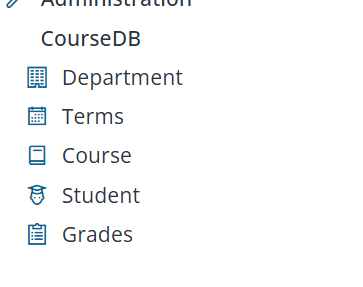
## Overriding Column Header and Width

If you want to display a different header in a grid (columns) or dialog (form), you can override it in the corresponding definition file. You can modify the columns by updating the following file located in TermRow.cs instead of TermRow.cs:
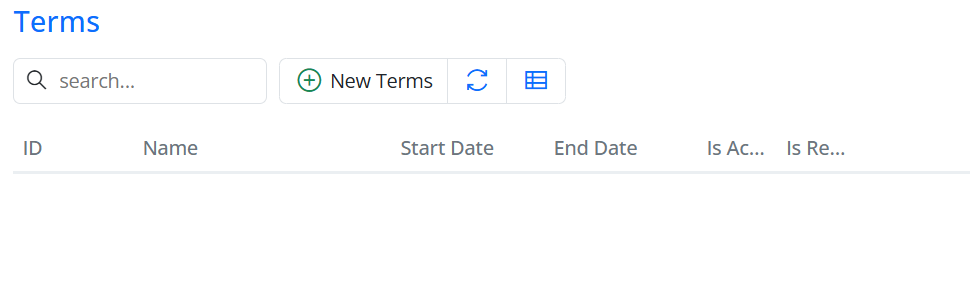

```csharp
namespace CourseTutorial.CourseDB.Columns;

[ColumnsScript("CourseDB.Terms")]
[BasedOnRow(typeof(TermsRow), CheckNames = true)]
public class TermsColumns
{
      public bool IsActive { get; set; }
      public bool IsRegistirationOpen {get; set;}
}
```
This column definition is based on the TermRow entity, and any properties you add here will override the properties defined in the entity class. Now, let's add a [DisplayName] attribute to the IsActive and IsRegistrationOpen properties, and also set the column widths and alignments.

```csharp
namespace CourseTutorial.CourseDB.Columns;

[ColumnsScript("CourseDB.Terms")]
[BasedOnRow(typeof(TermsRow), CheckNames = true)]
public class TermsColumns
{
    [DisplayName("IsCurrent"), Width(150), AlignRight]
    public bool IsActive { get; set; }

    [DisplayName("IsEnrollmentOpen"), Width(150), AlignRight]
    public bool IsRegistrationOpen { get; set; }
}
```
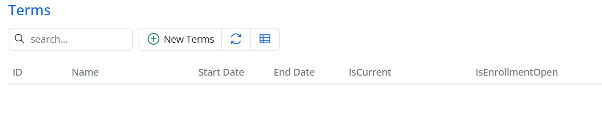


