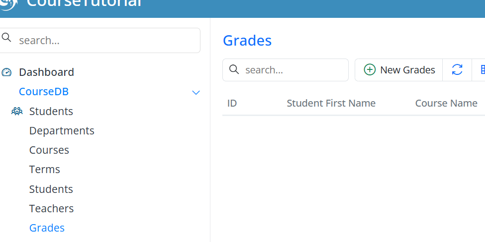
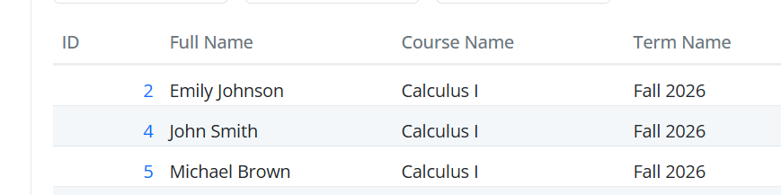
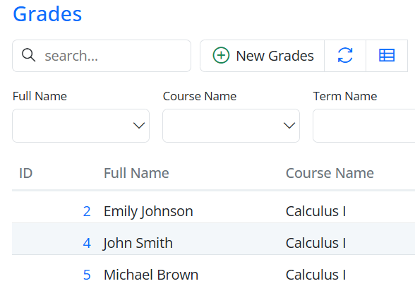
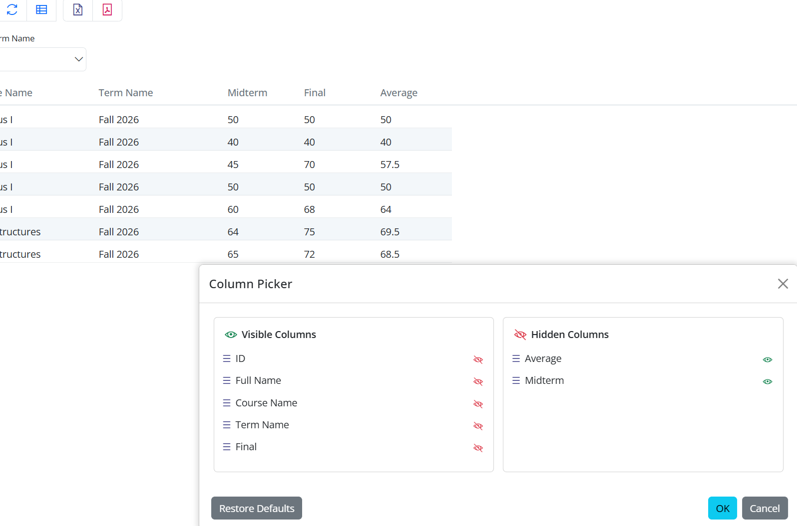
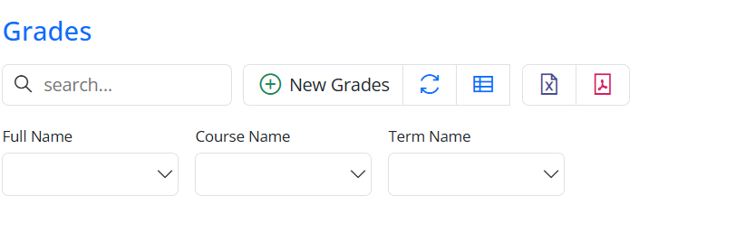
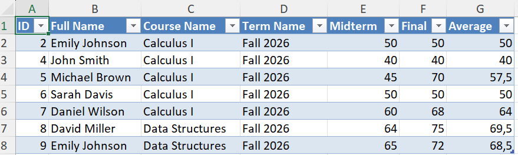
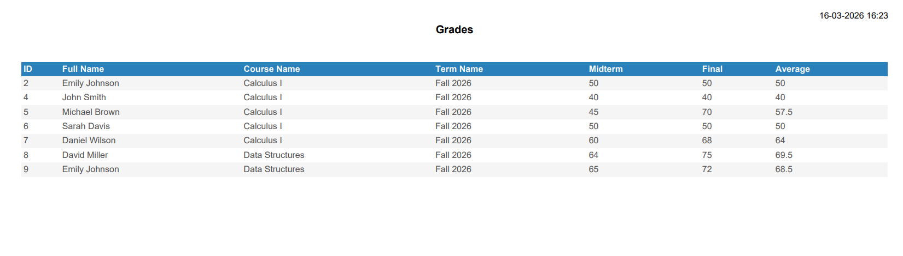

# Building a Student Information System

> This tutorial is contributed by `Burcu Canur`.

## What you will build

In this tutorial we'll build a simple **Student Information System** with Serenity. By the end you'll be able to manage:

- **Departments** (e.g., Computer Science, Mathematics)
- **Terms** (academic periods, e.g., Fall 2026, Spring 2027)
- **Courses** (with departments, codes, and credits)
- **Students** (with personal info and department assignment)
- **Student enrollments** (student ↔ course relationships via a master–detail grid)
- **Teachers and course assignments**
- **Grades** (midterm/final/average for each student/course/term)

Along the way you'll learn how to:

- Define database schema using migrations
- Generate CRUD screens with Sergen
- Build a master–detail UI (students + enrollments)
- Add filtering, exporting (Excel/PDF), and friendly navigation

## Running the Application

Before you begin, start the application from your IDE or from the command line with `dotnet run`. The default login is:

- **Username:** `admin`
- **Password:** `serenity`

You'll need to be signed in to create records through the screens you build.

## Create the Department Table with a Migration

Our system starts with the tables that everything else hangs off of, so let's begin with `Department` — every course, student, and teacher will belong to one.

We'll create it with a migration. The name carries a timestamp (`20250614_1700`), which keeps migrations in a clear order and avoids clashes when several people work on the same project.

The `Department` table only needs two columns for now:

- An auto-incrementing `Id` column as the primary key
- A `Name` column to store the department name, marked as unique

We're using `AutoReversingMigration`, which means FluentMigrator can roll the table back automatically if we ever need to undo it during development.

```csharp
using FluentMigrator;
namespace CourseTutorial.Migrations.DefaultDB;

[DefaultDB, MigrationKey(20250614_1700)]
public class DefaultDB_20250614_1700_Department : AutoReversingMigration
{
    public override void Up()
    {
        Create.Table("Department")
            .WithColumn("Id").AsInt32().IdentityKey(this)
            .WithColumn("Name").AsString(100).NotNullable().Unique();
    }
}
```

> **Note:** `IdentityKey(this)` is a Serenity/FluentMigrator helper that marks the column as both an auto-incrementing **identity** and the **primary key** in a single call. Every `Id` column in this tutorial uses it so the primary-key setup stays consistent.

## Verify the Migration Worked

Serenity runs pending migrations automatically when the application starts, so the table should already exist. Let's confirm.

In **SQL Server Management Studio (SSMS)** or **Visual Studio**:

- Connect to the database used by the Serenity application
- Expand the **Tables** node under the target database
- Locate the `[dbo].[Department]` table

> **Tip:** If you don't have SSMS or Visual Studio handy, you can verify from the command line. The default Serene/StartSharp template uses a SQL Server LocalDB database named `<YourProjectName>_Default_v1`:
>
> ```
> sqlcmd -S "(localdb)\MsSqlLocalDB" -d <YourProjectName>_Default_v1 -Q "SELECT * FROM dbo.Department; SELECT Version FROM dbo.VersionInfo ORDER BY Version;"
> ```
>
> Replace `<YourProjectName>` with your project's name, e.g. `CourseTutorial_Default_v1`.

Every applied migration is recorded in the `[dbo].[VersionInfo]` table, so Serenity knows what has already run and never applies the same migration twice.


## Generate the Code with Sergen

The table exists, but the application doesn't know about it yet. That's where **Sergen**, Serenity's code generator, comes in — it creates the row, page, grid, dialog, and service code for us.

Run it from the terminal:

```
> dotnet sergen g
```


When prompted, select the `Default` database connection.


Sergen then lists the available tables. Select `dbo.Department` with the Space key and press Enter to continue.

When asked for a module name, enter `CourseDB`.


Leave the default `All` option selected — it generates the complete set of files (row, service, page, grid, dialog), so you get a working edit screen with no extra effort.

Once generation finishes, start the application and you'll see **Department** under the new **CourseDB** menu in the sidebar.


## Add Some Sample Departments

The table and its screen are ready, so let's put a few rows in — the rest of the tutorial will refer back to them.

Open **CourseDB → Department** and add:

- Computer Science
- Mathematics
- Physics

These are the departments you'll pick from when you create courses, students, and teachers later on, so realistic names will make testing much nicer.

## What's Next

Now that `Department` is in place, we'll create migrations for the rest of the core entities:

- Terms
- Courses
- Student and StudentCourses
- Other related tables

A few simple rules keep things tidy as we go:

- Consistent naming conventions
- Migrations in chronological order
- Proper foreign key definitions so the data stays consistent


## Create the Terms Table with a Migration

Next up is the `Terms` table, which stores academic terms like *Spring 2027* and *Fall 2026*.

Like before, we'll create it with a timestamped migration. The `Terms` table has these columns:

- An auto-incrementing primary key  
- A required and unique `Name` column  
- `StartDate` and `EndDate` columns defining the academic period  
- An `IsActive` boolean (default `false`) — is this the current term?  
- An `IsRegistrationOpen` boolean (default `false`) — can students register for courses?  

We're using `AutoReversingMigration` again so the migration can be rolled back cleanly while we develop.

```csharp
using FluentMigrator;
namespace CourseTutorial.Migrations.DefaultDB;

[DefaultDB, MigrationKey(20250614_1706)]
public class DefaultDB_20250614_1706_Terms : AutoReversingMigration
{
    public override void Up()
    {
        Create.Table("Terms")
            .WithColumn("Id").AsInt32().IdentityKey(this)
            .WithColumn("Name").AsString(50).NotNullable().Unique()
            .WithColumn("StartDate").AsDateTime().NotNullable()
            .WithColumn("EndDate").AsDateTime().NotNullable()
            .WithColumn("IsActive").AsBoolean().NotNullable().WithDefaultValue(false)
            .WithColumn("IsRegistrationOpen").AsBoolean().NotNullable().WithDefaultValue(false);
    }
}
```

## Generate the Code with Sergen

Now let's generate the application code for `Terms`, just like we did for `Department`:

 - Select the `dbo.Terms` table  
 - Enter `CourseDB` as the module name  
 - Keep the default `All` option selected  

Once it's done, start the application and **Terms** will appear under the **CourseDB** menu.


## Add Some Sample Terms

Let's add a couple of terms — enrollments and grades later in the tutorial will reference them.

Open the CourseDB → Terms screen and create:

| Term        | Start Date | End Date   | Is Active | Is Registration Open |
| ----------- | ---------- | ---------- | --------- | -------------------- |
| Fall 2026   | 2026-09-01 | 2026-12-31 | True      | True                 |
| Spring 2027 | 2027-02-01 | 2027-06-15 | False     | False                |

These are the terms you'll pick from when you register students for courses.

> **Note:** Dates in this tutorial are written in ISO format (`YYYY-MM-DD`) so they're unambiguous regardless of the reader's culture. When you enter dates, Serenity's date editor uses your browser/application culture's format (e.g., `MM/DD/YYYY` for English/US), so you may need to type them in that culture's format.

## Create the Courses Table with a Migration

Next, the `Courses` table. Every course belongs to a department, has a name and a unique code, and carries a number of credits:

- Auto-incrementing primary key `Id`  
- `DepartmentId` — a foreign key to the `Department` table  
- Required `Name` column (max 100 characters)  
- Required and unique `Code` column (max 20 characters)  
- Required `Credit` column  

The foreign key is what keeps each course tied to its department.
```csharp
using FluentMigrator;
namespace CourseTutorial.Migrations.DefaultDB;

[DefaultDB, MigrationKey(20250615_1220)]
public class DefaultDB_20250615_1220_Courses : AutoReversingMigration
{
    public override void Up()
    {
        Create.Table("Courses")
            .WithColumn("Id").AsInt32().IdentityKey(this)
            .WithColumn("DepartmentId").AsInt32().NotNullable()
                .ForeignKey("FK_Courses_DepartmentId", "Department", "Id")
            .WithColumn("Name").AsString(100).NotNullable()
            .WithColumn("Code").AsString(20).NotNullable().Unique()
            .WithColumn("Credit").AsInt32().NotNullable();
    }
}
```

## Verify the Migration Worked

Let's make sure the migration did what we expect:

- Locate the `Courses` table in SQL Server Management Studio (SSMS) or Visual Studio  
- Check the migration history in the `[dbo].[VersionInfo]` table  
- Confirm the foreign key between `Courses.DepartmentId` and `Department.Id` exists  

> **Tip:** You can also verify these from the command line, as shown in the Department migration section:
>
> ```
> sqlcmd -S "(localdb)\MsSqlLocalDB" -d <YourProjectName>_Default_v1 -Q "EXEC sp_help 'dbo.Courses'; SELECT Version FROM dbo.VersionInfo ORDER BY Version;"
> ```

If all three check out, the schema matches the design.

## Generate the Code with Sergen

Time to generate the `Courses` code:

 - Select the `dbo.Courses` table  
 - Specify `CourseDB` as the module name  
 - Retain the default `All` option  

After generation, start the app and you'll see **Courses** in the navigation, ready for full CRUD.


## Add Some Sample Courses

Add a few courses now — you'll use them when creating enrollments in the next section.

Open the CourseDB → Courses screen and create:

| Department       | Course                      | Code    | Credit |
| ---------------- | --------------------------- | ------- | ------ |
| Computer Science | Introduction to Programming | CS101   | 4      |
| Computer Science | Data Structures             | CS201   | 4      |
| Mathematics      | Calculus I                  | MATH101 | 3      |
| Physics          | Physics I                   | PHYS101 | 3      |

Keep these course codes handy — we'll reference them when we build the student–course relationships.

Next, we'll create the `Students` and `StudentCourses` tables to model that relationship.

## Create the Students and StudentCourses Tables

Students and their course enrollments go hand in hand, so we'll create both tables in one migration — `Students` for the personal info, `StudentCourses` to link a student to a course (and optionally a term). Putting them together means the relationships exist from the very start.
```csharp
using FluentMigrator;

namespace CourseTutorial.Migrations.DefaultDB
{
    [DefaultDB, MigrationKey(20250616_1000)]
    public class DefaultDB_20250616_1000_StudentsAndStudentCourses : AutoReversingMigration
    {
        public override void Up()
        {
            Create.Table("Students")
                .WithColumn("Id").AsInt32().IdentityKey(this)
                .WithColumn("FirstName").AsString(100).NotNullable()
                .WithColumn("LastName").AsString(100).NotNullable()
                .WithColumn("FullName").AsString(201).NotNullable()
                .WithColumn("BirthDate").AsDateTime().Nullable()
                .WithColumn("DepartmentId").AsInt32().NotNullable()
                    .ForeignKey("FK_Students_DepartmentId", "Department", "Id");

            Create.Table("StudentCourses")
                .WithColumn("Id").AsInt32().IdentityKey(this)
                .WithColumn("StudentId").AsInt32().NotNullable()
                    .ForeignKey("FK_StudentCourses_StudentId", "Students", "Id")
                .WithColumn("CourseId").AsInt32().NotNullable()
                    .ForeignKey("FK_StudentCourses_CourseId", "Courses", "Id")
                .WithColumn("TermId").AsInt32().Nullable()
                    .ForeignKey("FK_StudentCourses_TermId", "Terms", "Id");

            Create.UniqueConstraint("UQ_Student_Course_Term")
                .OnTable("StudentCourses")
                .Columns("StudentId", "CourseId", "TermId");
        }
    }
}
```

Once the migration is applied, build the project and run Sergen for both the `Students` and `StudentCourses` tables.

Start the application and you'll have working CRUD screens for both.


## Add Some Sample Students

Let's add a few students so the master–detail screen has something to show.

Open the CourseDB → Students screen and create:

| Full Name     | Birth Date | Department       |
| ------------- | ---------- | ---------------- |
| John Smith    | 2004-03-15 | Computer Science |
| Emily Johnson | 2003-07-22 | Mathematics      |
| Michael Brown | 2004-11-05 | Physics          |
| Sarah Davis   | 2003-05-18 | Computer Science |

> **Note:** Enter the birth dates using the same date format described for the Terms records.

The `StudentCourses` table is already in place from the migration, but we won't use it as a standalone screen. Instead, we'll manage enrollments inside the Student dialog using a master–detail structure:

- Students are the master records
- StudentCourses are the detail records
- Course assignments happen inside the Student dialog

## Student ↔ StudentCourses as a Master–Detail

The idea is simple: an enrollment only makes sense in the context of a student, so instead of giving StudentCourses its own page, we'll manage each student's enrollments inside their dialog.

If StudentCourses had a standalone page, anyone could create enrollments without knowing which student they belong to — that makes it easy to end up with orphaned or inconsistent records. In practice, a course registration always belongs to a specific student, so we'll manage it within that relationship.

After this change:

- There is no standalone menu or page for StudentCourses
- Course records are viewed and edited only within the Student dialog
- Each course record is stored against its student
- Detail records are managed within the master record

## Remove the Standalone StudentCourses Page

When Sergen generates a Page class for an entity, Serenity also creates a standalone list screen and adds it to the navigation menu. In a master–detail design the detail table doesn't need its own page, so we'll remove it.

Delete these files:

- `StudentCoursesPage.cs`
- `StudentCoursesPage.tsx`

Also, if there is a menu item defined for StudentCourses in the navigation file (Sergen generates one in `CourseDBNavigation.cs`), remove that line.

> **Note:** After you rename `StudentCoursesGrid.tsx` to `StudentCoursesEditor.tsx` in the next step, the old `StudentCoursesDialog.tsx` is no longer referenced and can also be deleted.

Rebuild the project afterwards. StudentCourses will no longer appear in the menu or work as a standalone screen — enrollments are managed only within the Student dialog.


## Turn StudentCoursesGrid into a Grid Editor

To edit detail records inside the master dialog, Serenity provides `GridEditorBase`. Instead of the EntityGrid-based structure Sergen created, we'll use that for StudentCourses.

Rename `StudentCoursesGrid.tsx` to `StudentCoursesEditor.tsx` and give it these contents:

StudentCoursesEditor.tsx
```typescript
import { StudentCoursesColumns, StudentCoursesRow } from '../../ServerTypes/CourseDB';
import { GridEditorBase } from '@serenity-is/extensions';

export class StudentCoursesEditor<P = {}> extends GridEditorBase<StudentCoursesRow, P> {
    static override [Symbol.typeInfo] = this.registerEditor('CourseTutorial.CourseDB.StudentCoursesEditor');

    protected override getColumnsKey() { return StudentCoursesColumns.columnsKey; }
    protected override getLocalTextPrefix() { return StudentCoursesRow.localTextPrefix; }
}
```
This grid editor:

- Lives only inside the Student dialog and manages detail records together with the master record.
- Lets you add, edit, and delete detail rows right inside the dialog.
- Is never used as a standalone list screen.

Now build the project.

## Add the CourseList Field to StudentsForm.cs

To show the editor in the Student dialog, add this property to `StudentsForm.cs`:
```csharp
[DisplayName("Courses"), StudentCoursesEditor, SkipNameCheck]
public List<StudentCoursesRow> CourseList { get; set; }
```
The `StudentCoursesEditor` attribute tells Serenity which grid editor to use for this field, and `SkipNameCheck` stops Serenity from looking for a physical column for it in the `StudentsRow` table — this field represents the detail side of the relationship.

> **Note:** The `StudentCoursesEditor` attribute is generated from the TypeScript editor class by Serenity's client-types transform (`sergen t`, which also runs during `dotnet build`). If the attribute isn't found when you build, rebuild the project so the generated attribute file is picked up.

After this, the Student dialog will show a grid editor for the student's courses.


## Hide the StudentId Field

`StudentId` is the foreign key that ties a detail record to its student, so the user shouldn't have to edit it. Mark it with the `Hidden` attribute in `StudentCoursesForm.cs`:

```csharp
[FormScript("CourseDB.StudentCourses")]
[BasedOnRow(typeof(StudentCoursesRow), CheckNames = true)]
public class StudentCoursesForm
{
    [Hidden]
    public int StudentId { get; set; }
    public int CourseId { get; set; }
    public int TermId { get; set; }
}
```
The master–detail relationship fills in `StudentId` for us, so hiding it in the dialog is all we need.

> **Tip:** Because `CourseId` and `TermId` are plain `int` properties, the dialog renders them as numeric input boxes — you type the numeric ID (e.g., `1`) rather than picking from a list. To show dropdowns instead, add a lookup editor attribute, e.g. `[ServiceLookupEditor(typeof(CoursesRow))]` on `CourseId` and `[ServiceLookupEditor(typeof(TermsRow))]` on `TermId`.

We'll also drop the student column from `StudentCoursesColumns.cs`:
```csharp

namespace CourseTutorial.CourseDB.Columns;
[ColumnsScript("CourseDB.StudentCourses")]
[BasedOnRow(typeof(StudentCoursesRow), CheckNames = true)]
public class StudentCoursesColumns
{
    [EditLink, DisplayName("Db.Shared.RecordId"), AlignRight]
    public int Id { get; set; }
    public string CourseName { get; set; }
    public string TermName { get; set; }
}
```
Since detail rows are only shown inside the Student dialog, showing the student's name again in the grid would be redundant. The grid editor now displays just the course information.


## Create the Detail Dialog

Adding and editing detail rows happens through a popup dialog. In a master–detail design that dialog should derive from `GridEditorDialog` (not `EntityDialog`), and it's only used by the grid editor — never as a standalone page.

Create a new file named `StudentCoursesEditDialog.tsx`:
StudentCoursesEditDialog.tsx

```typescript
import { GridEditorDialog } from "@serenity-is/extensions";
import { StudentCoursesForm, StudentCoursesRow } from "../../ServerTypes/CourseDB";

export class StudentCoursesEditDialog extends GridEditorDialog<StudentCoursesRow> {
    static override [Symbol.typeInfo] = this.registerClass("CourseTutorial.CourseDB.StudentCoursesEditDialog");

    protected override getFormKey() { return StudentCoursesForm.formKey; }
    protected override getLocalTextPrefix() { return StudentCoursesRow.localTextPrefix; }
    protected form = new StudentCoursesForm(this.idPrefix);
}
```
`GridEditorDialog` is the base class for the add/edit dialog that a grid editor opens, so it's exactly what we need for detail rows.

## Wire the Editor to the Dialog

Now we tell the grid editor which dialog to open when the user adds or edits a row. Update `StudentCoursesEditor.tsx`:

```typescript
import { GridEditorBase } from "@serenity-is/extensions";
import { StudentCoursesColumns, StudentCoursesRow } from "../../ServerTypes/CourseDB";
import { StudentCoursesEditDialog } from "./StudentCoursesEditDialog";

export class StudentCoursesEditor extends GridEditorBase<StudentCoursesRow> {
    static override [Symbol.typeInfo] = this.registerEditor("CourseTutorial.CourseDB.StudentCoursesEditor");

    protected override getColumnsKey() { return StudentCoursesColumns.columnsKey; }
    protected override getDialogType() { return StudentCoursesEditDialog; }
    protected override getAddButtonCaption() { return "Add"; }
}
```

`getDialogType` tells the editor which dialog to open. We'll also override `getAddButtonCaption` so the add button reads "Add" instead of the default:

```ts
protected override getAddButtonCaption() {
    return "Add";
}
```


Clicking **Add** opens the `StudentCoursesEditDialog`, where you can create and edit detail records.

## Tell the Server About the Relationship

The server side of the relationship is declared with the `MasterDetailRelation` attribute on `StudentsRow.cs`. Add a list field that holds the student's StudentCourses records:
```csharp
[MasterDetailRelation(foreignKey: nameof(StudentCoursesRow.StudentId), ColumnsType = typeof(Columns.StudentCoursesColumns))]
[DisplayName("Course List"), NotMapped]
public List<StudentCoursesRow> CourseList { get => fields.CourseList[this]; set => fields.CourseList[this] = value; }

public class RowFields : RowFieldsBase
{
    public RowListField<StudentCoursesRow> CourseList;
}
```
`MasterDetailRelation` ties the StudentCourses records to their student; the foreign key it uses is `StudentCoursesRow.StudentId`.

> **Note:** `StudentCoursesColumns` lives in the `CourseTutorial.CourseDB.Columns` namespace. From inside `StudentsRow.cs` you must refer to it as `Columns.StudentCoursesColumns` (the child namespace), otherwise the code won't compile.

`NotMapped` tells Serenity this field isn't a physical column in the `Students` table — it only represents the detail list.

With this in place:

- Loading a Student automatically loads their enrollments.
- New detail rows get `StudentId` filled in automatically.
- Detail rows are added, updated, and deleted together with the master row.

## What You'll See in the Dialog

Because we put the editor on `StudentsForm`, there's nothing else to add to the dialog. When it opens:

- The student's fields appear at the top.
- Their enrollments show in the grid editor.
- Add/edit/delete of enrollments happens through the popup dialog.

Serenity takes care of the rest: detail rows are saved automatically when you save the master, you don't have to write an extra service, and the framework keeps the data consistent.

## Create the Teachers and TeacherCourse Tables

Teachers work like students — a teacher teaches courses, so we'll add a `Teachers` table plus a `TeacherCourse` join table that maps teachers to the courses they teach.
```csharp
using FluentMigrator;

namespace CourseTutorial.Migrations.DefaultDB
{
    [DefaultDB, MigrationKey(20250707_1015)]
    public class DefaultDB_20250707_1015_TeachersAndTeacherCourse : AutoReversingMigration
    {
        public override void Up()
        {
            Create.Table("Teachers")
                .WithColumn("Id").AsInt32().IdentityKey(this)
                .WithColumn("FirstName").AsString(100).NotNullable()
                .WithColumn("LastName").AsString(100).NotNullable()
                .WithColumn("FullName").AsString(201).NotNullable()
                .WithColumn("Email").AsString(150).NotNullable().Unique()
                .WithColumn("DepartmentId").AsInt32().NotNullable()
                    .ForeignKey("FK_Teachers_DepartmentId", "Department", "Id");

            Create.Table("TeacherCourse")
                .WithColumn("Id").AsInt32().IdentityKey(this)
                .WithColumn("TeacherId").AsInt32().NotNullable()
                    .ForeignKey("FK_TeacherCourse_TeacherId", "Teachers", "Id")
                .WithColumn("CourseId").AsInt32().NotNullable()
                    .ForeignKey("FK_TeacherCourse_CourseId", "Courses", "Id");

            Create.UniqueConstraint("UQ_Teacher_Course")
                .OnTable("TeacherCourse")
                .Columns("TeacherId", "CourseId");
        }
    }
}

```

> **Note:** This tutorial only creates the `Teachers` and `TeacherCourse` tables to keep the schema complete; it does not generate a user interface or sample data for them. You can extend the application later by running Sergen for these tables.

## Create the Grades Table

Each student gets a grade for each course, so let's add a `Grades` table. A grade row belongs to a student and a course (and a term), and stores the Midterm, Final, and Average values.

```csharp
using FluentMigrator;

namespace CourseTutorial.Migrations.DefaultDB;

[DefaultDB, MigrationKey(20250616_1200)]
public class DefaultDB_20250616_1200_Grades : AutoReversingMigration
{
    public override void Up()
    {
        Create.Table("Grades")
            .WithColumn("Id").AsInt32().IdentityKey(this)
            .WithColumn("StudentId").AsInt32().NotNullable()
                .ForeignKey("FK_Grades_StudentId", "Students", "Id")
            .WithColumn("CourseId").AsInt32().NotNullable()
                .ForeignKey("FK_Grades_CourseId", "Courses", "Id")
            .WithColumn("TermId").AsInt32().NotNullable()
                .ForeignKey("FK_Grades_TermId", "Terms", "Id")
            .WithColumn("Midterm").AsDecimal(5, 2).Nullable()
            .WithColumn("Final").AsDecimal(5, 2).Nullable()
            .WithColumn("Average").AsDecimal(5, 2).Nullable();

        Create.UniqueConstraint("UQ_Grades_StudentId_CourseId_TermId")
            .OnTable("Grades")
            .Columns("StudentId", "CourseId", "TermId");
    }
}
```

The unique constraint stops duplicate grade rows for the same student/course/term combination.

## Generate the Code with Sergen

Generate the `Grades` code the same way as before: select `dbo.Grades`, use the `CourseDB` module, and keep the default `All` option.

Start the application and the **Grades** screen will appear under **CourseDB**, ready for adding, editing, and viewing grades.



Use this screen to add students' course grades, edit existing grades, and view grade records.

## Calculate the Average Automatically

Right now `Average` is a plain input, so a user can type anything into it — which invites mistakes. Let's compute it on the server from `Midterm` and `Final` instead.

## Step 1 — Remove the Average field from the form

Open `GradesForm.cs` and remove the `Average` property, so the form ends with `Midterm` and `Final`:

```csharp
public int StudentId { get; set; }
public int CourseId { get; set; }
public int TermId { get; set; }
public decimal Midterm { get; set; }
public decimal Final { get; set; }
```
## Step 2 — Calculate the average in GradesRow

Add this method to `GradesRow.cs`:

```csharp
public void CalculateAverage()
{
    if (Midterm != null && Final != null)
        Average = (Midterm + Final) / 2;
}
```
## Step 3 — Call it from the SaveHandler

Override `BeforeSave` in `GradesSaveHandler.cs` so the average is calculated before the record is saved:

```csharp
protected override void BeforeSave()
{
    base.BeforeSave();

    Row.CalculateAverage();
}
```
That's it — from now on the average is computed automatically, so users can't enter an inconsistent value.

## Show the Student's Full Name in Grades

The Grades screen currently shows only the student's first name (Sergen generated a `StudentFirstName` field from the join). Let's show the full name instead:

- Remove `StudentFirstName` from `GradesRow.cs`.
- Link a `FullName` field from `StudentsRow` into `GradesRow` instead.
- Update `GradesColumns.cs` accordingly.

### Update GradesRow.cs

Remove `StudentFirstName` and add a `FullName` field:
```csharp
[DisplayName("Full Name"), Origin(jStudent, nameof(StudentsRow.FullName))]
public string FullName 
{ 
    get => fields.FullName[this]; 
    set => fields.FullName[this] = value; 
}
```
```csharp
// Declaration in the Fields class
public StringField FullName;
```

### Update GradesColumns.cs

Add a `FullName` column to `GradesColumns.cs` and remove the old `StudentFirstName` property:

```csharp
public string FullName { get; set; }
```
### Link StudentId to FullName

Point `StudentId` at `FullName` so the student column shows the full name:
```csharp
[DisplayName("Student"), NotNull, ForeignKey(typeof(StudentsRow)), LeftJoin(jStudent), TextualField(nameof(FullName))]
[ServiceLookupEditor(typeof(StudentsRow), Service = "CourseDB/Students/List")]
public int? StudentId { get => fields.StudentId[this]; set => fields.StudentId[this] = value; }
```
And move the `NameProperty`/`QuickSearch` in `StudentsRow` to the `FullName` field:
```csharp
[DisplayName("Full Name"), Size(201), NotNull, NameProperty, QuickSearch]
public string FullName { get => fields.FullName[this]; set => fields.FullName[this] = value; }
```
The Student column in the Grades screen now shows the full name.



Before we add the Excel/PDF export buttons, let's add quick filtering — handy for filtering exactly the data you want to export.

## Quick Filtering + Excel/PDF Export

QuickFilter lets you narrow the grid down before exporting, and ColumnsPicker lets you choose which columns to include — so you can report on exactly the data you want. It's one of Serenity's handiest features for reporting.

Add `[QuickFilter]` to the Grades columns you'll want to filter by:
```csharp
namespace CourseTutorial.CourseDB.Columns;

[ColumnsScript("CourseDB.Grades")]
[BasedOnRow(typeof(GradesRow), CheckNames = true)]
public class GradesColumns
{
    [EditLink, DisplayName("Db.Shared.RecordId"), AlignRight]
    public int Id { get; set; }

    [QuickFilter]
    public string FullName { get; set; }

    [QuickFilter]
    public string CourseName { get; set; }

    [QuickFilter]
    public string TermName { get; set; }

    public decimal Midterm { get; set; }
    public decimal Final { get; set; }
    public decimal Average { get; set; }
}
```


Filtering and reporting are handled by the same grid infrastructure, so there's nothing extra to write.


## Add Excel and PDF Export Buttons

Exporting is just two toolbar buttons — Serenity's built-in helpers handle both formats, so there's almost no code.

First, make sure `GradesGrid` extends `EntityGrid<GradesRow>` (Sergen already generated this):
```typescript
import { EntityGrid } from '@serenity-is/corelib';
import { GradesColumns, GradesRow, GradesService } from '../../ServerTypes/CourseDB';
import { GradesDialog } from './GradesDialog';

export class GradesGrid extends EntityGrid<GradesRow> {
    static override [Symbol.typeInfo] = this.registerClass("CourseTutorial.CourseDB.GradesGrid");

    protected override getColumnsKey() { return GradesColumns.columnsKey; }
    protected override getDialogType() { return GradesDialog; }
    protected override getRowDefinition() { return GradesRow; }
    protected override getService() { return GradesService.baseUrl; }
}
```
### Override getButtons()

Add the export buttons in `getButtons()` (and add `import { ExcelExportHelper, PdfExportHelper } from "@serenity-is/extensions";` at the top of the file):
```typescript
protected override getButtons() {
    let buttons = super.getButtons();

    // Excel export button
    buttons.push(ExcelExportHelper.createToolButton({
        grid: this,
        service: GradesService.baseUrl + '/ListExcel',
        separator: true
    }));

    // PDF export button
    buttons.push(PdfExportHelper.createToolButton({
        grid: this
    }));

    return buttons;
}
```

### What each button does

- `ExcelExportHelper.createToolButton`: exports the grid to Excel. The `service` points at the backend endpoint, and `separator: true` adds a small gap before the button.
- `PdfExportHelper.createToolButton`: exports the grid to PDF on the frontend. Any filters or column selections you've applied show up in the PDF too.

### How the exports work

- **Excel** — the grid calls the backend `/ListExcel` endpoint. `GradesListHandler.cs` pulls the filtered, sorted, and paged rows, `IExcelExporter` turns them into an Excel file, and `ExcelContentResult.Create(...)` sends it to the browser for download.
- **PDF** — the export runs on the frontend. `PdfExportHelper` reads the grid's current data (including filters and selected columns) and generates the PDF for download.

Both exports respect the grid's state, so whatever you see on screen — quick filters, column filters, sorting, or columns you picked with ColumnsPicker — is exactly what gets exported.

### Why this is nice

- **Minimal code:** you only add the buttons — no custom backend or frontend to write.
- **Fully integrated:** exports automatically honor the grid's filters, sorting, and column selection.
- **Fast and reliable:** Serenity uses its built-in handler, exporter, and frontend helpers.
- **User-friendly:** users export exactly what they see.
- **Flexible columns:** with **ColumnsPicker**, users choose which columns to show, and the exports respect that choice.



Excel and PDF buttons in the toolbar:



Excel output example:



PDF output example:



That's the whole export feature — users can export filtered, sorted data to Excel or PDF, pick their columns with ColumnsPicker, and generate reports without writing any extra logic.

## Give the Navigation Menu Icons

A little icon next to each menu item makes the sidebar much easier to scan. Serenity templates like Serene and StartSharp ship with the **Line Awesome** icon library, a modern alternative to Font Awesome. It's largely compatible with Font Awesome 4.7 class names, so you can use classes like `fa-book` or `fa-user-graduate` in your `NavigationLink` attributes.

Open the navigation file for your module (e.g., `Modules/CourseDB/CourseDBNavigation.cs`).

> **Note:** Sergen may have already added `NavigationLink` attributes for your pages in this file. In that case, **edit the existing lines** to add icons rather than adding duplicate attributes — otherwise you'll end up with multiple menu entries for the same page.

Below are the NavigationLink declarations for each page, each with a section name, title, and an icon. You can find the full list of available icons and their CSS classes on [this page](https://demo.serenity.is/UIElements/Icons).

```csharp
using Serenity.Navigation;
using MyPages = CourseTutorial.CourseDB.Pages;

[assembly: NavigationLink(int.MaxValue, "CourseDB/Department", typeof(MyPages.DepartmentPage), icon: "fas fa-building")]
[assembly: NavigationLink(int.MaxValue, "CourseDB/Terms", typeof(MyPages.TermsPage), icon: "fas fa-calendar-alt")]
[assembly: NavigationLink(int.MaxValue, "CourseDB/Courses", typeof(MyPages.CoursesPage), icon: "fas fa-book")]
[assembly: NavigationLink(int.MaxValue, "CourseDB/Students", typeof(MyPages.StudentsPage), icon: "fas fa-user-graduate")]
[assembly: NavigationLink(int.MaxValue, "CourseDB/Grades", typeof(MyPages.GradesPage), icon: "fas fa-clipboard-list")]
```

> **Note:** The path in each link (e.g., `CourseDB/Courses`) should match the actual page/table name. Use `Courses` and `Students` (plural) to match the page names, otherwise the menu item text or links will be inconsistent.


## Rename a Column Header (and Set a Width)

To show a different header — or adjust the width — of a column, do it in the columns definition file (typically `TermsColumns.cs`) instead of editing the row class (`TermsRow.cs`).


The generated `TermsColumns.cs` already contains every field from the row:

```csharp
namespace CourseTutorial.CourseDB.Columns;

[ColumnsScript("CourseDB.Terms")]
[BasedOnRow(typeof(TermsRow), CheckNames = true)]
public class TermsColumns
{
    [EditLink, DisplayName("Db.Shared.RecordId"), AlignRight]
    public int Id { get; set; }
    [EditLink]
    public string Name { get; set; }
    public DateTime StartDate { get; set; }
    public DateTime EndDate { get; set; }
    public bool IsActive { get; set; }
    public bool IsRegistrationOpen { get; set; }
}
```

The attributes you add on a property here override what's on the row entity. To customize the two boolean columns, add `[DisplayName]`, width, and alignment attributes **to those properties**, leaving the other columns alone:

```csharp
namespace CourseTutorial.CourseDB.Columns;

[ColumnsScript("CourseDB.Terms")]
[BasedOnRow(typeof(TermsRow), CheckNames = true)]
public class TermsColumns
{
    [EditLink, DisplayName("Db.Shared.RecordId"), AlignRight]
    public int Id { get; set; }
    [EditLink]
    public string Name { get; set; }
    public DateTime StartDate { get; set; }
    public DateTime EndDate { get; set; }

    [DisplayName("IsCurrent"), Width(150), AlignRight]
    public bool IsActive { get; set; }

    [DisplayName("IsEnrollmentOpen"), Width(150), AlignRight]
    public bool IsRegistrationOpen { get; set; }
}
```

> **Important:** If you replace the class with only the two boolean properties, the other columns (`Id`, `Name`, `StartDate`, `EndDate`) will disappear from the grid. Always keep the full set of columns and only modify the attributes.


