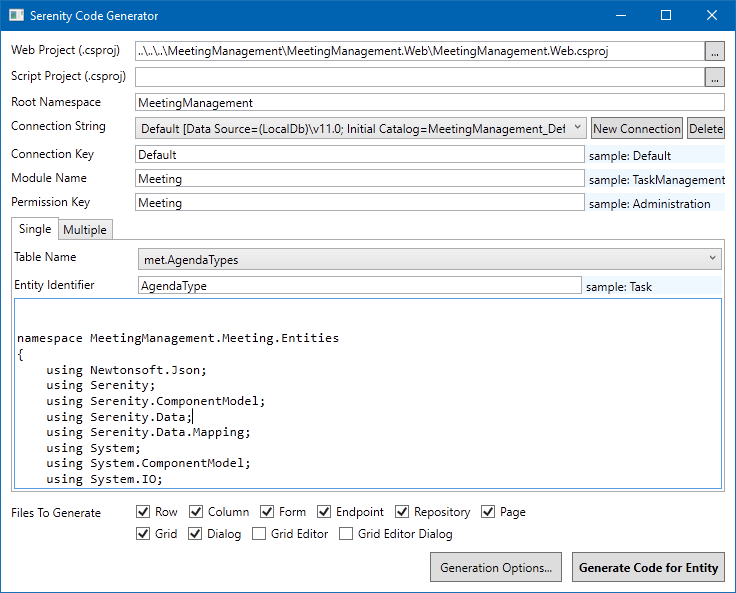
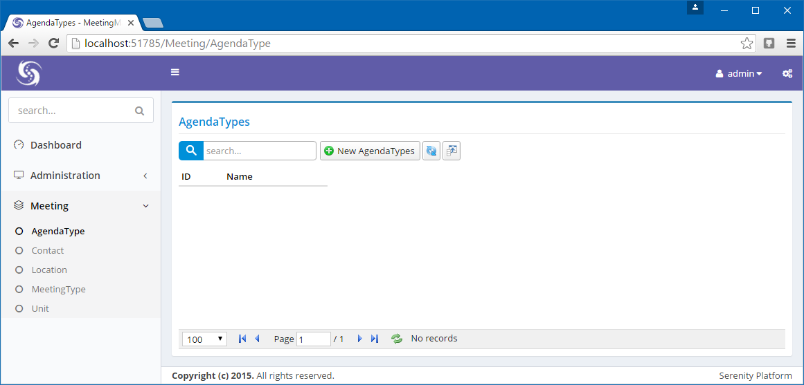

# Creating Lookup Tables

Let's start by creating lookup tables we'll need.

Here is a list of these tables:

* Meeting Types (Board Meeting, Weekly Analytics, SCRUM Meeting, Annual Meeting, so on...)
* Locations (where meeting will be held, room numbers, address etc.)
* Agenda Types (what subject(s) an agenda is about, might be multiple)
* Units (which unit is organizing the meeting)
* Contacts (people which would attend meetings, reporters, managers etc.)

We'll use database schema *met* for tables.

Create a new migration under, *Modules/Common/Migrations/DefaultDB* with name *DefaultDB_20160709_232400_MeetingLookups*:

```cs
using FluentMigrator;

namespace MeetingManagement.Migrations.DefaultDB
{
    [Migration(20160709232400)]
    public class DefaultDB_20160709_232400_MeetingLookups 
        : AutoReversingMigration
    {
        public override void Up()
        {
            Create.Schema("met");
            
            Create.Table("AgendaTypes").InSchema("met")
                .WithColumn("AgendaTypeId").AsInt32()
                    .Identity().PrimaryKey().NotNullable()
                .WithColumn("Name").AsString(100).NotNullable();

            Create.Table("Contacts").InSchema("met")
                .WithColumn("ContactId").AsInt32()
                    .Identity().PrimaryKey().NotNullable()
                .WithColumn("Title").AsString(30).Nullable()
                .WithColumn("FirstName").AsString(50).NotNullable()
                .WithColumn("LastName").AsString(50).NotNullable()
                .WithColumn("Email").AsString(100).NotNullable();

            Create.Table("Locations").InSchema("met")
                .WithColumn("LocationId").AsInt32()
                    .Identity().PrimaryKey().NotNullable()
                .WithColumn("Name").AsString(100).NotNullable()
                .WithColumn("Address").AsString(300).Nullable()
                .WithColumn("Latitude").AsDouble()
                .WithColumn("Longitude").AsDouble();

            Create.Table("MeetingTypes").InSchema("met")
                .WithColumn("MeetingTypeId").AsInt32()
                    .Identity().PrimaryKey().NotNullable()
                .WithColumn("Name").AsString(100).NotNullable();

            Create.Table("Units").InSchema("met")
                .WithColumn("UnitId").AsInt32()
                    .Identity().PrimaryKey().NotNullable()
                .WithColumn("Name").AsString(100).NotNullable();
        }
    }
}
```


### Generating Code for Lookup Tables

Our module name will be *Meetings*. We should use non-plural entity identifiers for generated code:

* AgendaTypes => AgendaType
* Contacts => Contact
* Locations => Location
* MeetingTypes => MeetingType
* Units => Unit

Generate code for these 5 tables using the entity identifiers given above:



Generated interface for these tables is fine enough. Just need to do a few cosmetic touches.



### Moving Navigation Links to NavigationItems.cs

Open *AgendaTypePage.cs*, *ContactPage.cs*, *LocationPage.cs*, *MeetingTypePage.cs* and *UnitPage.cs* files and move navigation links at top of them to *NavigationItems.cs*:

```cs
using Serenity.Navigation;
using Administration = MeetingManagement.Administration.Pages;
using Meeting = MeetingManagement.Meeting.Pages;

[assembly: NavigationLink(1000, "Dashboard", 
    url: "~/", permission: "", icon: "icon-speedometer")]

[assembly: NavigationMenu(2000, "Meeting")]
[assembly: NavigationLink(2500, "Meeting/Agenda Types", 
    typeof(Meeting.AgendaTypeController))]
[assembly: NavigationLink(2600, "Meeting/Contacts", 
    typeof(Meeting.ContactController))]
[assembly: NavigationLink(2700, "Meeting/Locations", 
    typeof(Meeting.LocationController))]
[assembly: NavigationLink(2800, "Meeting/Meeting Types", 
    typeof(Meeting.MeetingTypeController))]
[assembly: NavigationLink(2900, "Meeting/Units", 
    typeof(Meeting.UnitController))]
```


### Setting DisplayName and InstanceName Attributes of Lookup Tables

Open *AgendaTypeRow.cs*, *ContactRow.cs*, *LocationRow.cs*, *MeetingTypeRow.cs* and *UnitRow.cs* files and change *DisplayName* and *InstanceName* attributes like below:

* AgendaTypeRow => "Agenda Types", "Agenda Type"
* ContactRow => "Contacts", "Contact"
* LocationRow => "Locations", "Location"
* MeetingTypeRow => "Meeting Types", "Meeting Type"
* UnitRow => "Units", "Unit"

```cs
[ConnectionKey("Default"), TwoLevelCached,
 DisplayName("Agenda Types"), InstanceName("Agenda Type")]
[ReadPermission("Meeting")]
[ModifyPermission("Meeting")]
public sealed class AgendaTypeRow : Row, IIdRow, INameRow
{
```


 