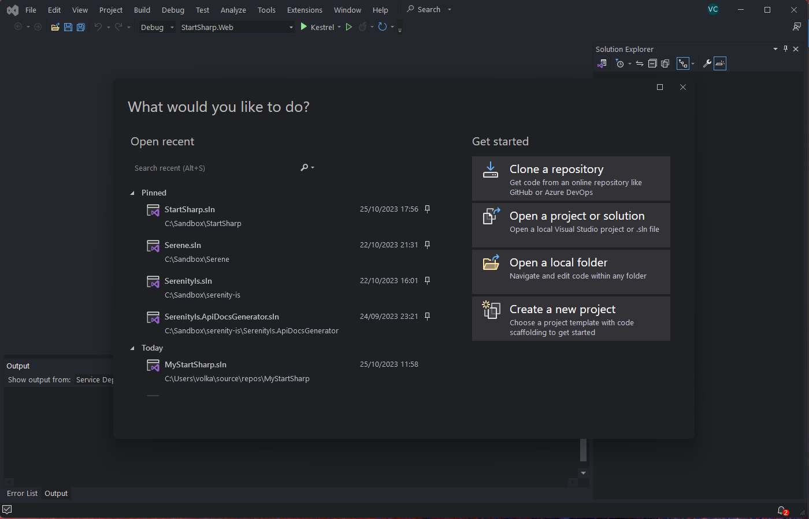

# Tutorial: Movie Database

This tutorial will guide you through the process of creating an editing interface for a website that resembles IMDB.

> Before we begin, please ensure that you have the necessary prerequisites. Refer to the [Getting Started](../../getting_started/README.md) section for more information.

## Creating a New Project Named "MovieTutorial"

To initiate a new project, launch Visual Studio and click on "Create a New Project" from the welcome screen.

If you are already in the Integrated Development Environment (IDE) and not on the welcome screen, close the current solution by selecting "File -> Close Solution," then choose "File -> New Project."

In the "Create a New Project" dialog, type "Serene" into the search input:

Select the "Serene" template and click the "Next" button located at the bottom right.

Within the "Configure your new project" dialog, input "MovieTutorial" as the project name and click the "Next" button once more.

An "Additional information" dialog will appear. This is where you can choose to exclude some demo modules, but for now, leave them as they are and click the "Create" button to proceed.

In the Solution Explorer, you should now see a project named "MovieTutorial.Web."

MovieTutorial.Web is an ASP.NET Core project that contains server-side code as well as static resources like CSS files, images, and more. It also includes a tsconfig.json file at the root, indicating that it is a TypeScript project.