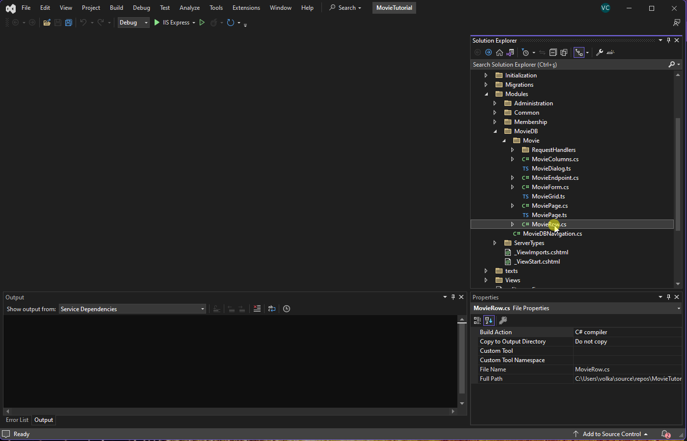
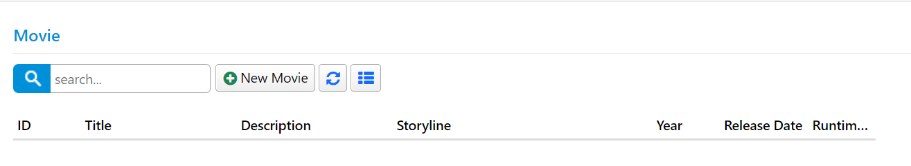
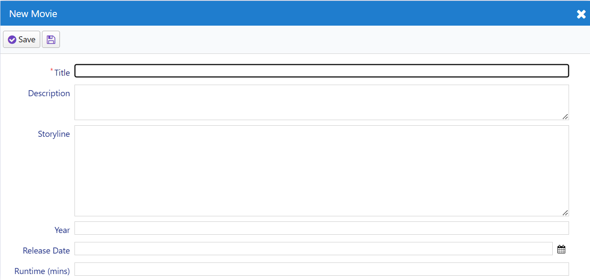
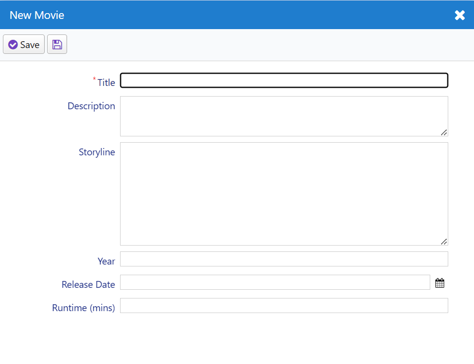

# Customizing Movie UI



## Customizing Field Captions

In our movie grid and form, there is a field named "Runtime." This field expects an integer number in minutes, but its title doesn't indicate this. Let's change its title to "Runtime (mins)."

You can make this change by updating the entity itself, ensuring that its title changes everywhere. When Sergen generated code for the Movie table, it created an entity class named MovieRow. You can find it in the "Modules/MovieDB/Movie" directory.

Here's an excerpt from the source code of MovieRow, including our Runtime property:

```cs
//...
public sealed class MovieRow : Row<MovieRow.RowFields>, IIdRow, INameRow
{
    //...
    
    [DisplayName("Runtime")]
    public int? Runtime { get => fields.Runtime[this]; set => fields.Runtime[this] = value; }
    
    //...
}
```

To change the title, update the `[DisplayName]` attribute value to "Runtime (mins)":

```cs
//...
public sealed class MovieRow : Row<MovieRow.RowFields>, IIdRow, INameRow
{
    //...
    
    [DisplayName("Runtime (mins)")]
    public int? Runtime { get => fields.Runtime[this]; set => fields.Runtime[this] = value; }
    
    //...
}
```

After making this change, rebuild the solution and run the application. You will notice that the field title is updated in both the grid and the dialog.



## Overriding Column Title and Width

If you want to display a different title in the grid (columns) or dialog (form), you can override it in the corresponding definition file. You can modify columns by updating the `MovieColumns.cs` file, which is located next to `MovieRow.cs`:

```cs
namespace MovieTutorial.MovieDB.Columns;

[ColumnsScript("MovieDB.Movie")]
[BasedOnRow(typeof(MovieRow), CheckNames = true)]
public class MovieColumns
{
    //...

    public int Runtime { get; set; }
}
```

This column definition is based on the `MovieRow` entity, and any attributes you add to properties here will override attributes defined in the entity class. Let's add a `[DisplayName]` attribute to the `Runtime` property and also set the column width and alignment:

```cs
namespace MovieTutorial.MovieDB.Columns;

[ColumnsScript("MovieDB.Movie")]
[BasedOnRow(typeof(MovieRow), CheckNames = true)]
public class MovieColumns
{
    //...

    [DisplayName("Runtime in Minutes"), Width(150), AlignRight]
    public int Runtime { get; set; }
}
```

After making these changes, rebuild and run the application. You'll see that the column title is updated, and the width and alignment are adjusted.


If you wanted to override the form field title, you could follow similar steps in the `MovieForm.cs` file.

## Changing Editor Type for Description and Storyline

To change the editor type for the Description and Storyline fields to a textarea, open the `MovieForm.cs` file, which is located in the same folder as `MovieColumns.cs` and `MovieRow.cs`:

```cs
//...
[FormScript("MovieDB.Movie")]
[BasedOnRow(typeof(MovieRow), CheckNames = true)]
public class MovieForm
{
    public string Title { get; set; }
    public string Description { get; set; }
    public string Storyline { get; set; }
    //...
}
```

Add the `[TextAreaEditor]` attribute to both the `Description` and `Storyline` properties, specifying the number of rows for each:

```cs
//...
[FormScript("MovieDB.Movie")]
[BasedOnRow(typeof(MovieRow), CheckNames = true)]
public class MovieForm
{
    public string Title { get; set; }
    [TextAreaEditor(Rows = 3)]
    public string Description { get; set; }
    [TextAreaEditor(Rows = 8)]
    public string Storyline { get; set; }
    //...
}
```

Rebuild and run the application. You'll see that the Description and Storyline fields are now displayed as textareas with the specified number of rows.



Serenity provides various editor types, and some are automatically selected based on the field data type, while others need to be set explicitly.

## Setting Initial Dialog Size With CSS

To adjust the size of the Movie dialog, you can add CSS rules to the `MovieTutorial.Web/wwwroot/Content/site/site.css` file:

```css
.s-MovieDB-MovieDialog > .size {
  width: 650px;
  height: 550px;
}

.s-MovieDB-MovieDialog .caption {
  width: 150px;
}
```

These rules apply to elements with the class `s-MovieDB-MovieDialog`, which is automatically generated as "s-" + ModuleName + "-" + ClassName. The first rule specifies the default width and height for the dialog, while the second rule sets the width for field labels.

Rebuild the application, and when you refresh the browser, you will immediately see the effects of the CSS changes.



Serenity dialogs are responsive by default. Even though we set a specific height and width for the desktop mode, the dialog will adjust its size in response to the device's screen size, eliminating the need for CSS `@media` queries.

## Changing Page Title

The page currently has the title "Movie." Let's update it to "Movies," which is a more natural title. Open the `MovieRow.cs` file again and change the `[DisplayName]` attribute value on top of the row class to "Movies":

```cs
// ...
[DisplayName("Movies"), InstanceName("Movie")]
public sealed class MovieRow : Row<MovieRow.RowFields>, IIdRow, INameRow
{
```

This change affects how the table is referenced and sets the default page title.

The `InstanceName` corresponds to the singular name and is used for buttons like "New Movie" (Add) and determines the dialog title (e.g., "Edit Movie").