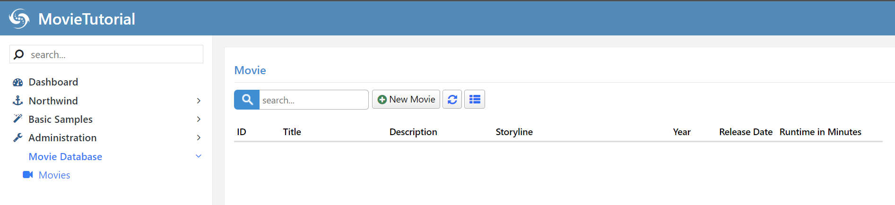
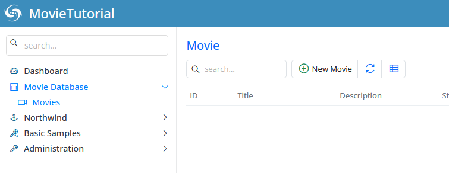
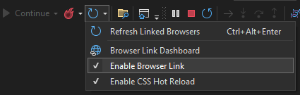

# Handling Movie Navigation

When Sergen generated code for the Movie table, it also created a navigation item entry. In Serene, navigation items are created using special assembly attributes.

<video alt="Handling Movie Navigation Animation" controls>
  <source src="img/04-handling-movie-navigation.mp4" type="video/mp4">
</video>

Open the `MovieDBNavigation.cs` file in the `MovieDB` module folder. You'll find this line in the file:

```cs
[assembly: NavigationLink(int.MaxValue, "MovieDB/Movie", 
    typeof(MyPages.MoviePage), icon: null)]
```

The first argument to this attribute is the display order for this navigation item (`int.MaxValue`). Since we currently have only one navigation item in the `Movie` section, we don't need to worry about ordering for now.

The second parameter is the navigation title in the format `Section Title/Link Title`, with a slash (`/`) separating the section and navigation items.

Let's change it to `Movie Database/Movies` and set the icon to `fa-video-camera`:

```cs
[assembly: NavigationLink(int.MaxValue, "Movie Database/Movies", 
    typeof(MyPages.MoviePage), icon: "fa-video-camera")]
```



The Serene and StartSharp template includes Line Awesome, which is a modern alternative to Font Awesome. You can find a comprehensive list of icons and their corresponding CSS classes on [this page](https://demo.serenity.is/Serenity.Demo.AdvancedSamples/UIElements/Icons).

## Ordering Navigation Sections

By default, the `Movie Database` menu, which is auto-generated, has `int.MaxValue` as the order, which is calculated from the lowest order of its children. This places it at the bottom of the left navigation menu.

To move it above the `Northwind` menu, which has an order value of `7000` (as seen in the Northwind menu definition [here](https://github.com/serenity-is/common-features/blob/master/src/Serenity.Demo.Northwind/Modules/Shared/NorthwindNavigation.cs)), we can use an order value lower than `7000`, such as `6000`. This new order value will place our `Movie Database` menu before the `Northwind` menu:

```cs
[assembly: NavigationMenu(6000, "Movie Database", icon: "fa-film")]
[assembly: NavigationLink(6100, "Movie Database/Movies", 
    typeof(MyPages.MoviePage), icon: "fa-video-camera")]
```

In this update, we've defined a navigation menu, `Movie Database`, with the `fa-film` icon. Without an explicitly defined navigation menu, Serenity generates one implicitly, but in such cases, you can't set the menu order or icon yourself.

We've set the display order of the `Movie Database/Movies` link to `6100`. However, this value doesn't have an impact right now since there's only one navigation item under the `Movie Database` menu. The display order for sub-items only matters when ordering items among their siblings. Even if we assigned a value of `1` to the `Movies` link, it wouldn't move it above the `Dashboard` link, as the parent menu, `Movie Database`, has an order of `6000`.

After making these changes, the navigation menu will look like this:



## Troubleshooting Some Issues with Visual Studio

While your application is running, Visual Studio may not allow you to modify code. If you stop debugging, the browser window may also close.

While there is a `Hot Reload` feature, it might not always reflect your changes, especially when you modify attributes or other critical parts.

To address these issues, you can start your application without debugging by using `Ctrl+F5`. This enables you to modify TypeScript code while your application is running and see the changes instantly, thanks to the `watch` feature, which is enabled by default for Serenity applications in development mode.

However, if you modify CSHTML or CS files, you will need to rerun the application with Ctrl+F5.

Additionally, you might notice a top blue progress bar on your site that appears to keep running as if it's still loading something. This behavior is due to the `Browser Link` feature in Visual Studio. To disable it, locate the button in the Visual Studio toolbar that resembles a refresh icon (next to the play icon with the browser name like Chrome), click the dropdown, and uncheck the "Enable Browser Link" option.

