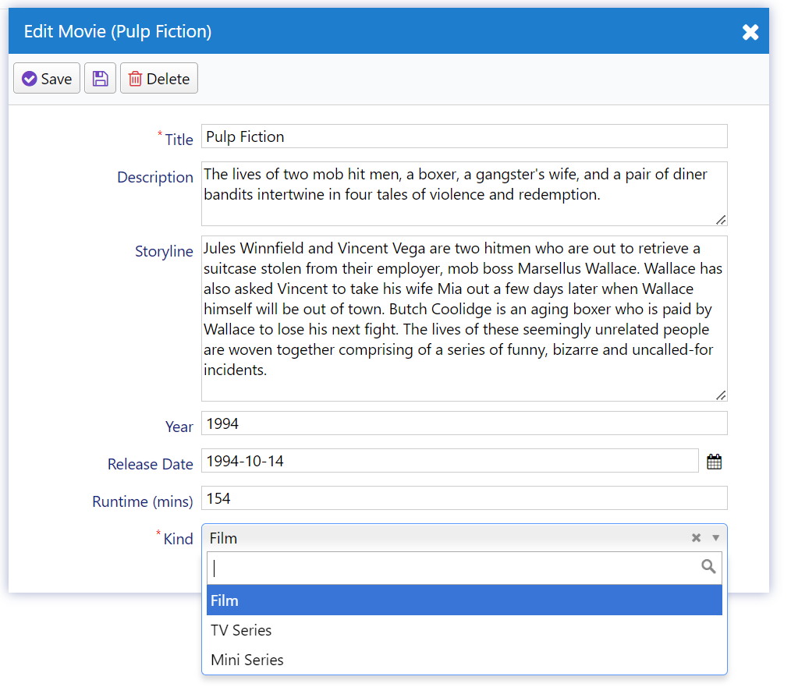

# Adding a Movie Kind Field

To include TV series and mini-series in your movie database, you'll need to add a new field called "MovieKind." Since we didn't include it during the initial table creation, we'll create a new migration to add it to our database.

<video alt="Adding a Movie Kind Field Animation" controls>
  <source src="img/06-adding-movie-kind-field.mp4" type="video/mp4">
</video>

**Note:** Do not modify existing migrations, as they will not run again.

1. Create a new migration file under *Migrations/DefaultDB/DefaultDB_20221114_1825_MovieKind.cs*:

    ```csharp
    using FluentMigrator;

    namespace MovieTutorial.Migrations.DefaultDB;
   
    [DefaultDB, MigrationKey(20221114_1825)]
    public class DefaultDB_20221114_1825_MovieKind : AutoReversingMigration
    {
        public override void Up()
        {
            Alter.Table("Movie")
                .AddColumn("Kind").AsInt32().NotNullable().WithDefaultValue(1);
        }
    }
    ```

2. Declare a `MovieKind` enumeration that defines the types of movies. You can create this enumeration in *Modules/MovieDB/Movie/MovieKind.cs*:

    ```csharp
    namespace MovieTutorial.MovieDB;

    [EnumKey("MovieDB.MovieKind")]
    public enum MovieKind
    {
        [Description("Film")]
        Film = 1,
        [Description("TV Series")]
        TvSeries = 2,
        [Description("Mini Series")]
        MiniSeries = 3
    }
    ```

3. Add the `Kind` field to the `MovieRow` entity class. Manually add the `Kind` property to your `MovieRow.cs` after the `Runtime` property:

   ```csharp
   [DisplayName("Runtime (mins)")]
   public int? Runtime { get => fields.Runtime[this]; set => fields.Runtime[this] = value; }

   [DisplayName("Kind"), NotNull]
   public MovieKind? Kind { get => fields.Kind[this]; set => fields.Kind[this] = value; }
   ```

4. In the `RowFields` class within the same `MovieRow.cs` file, add the `Kind` field after the `Runtime` field:

   ```csharp
   public class RowFields : RowFieldsBase
   {
       // ...
       public Int32Field Runtime;
       public EnumField<MovieKind> Kind;
   }
   ```

5. To make the `Kind` field available in the movie form, you need to modify the `MovieForm.cs` file:

    ```csharp
    // ...
    public class MovieForm
    {
        // ...
        public int Runtime { get; set; }
        public MovieKind Kind { get; set; }
    }
    ```

6. To make the `Kind` field available in the movie grid, you need to modify the `MovieColumns.cs` file:

    ```csharp
    // ...
    public class MovieColumns
    {
        // ...
        public int Runtime { get; set; }
        public MovieKind Kind { get; set; }
    }
    ```

7. Rebuild your solution to ensure there are no build errors and run your application. Now, in the "Add Movie" dialog, you'll have a dropdown to select the movie kind.



8. Since "Kind" is a required field, you need to provide a default value in the "Add Movie" dialog to avoid validation errors. Most movies will likely be feature films, so let's set "Film" as the default value for the "Kind" property. To add a default value for the "Kind" property, modify the `MovieRow.cs` file by adding a `DefaultValue` attribute like this:

   ```csharp
   [DisplayName("Kind"), NotNull, DefaultValue(MovieKind.Film)]
   public MovieKind? Kind { get => fields.Kind[this]; set => fields.Kind[this] = value; }
   ```

Now, when you open the "Add Movie" dialog, the "Kind" field will be pre-filled with "Film".

