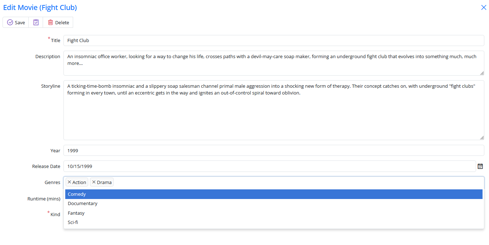
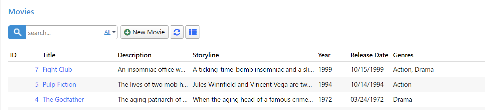

# Supporting Multiple Genres per Movie

As your requirements evolve, you might find the need to allow the selection of multiple genres for a single movie. To achieve this, you'll require a many-to-many (M-N) mapping table that can associate movies with multiple genres.

<video alt="Multiple Genres per Movie Animation" controls>
  <source src="img/08-multiple-genres-per-movie.mp4" type="video/mp4">
</video>

Let's begin by creating a migration to set up the `MovieGenres` table. Create a new migration file, `Migrations/DefaultDB/DefaultDB_20221115_1405_MovieGenres.cs`, and include the following content:

```csharp
using FluentMigrator;

namespace MovieTutorial.Migrations.DefaultDB;

[DefaultDB, MigrationKey(20221115_1405)]
public class DefaultDB_20221115_1405_MovieGenres : ForwardOnlyMigration
{
    public override void Up()
    {
        Create.Table("MovieGenres")
            .WithColumn("MovieGenreId").AsInt32()
                .Identity().PrimaryKey().NotNullable()
            .WithColumn("MovieId").AsInt32().NotNullable()
                .ForeignKey("FK_MovieGenres_MovieId", "Movie", "MovieId")
            .WithColumn("GenreId").AsInt32().NotNullable()
                .ForeignKey("FK_MovieGenres_GenreId", "Genre", "GenreId");

        Execute.Sql(
            @"INSERT INTO MovieGenres (MovieId, GenreId) 
                SELECT m.MovieId, m.GenreId 
                FROM Movie m 
                WHERE m.GenreId IS NOT NULL");

        Delete.ForeignKey("FK_Movie_GenreId")
            .OnTable("Movie");
        Delete.Column("GenreId")
            .FromTable("Movie");
    }
}
```

In this migration, we create the `MovieGenres` table with columns `MovieGenreId`, `MovieId`, and `GenreId`. We also insert existing genre information from the `Movie` table into this new table. Finally, we delete the `GenreId` column and its associated foreign key constraint from the `Movie` table.

## Removing Single Genre-Related Mappings from the Codebase

After executing the migration, you'll need to eliminate references to the `GenreId` and `GenreName` properties from the codebase.

Remove the `GenreId` and `GenreName` properties along with their related field objects from `MovieRow.cs`:

```csharp
[DisplayName("Genre"), ForeignKey(typeof(GenreRow)), LeftJoin(jGenre)]
[LookupEditor(typeof(GenreRow), InplaceAdd = true)]
public int? GenreId { get => fields.GenreId[this]; set => fields.GenreId[this] = value; }

[DisplayName("Genre"), Expression($"{jGenre}.Name")]
public string GenreName { get => fields.GenreName[this]; set => fields.GenreName[this]; }

Int32Field GenreId;
StringField GenreName;
```

Remove the `GenreName` property from `MovieColumns.cs`:

```csharp
[Width(100), QuickFilter]
public string GenreName { get; set; }
```

Remove the `GenreId` property from `MovieForm.cs`:

```csharp
public int GenreId { get; set; }
```

After removing these properties, rebuild your project, and you'll have a functional "Movies" page, albeit without the ability to select multiple genres yet.

## Generating Code for the MovieGenres Table

To handle the many-to-many relationship between movies and genres, we need to generate code for the `MovieGenres` table. Run the Serene code generation process for the `MovieGenres` table with the following parameters:

- Connection Key: **Default**
- Table Name: **dbo.MovieGenres**
- Module Name: **MovieDB**
- Class Identifier: **MovieGenres**
- Permission Key: **Administration:General**
- What to Generate: **Row & Services**

## Adding the GenreList Field

Now that a movie can have multiple genres, the way genre information is stored needs to change. Instead of a single integer property, we'll use a list of integers, specifically `List<int>`. Add the `GenreList` property to the `MovieRow.cs` file:

```csharp
//...
[DisplayName("Genres"), LookupEditor(typeof(GenreRow), Multiple = true), NotMapped]
[LinkingSetRelation(typeof(MovieGenresRow), nameof(MovieGenresRow.MovieId), nameof(MovieGenresRow.GenreId))]
public List<int> GenreList { get => fields.GenreList[this]; set => fields.GenreList[this] = value; }

public class RowFields : RowFieldsBase
{
    //...
    public ListField<int> GenreList;
}
```

The `GenreList` property has a `[LookupEditor]` attribute similar to the previous `GenreId` property but with the added argument `Multiple = true` to enable multiple genre selection. We also use the `[NotMapped]` attribute because there's no corresponding `GenreList` column in the database. This informs Serenity that this property should not be mapped to a database column.

We also add a `[LinkingSetRelation]` attribute to specify the many-to-many relationship between movies and genres:

```csharp
[LinkingSetRelation(typeof(MovieGenresRow), nameof(MovieGenresRow.MovieId), nameof(MovieGenresRow.GenreId))]
```

- The first argument specifies the type of the many-to-many mapping row, which is `MovieGenresRow` in this case.
- The second argument specifies the property name of the field in the many-to-many mapping row (`MovieGenresRow`) that matches the `MovieId` property in the current row.
- The third argument specifies the property name of the field in the many-to-many mapping row (`MovieGenresRow`) that links multiple genres by their IDs, which corresponds to the `GenreId` property.

The `[LinkingSetRelation]` attribute is crucial for managing this many-to-many relationship.

## Adding GenreList to the Form

Next, modify the `MovieForm.cs` file to include the `GenreList` property:

```csharp
public class MovieForm
{
    //...
    public List<int> GenreList { get; set; }
}
```

Now, you can add multiple genres to a movie using the modified form:



## Displaying Selected Genres in a Column

In the past, when we only had one genre per movie, displaying the selected genre in a column was straightforward – we could achieve this by adding a view field to `MovieRow.cs`. However, this time around, it won't be as simple.

Let's begin by adding the `GenreList` property to `MovieColumns.cs`:

```csharp
public class MovieColumns
{
    // ...
    [Width(200)]
    public List<int> GenreList { get; set; }
}
```

With this addition, the `GenreList` column now contains a list of integer values, which can be thought of as an array in JavaScript. Fortunately, in JavaScript, the `.toString()` method for an array returns items separated by commas. So, for example, for the movie *Fight Club*, we would have *"1,2"*.

However, it would be more informative to have genre names instead of genre IDs

. Therefore, we need to format these values by converting the Genre IDs into their corresponding Genre names.

## Creating the `GenreListFormatter` Class

It's time to create a SlickGrid column formatter. To do this, create a file named `GenreListFormatter.ts` next to `MovieGrid.ts`:

```typescript
import { Decorators, Formatter, Lookup } from "@serenity-is/corelib";
import { FormatterContext } from "@serenity-is/sleekgrid";
import { GenreRow } from "@/ServerTypes/MovieDB/GenreRow";

let lookup: Lookup<GenreRow>;
let promise: Promise<Lookup<GenreRow>>;

@Decorators.registerFormatter('MovieTutorial.GenreListFormatter')
export class GenreListFormatter implements Formatter {

    format(ctx: FormatterContext) {

        let idList = ctx.value as string[];
        if (!idList || !idList.length)
            return "";

        let byId = lookup?.itemById;
        if (byId) {
            return idList.map(x => {
                var z = byId[x];
                return ctx.escape(z == null ? x : z.Name);
            }).join(", ");
        }

        promise ??= GenreRow.getLookupAsync().then(l => {
            lookup = l;
            try {
                ctx.grid?.invalidate();
            }
            finally {
                lookup = null;
                promise = null;
            }
        }).catch(() => promise = null);

        return `<i class="fa fa-spinner"></i>`;
    }
}
```

Here, we introduce a new formatter, *GenreListFormatter*, and register it with the Serenity type system using the *@Decorators.registerFormatter* decorator. These decorators serve a purpose similar to .NET attributes.

All formatters must implement the Formatter interface, which includes a *format* method that accepts a *ctx* parameter of type *FormatterContext*.

The *ctx* parameter, representing the formatting context, is an object with several members. One of its key properties is *value*, which holds the column value for the current grid row/column being formatted.

Since we know that this formatter will be applied to a column with a `List<int>` value, we begin by casting the value to a *number[]*.

> Note: In JavaScript, there is no Int32 type. Types like Int32, Double, Single in .NET correspond to the number type in JavaScript. Additionally, the generic *`List<>`* type in C# maps to an array in JavaScript.

If the array is either empty or null, it's safe to return an empty string:

```typescript
let idList = ctx.value as number[];
if (!idList || !idList.length)
    return "";
```

Next, we check if we already have a reference to the Genre lookup and its `itemById` property. For this example, we load the Genre lookup asynchronously to avoid blocking the browser UI thread. Once we load the lookup for the first time, we set it in the `lookup` variable, preventing the need to reload it with each render.

```typescript
let byId = lookup?.itemById;
if (byId) {
```

If the lookup is already loaded, it contains a dictionary of *Genre* rows in its *itemById* property:

We proceed to map the ID values in our *idList* to their corresponding Genre names using the *Array.map* function in JavaScript. This operation is akin to a LINQ Select statement:

```typescript
return idList.map(x => {
    var z = byId[x];
    return ctx.escape(z == null ? x : z.Name);
}).join(", ");
```

If we can find the genre row corresponding to a specific ID, we return its Name value. We also ensure that the genre name is HTML encoded in case it contains invalid HTML characters like `<`, `>`, or `&`. For this encoding, we make use of the ctx.escape function.

If the lookup is not yet available, we verify if there is an existing asynchronous call in progress to load the lookup and create a promise if not by calling the `getLookupAsync` method:

```typescript
promise ??= GenreRow.getLookupAsync().then(l => {
```

This way we avoid multiple successive calls to getLookupAsync as this formatter is called for every cell in the `GenderList` of the grid. 

Once the promise completes, we set the lookup variable and trigger a grid re-render:

```typescript
lookup = l;
try {
    ctx.grid?.invalidate();
}
```

After re-rendering is complete we set the promise and lookup variables to null.

```typescript
finally {
    lookup = null;
    promise = null;
}
}).catch(() => promise = null);
```

While loading is in progress, we return a spinner icon from the formatter:

```typescript
return `<i class="fa fa-spinner"></i>`;
```

## Applying GenreListFormatter to the GenreList Column

Now that we've defined a new formatter class, we need to rebuild the project so that we can reference *GenreListFormatter* in server-side code.

After building and transforming, open the `MovieColumns.cs` file and attach this formatter to the `GenreList` property:

```csharp
public class MovieColumns
{
    //...
    [Width(200), GenreListFormatter]
    public List<int> GenreList { get; set; }
}
```

With this configuration, you will see Genre names displayed in the Genre column:

