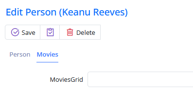
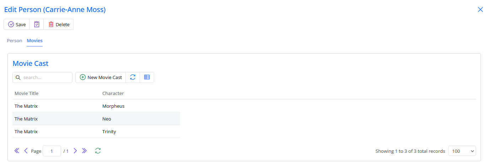
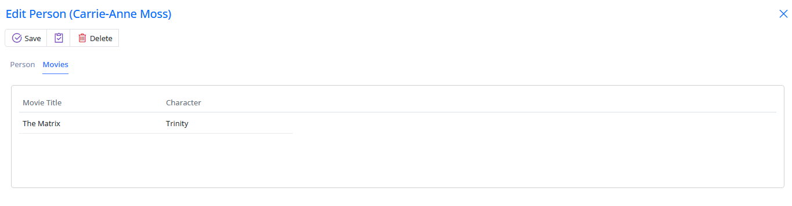

# Listing Movies in Person Dialog

To display a list of movies that a person has acted in, we'll add a tab to the `PersonDialog`.

<video alt="Listing Movies in Person Dialog Animation" controls>
  <source src="img/11-listing-movies-in-person-dialog.mp4" type="video/mp4">
</video>

Serenity supports defining tabs in the form script.

Edit the `PersonForm.cs` file to include a `MoviesGrid` property and two new tabs:

```cs
//...
public class PersonForm
{
    [Tab("Person")]
    public string FirstName { get; set; }
    public string LastName { get; set; }
    public DateTime BirthDate { get; set; }
    public string BirthPlace { get; set; }
    public Gender Gender { get; set; }
    public int Height { get; set; }

    [Tab("Movies"), IgnoreName]
    public string MoviesGrid { get; set; }
}
```

Serenity will open a tab named "Person" and add the properties until it encounters another tab or reaches the end of the properties. It creates the tabs in order, so be careful where you place properties. Don't forget to include the `IgnoreName` attribute since `MoviesGrid` is not a property in `PersonRow`.

Now, we have tabs in the `PersonDialog`:



### Creating the PersonMovieGrid

For now, `MoviesGrid` contains a `StringEditor`. We need to define a grid with suitable columns and place it in that tab.

First, declare the columns we'll use with the grid in the file `PersonMovieColumns.cs`, which should be located next to `PersonColumns.cs`:

```cs
namespace MovieTutorial.MovieDB.Columns;

[ColumnsScript]
[BasedOnRow(typeof(MovieCastRow))]
public class PersonMovieColumns
{
    [Width(220)]
    public string MovieTitle { get; set; }
    [Width(200)]
    public string Character { get; set; }
}
```

Rebuild and define a `PersonMovieGrid` class in the file `PersonMovieGrid.ts`, which should be located next to `PersonGrid.ts`:

```ts
import { Decorators, EntityGrid } from "@serenity-is/corelib";
import { MovieCastRow, MovieCastService } from "../../ServerTypes/MovieDB";

@Decorators.registerEditor("MovieTutorial.MovieDB.PersonMovieGrid")
export class PersonMovieGrid extends EntityGrid<MovieCastRow, any>
{
    protected getColumnsKey() { return PersonMovieColumns.columnsKey; }
    protected getRowDefinition() { return MovieCastRow; }
    protected getService() { return MovieCastService.baseUrl; }

    constructor(container: JQuery) {
        super(container);
    }
}
```

We are registering this grid as an editor, so `sergen` will generate an attribute for this grid after we rebuild.

Open `PersonForm.cs` and set `PersonMovieGrid` as the editor for the `MoviesGrid` property. Don't forget to rebuild your project first so that the attribute for `PersonMovieGrid` is generated by `sergen`.

```cs
//...
public class PersonForm
{
    //...
    [Tab("Movies"), IgnoreName, PersonMovieGrid]
    public string MoviesGrid { get; set; }
}
```

We'll actually use the `MovieCast` service to list movies a person has acted in.

Now, we can see the list of movies in the "Movies" tab, but we need to address some issues:


### Removing the Label from MoviesGrid

We need to get rid of the label that the movie grid has. Serenity has a `LabelWidth` attribute to adjust the label width of properties.

Edit `PersonForm.cs`:

```cs
namespace MovieTutorial.MovieDB.Forms
{
    //...
    public class PersonForm
    {
        //...
        [Tab("Movies"), IgnoreName, PersonMovieGrid, LabelWidth("0")]
        public string MoviesGrid { get; set; }
    }
}
```

As you can see, we set "0" as a string. Serenity hides the caption if it sees "0" as a string.

> Check out [this](../../attributes/attributes.md) for more attributes you can use.

We hide the label, so now we only have the grid on this tab. However, the grid still has some problems.



### Filtering Movies for the Person

No, Carrie-Anne Moss didn't act in three roles. This grid is showing all movie cast records for now, as we haven't specified the filter it should apply yet.

`PersonMovieGrid` should know the person it shows the movie cast records for. We need to add a `personId` property to this grid. This `personId` should be passed somehow to the list service for filtering.

```ts
import { Decorators, EntityGrid } from "@serenity-is/corelib";
import { MovieCastRow, MovieCastService } from "../../ServerTypes/MovieDB";

@Decorators.registerEditor("MovieTutorial.MovieDB.PersonMovieGrid")
export class PersonMovieGrid extends EntityGrid<MovieCastRow, any>
{
    protected getColumnsKey() { return PersonMovieColumns.columnsKey; }
    protected getRowDefinition() { return MovieCastRow; }
    protected getService() { return MovieCastService.baseUrl; }

    constructor(container: JQuery) {
        super(container);
    }

    protected getButtons() {
        return null;
    }

    protected getInitialTitle() {
        return null;
    }

    protected usePager() {
        return false;
    }

    protected getGridCanLoad() {
        return this.personId != null;
    }

    private _personId: number;

    get personId() {
        return this._personId;
    }

    set personId(value: number) {
        if (this._personId != value) {
            this._personId = value;
            this.setEquality(MovieCastRow.Fields.PersonId, value);
            this.refresh();
        }
    }
}
```

> We are using ES5 (EcmaScript 5) property (get/set) features, which are similar to C# properties.

We store the person ID in a private variable. When it changes, we also set an equality filter for the `PersonId` field using the `setEquality` method (which will be sent to the list service) and refresh to see changes.

> The equality filter is the list request parameter that is also used by quick filter items.

Overriding `getGridCanLoad` method allows us to control when the grid can call the list service. If we didn't override it, while creating a new person, the grid would load all movie cast records, as there is not a `personId` yet (it is null).

> List handler ignores an equality filter parameter if its value is null, just like when a quick filter dropdown is empty, all records are shown.

We also made three cosmetic changes by overriding three methods: first to remove all buttons from the toolbar (`getButtons`), second to remove the title from the grid (`getInitialTitle`) as the tab title is enough, and third to remove paging functionality (`usePager`), as a person can't have a million movies, right?

### Setting PersonId of PersonMovie

Grid in PersonDialog

If nobody sets the grid's `personId` property, it will always be null, and no records will be loaded. We should set it in the `afterLoadEntity` method of the `PersonDialog`:

```ts
//...
export class PersonDialog extends EntityDialog<PersonRow, any> {
    //...

    protected afterLoadEntity() {
        super.afterLoadEntity();

        this.form.MoviesGrid.personId = this.entityId;
    }
}
```

The `afterLoadEntity` method is called after an entity or a new entity is loaded into the dialog.

> Please note that the entity is loaded in a later phase, so it won't be available in the dialog constructor.

`this.entityId` refers to the identity value of the currently loaded entity. In new record mode, it is null.

> `afterLoadEntity` and `loadEntity` might be called several times during the dialog's lifetime, so avoid creating some child objects in these events; otherwise, you will have multiple instances of created objects. That's why we created the grid in the dialog constructor.



### Fixing Movies Tab Size

You might have noticed that when you switch to the "Movies" tab, the dialog gets a bit shorter in height. This happens because the dialog is set to auto height and grids are 200px by default. When you switch to the "Movies" tab, the form gets hidden, so the dialog adjusts to the movies grid's height.

Edit `site.css`:

```css
.s-MovieDB-PersonDialog .s-PersonMovieGrid > .grid-container {
    height: 186px;
}
```

