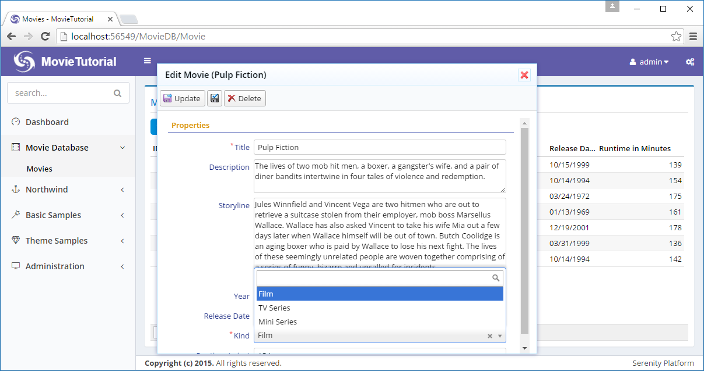

# Adding a Movie Kind Field

If we wanted to also keep TV series and mini series in our movie table, we would need another field to store it: *MovieKind*.

As we didn't add it while creating the Movie table, now we'll write another migration to add it to our database.

> Don't modify existing migrations, they won't run again.

Create another migration file under *Migrations/DefaultDB/ DefaultDB_20160519_145500_MovieKind.cs*:

```cs
using FluentMigrator;

namespace MovieTutorial.Migrations.DefaultDB
{
    [Migration(20160519145500)]
    public class DefaultDB_20160519_145500_MovieKind : Migration
    {
        public override void Up()
        {
            Alter.Table("Movie").InSchema("mov")
                .AddColumn("Kind").AsInt32().NotNullable()
                    .WithDefaultValue(1);
        }

        public override void Down()
        {
        }
    }
}
```


### Declaring a MovieKind Enumeration

Now as we added *Kind* column to *Movie* table, we need a set of movie kind values. Let's define it as an enumeration at *MovieTutorial.Web/Modules/MovieDB/Movie/MovieKind.cs*:

```cs
using Serenity.ComponentModel;
using System.ComponentModel;

namespace MovieTutorial.MovieDB
{
    [EnumKey("MovieDB.MovieKind")]
    public enum MovieKind
    {
        [Description("Film")]
        Film = 1,
        [Description("TV Series")]
        TvSeries = 2,
        [Description("Mini Series")]
        MiniSeries = 3
    }
}
```


### Adding Kind Field to MovieRow Entity

As we are not using Sergen anymore, we need to add a mapping in our MovieRow.cs for *Kind* column manually. Add following property declaration in MovieRow.cs after *Runtime* property:

```cs
[DisplayName("Runtime (mins)")]
public Int32? Runtime
{
    get => fields.Runtime[this];
    set => fields.Runtime[this] = value;
}

[DisplayName("Kind"), NotNull]
public MovieKind? Kind
{
    get => (MovieKind?)fields.Kind[this];
    set => fields.Kind[this] = (Int32?)value;
}
```

We also need to declare a Int32Field object which is required for Serenity entity system. On the bottom of MovieRow.cs locate *RowFields* class and modify it to add *Kind* field after the *Runtime* field:

```cs
public class RowFields : RowFieldsBase
{
    // ...
    public Int32Field Runtime;
    public Int32Field Kind;
}
```


### Adding Kind Selection To Our Movie Form

If we build and run our project now, we'll see that there is no change in the Movie form, even if we added *Kind* field mapping to the *MovieRow*. This is because, fields shown/edited in the form are controlled by declerations in *MovieForm.cs*. 

Modify *MovieForm.cs* as below:

```cs
namespace MovieTutorial.MovieDB.Forms
{
    // ...
    [FormScript("MovieDB.Movie")]
    [BasedOnRow(typeof(Entities.MovieRow), CheckNames = true)]
    public class MovieForm
    {
        // ...
        public Int32 Runtime { get; set; }
        public MovieKind Kind { get; set; }
    }
}
```

Now, build your solution and run it.

In some cases when you try to edit a movie or add a new one, nothing will happen. This is an expected situation. If you check developer tools console of your browser (F12, inspect element etc.) you'll see such an error:

```txt
Uncaught Can't find MovieTutorial.MovieDB.MovieKind enum type!
```

> You might not have this error with ASP.NET Core version as it auto transforms T4 on build.

 ### Please Note!

Whenever such a thing happens, e.g. some button not working, you got an empty page, grid etc, please first check > browser console for errors, before reporting it. 

### Why We Had This Error?

This error is caused by MoveKind enumeration not available client side. We should run our T4 templates before executing our program.

Rebuild your solution, make sure there are no build errors and execute it. Now we have a nice dropdown in our form to select movie kind.




### Declaring a Default Value for Movie Kind

As *Kind* is a required field, we need to fill it in *Add Movie* dialog, otherwise we'll get a validation error.

But most movies we'll store are feature films, so its default should be this value.

To add a default value for *Kind* property, add a *DefaultValue* attribute on _MoviesRow.cs_ like this:

```cs
[DisplayName("Kind"), NotNull, DefaultValue(MovieKind.Film)]
public MovieKind? Kind
{
    get => (MovieKind?)fields.Kind[this];
    set => fields.Kind[this] = (Int32?)value;
}
```

Now, in *Add Movie* dialog, *Kind* field will come prefilled as *Film*.