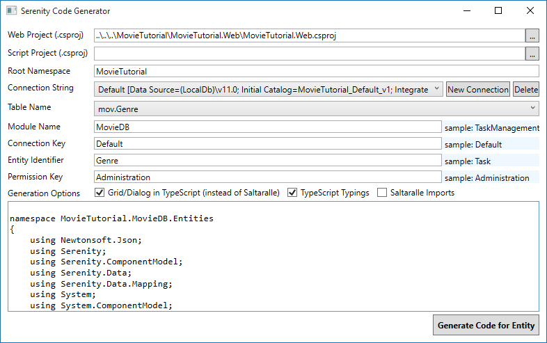
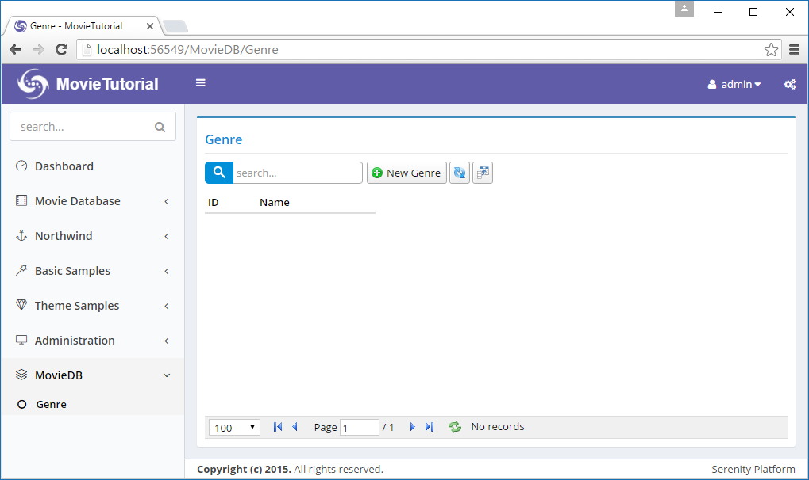
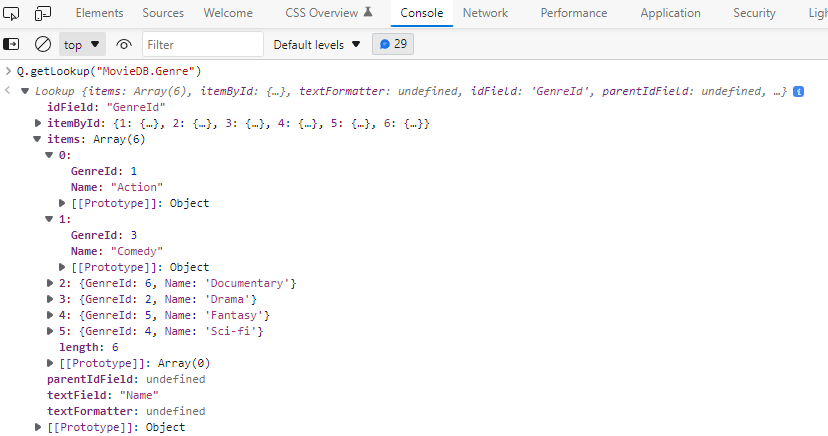
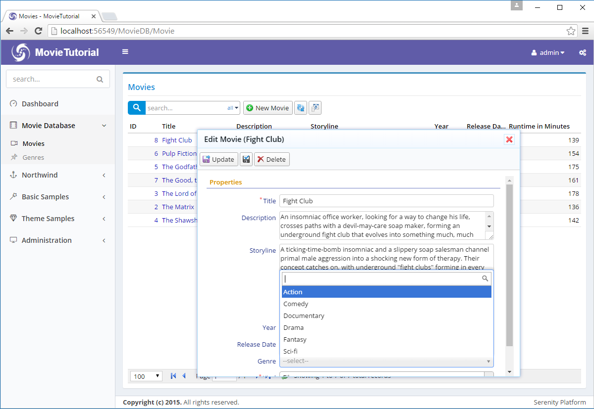
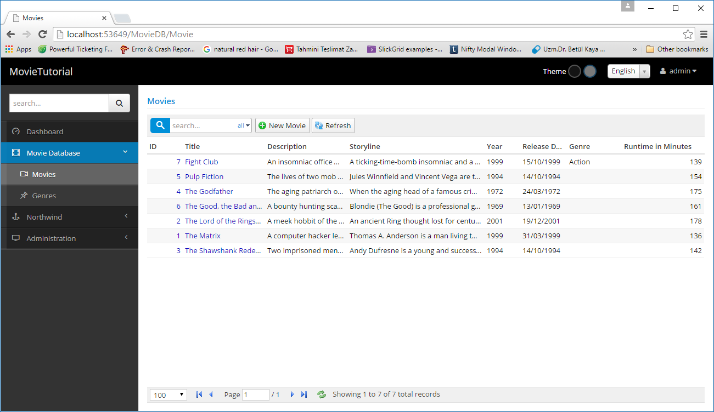
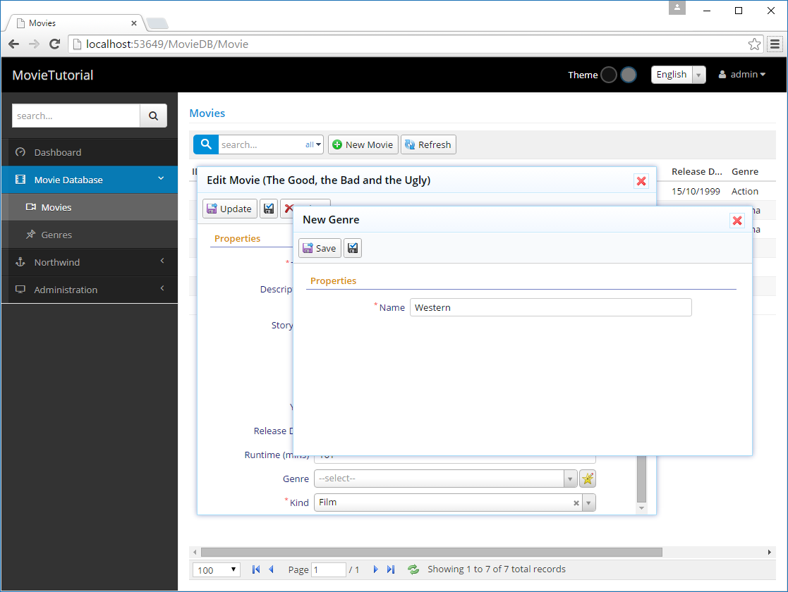
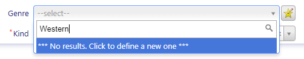

# Adding Movie Genres


### Adding Genre Field

To hold Movie genres we need a lookup table. For *Kind* field we used an enumeration but this time genres might not be that *static* to declare them as an enumeration.

As usual, we start with a migration.

*Modules/Common/Migrations/DefaultDB/ DefaultDB_20160519_154700_GenreTable.cs*:

```cs
using FluentMigrator;
using System;

namespace MovieTutorial.Migrations.DefaultDB
{
    [Migration(20160519154700)]
    public class DefaultDB_20160519_154700_GenreTable : Migration
    {
        public override void Up()
        {
            Create.Table("Genre").InSchema("mov")
                .WithColumn("GenreId").AsInt32().NotNullable()
                    .PrimaryKey().Identity()
                .WithColumn("Name").AsString(100).NotNullable();

            Alter.Table("Movie").InSchema("mov")
                .AddColumn("GenreId").AsInt32().Nullable()
                    .ForeignKey("FK_Movie_GenreId", "mov", "Genre", "GenreId");
        }

        public override void Down()
        {
        }
    }
}
```

We also added a *GenreId* field to *Movie* table.

> Actually a movie can have multiple genres so we should keep it in a separate *MovieGenres* table. But for now, we think it as single. We'll see how to change it to multiple later.


### Generating Code For Genre Table

Fire sergen.exe using Package Manager Console again and generate code for *Genre* table with the parameters shown below:




Rebuild solution and run it. We'll get a new page like this:



As you see in screenshot, it is generated under a new section *MovieDB* instead of the one we renamed recently: *Movie Database*.

This is because *Sergen* has no idea of what customizations we performed on our *Movie* page. So we need to movie it under *Movie Database* manually.

Open *Modules/Movie/GenrePage.cs*, cut the navigation link shown below:

```cs
[assembly:Serenity.Navigation.NavigationLink(int.MaxValue, "MovieDB/Genre",
    typeof(MovieTutorial.MovieDB.Pages.GenreController))]

````

And move it to *Modules/Common/Navigation/NavigationItems.cs*:

```cs
//...
[assembly: NavigationMenu(2000, "Movie Database", icon: "icon-film")]
[assembly: NavigationLink(2100, "Movie Database/Movies", 
    typeof(MovieDB.MovieController), icon: "icon-camcorder")]
[assembly: NavigationLink(2200, "Movie Database/Genres", 
    typeof(MovieDB.GenreController), icon: "icon-pin")]
//...
```


### Adding Several Genre Definitions 

Now let's add some sample genres. I'll do it through migration, to not to repeat it in another PC, but you might want to add them manually through Genre page.

```cs
using FluentMigrator;
using System;

namespace MovieTutorial.Migrations.DefaultDB
{
    [Migration(20150924154100)]
    public class DefaultDB_20150924_154100_SampleGenres : Migration
    {
        public override void Up()
        {
            Insert.IntoTable("Genre").InSchema("mov")
                .Row(new
                {
                    Name = "Action"
                })
                .Row(new
                {
                    Name = "Drama"
                })
                .Row(new
                {
                    Name = "Comedy"
                })
                .Row(new
                {
                    Name = "Sci-fi"
                })
                .Row(new
                {
                    Name = "Fantasy"
                })
                .Row(new
                {
                    Name = "Documentary"
                });
        }

        public override void Down()
        {
        }
    }
}
```


### Mapping GenreId Field in MovieRow

As we did with *Kind* field before, *GenreId* field needs to be mapped in *MovieRow.cs*.

```cs
namespace MovieTutorial.MovieDB.Entities
{
    // ...
    public sealed class MovieRow : Row, IIdRow, INameRow
    {
        [DisplayName("Kind"), NotNull, DefaultValue(1)]
        public MovieKind? Kind
        {
            get { return (MovieKind?)Fields.Kind[this]; }
            set { Fields.Kind[this] = (Int32?)value; }
        }

        [DisplayName("Genre"), ForeignKey("[mov].Genre", "GenreId"), LeftJoin("g")]
        public Int32? GenreId
        {
            get { return Fields.GenreId[this]; }
            set { Fields.GenreId[this] = value; }
        }

        [DisplayName("Genre"), Expression("g.Name")]
        public String GenreName
        {
            get { return Fields.GenreName[this]; }
            set { Fields.GenreName[this] = value; }
        }

        // ...

        public class RowFields : RowFieldsBase
        {
            // ...
            public readonly Int32Field Kind;
            public readonly Int32Field GenreId;
            public readonly StringField GenreName;

            public RowFields()
                : base("[mov].Movie")
            {
                LocalTextPrefix = "MovieDB.Movie";
            }
        }
    }
}
```

Here we mapped *GenreId* field and also declared that it has a foreign key relation to *GenreId* field in *[mov].Genre* table using *ForeignKey* attribute.

> If we did generate code for Movie table after we added this Genre table, Sergen would understand this relation by checking foreign key definition at database level, and generate similar code for us.

We also added another field, *GenreName* that is not actually a field in *Movie* table, but in *Genre* table. 

Serenity entities are more like SQL views. You can bring in fields from other tables with joins.

By adding *LeftJoin("g")* attribute to MovieId property, we declared that whenever Genre table needs to be joined to, its alias will be *g*.

So when Serenity needs to select from *Movies* table, it will produce an SQL query like this:

```sql
SELECT t0.MovieId, t0.Kind, t0.GenreId, g.Name as GenreName 
FROM Movies t0
LEFT JOIN Genre g on t0.GenreId = g.GenreId 
```

> This join will only be performed if a field from Genre table requested to be selected, e.g. its column is visible in a data grid.

By adding *Expression("g.Name")* on top of *GenreName* property, we specified that this field has an SQL expression of *g.Name*, thus it is a view field originating from our *g* join.

### Adding Genre Selection To Movie Form

Let's add GenreId field to our form in *MovieForm.cs*:

```cs
namespace MovieTutorial.MovieDB.Forms
{
    //...
    [FormScript("MovieDB.Movie")]
    [BasedOnRow(typeof(Entities.MovieRow))]
    public class MovieForm
    {
        //...
        public Int32 GenreId { get; set; }
        public MovieKind Kind { get; set; }
    }
}
```

Now if we build and run application, we'll see that a Genre field is added to our form. The problem is, it accepts data entry as an integer. We want it to use a dropdown.

It's clear that we need to change editor type for GenreId field.


### Declaring a Lookup Script for Genres

To show an editor for *Genre* field, list of genres in our database should be available at client side.

For enumeration values, it was simple, we just run T4 templates, and they copied enum declaration to script side.

Here we can't do the same. Genre list is a database based dynamic list.

Serenity has notion of *dynamic scripts* to make dynamic data available to script side in the form of runtime generated scripts.

> Dynamic scripts are similar to web services, but their outputs are dynamic javascript files that can be cached on client side. 
> 
> The *dynamic* here corresponds to the data they contain, not their behavior. Unlike web services, dynamic scripts can't accept any parameters. And their data is shared among all users of your site. They are like singletons or static variables. 
> 
> You shouldn't try to write a dynamic script (e.g. lookup) that acts like a web service.

To declare a dynamic lookup script for Genre table, open *GenreRow.cs* and modify it like below:

```cs
namespace MovieTutorial.MovieDB.Entities
{
    // ...

    [ConnectionKey("Default"), DisplayName("Genre"), InstanceName("Genre"), 
        TwoLevelCached]
    [ReadPermission("Administration")]
    [ModifyPermission("Administration")]
    [JsonConverter(typeof(JsonRowConverter))]
    [LookupScript("MovieDB.Genre")]
    public sealed class GenreRow : Row, IIdRow, INameRow
    {
        // ...
    }
```

We just added line with *[LookupScript("MovieDB.Genre")]*.

Rebuild your project, launch it, after logging in, open developer console by *F12*.

Type *Q.getLookup('MovieDB.Genre')*

and you will get something like this:



Here *MovieDB.Genre* is the lookup key we assigned to this lookup script when declaring it with:

> [LookupScript("MovieDB.Genre")]

This step was just to show how to check if a lookup script is available client side.

> Lookup key, *"MovieDB.Genre"* is case sensitive. Make sure you type exact same case everywhere.

### Using LookupEditor for Genre Field

There are two places to set editor type for GenreId field. One is MovieForm.cs, other is MovieRow.cs.

I usually prefer the latter, as it is the central place, but you may choose to set it on a form, if that editor type is specific to that form only.

> Information defined on a form can't be reused. For example, grids use information in XYZColumn.cs / XYZRow.cs while dialogs use information in XYZForm.cs / XYZRow.cs. So it's usually better to define things in XYZRow.cs.

Open MovieRow.cs and add *LookupEditor* attribute to *GenreId* property as shown below:

```cs
    [DisplayName("Genre"), ForeignKey("[mov].Genre", "GenreId"), LeftJoin("g")]
    [LookupEditor("MovieDB.Genre")]
    public Int32? GenreId
    {
        get { return Fields.GenreId[this]; }
        set { Fields.GenreId[this] = value; }
    }

```

After we build and launch our project, we'll now have a searchable dropdown (Select2.js) on our Genre field.



While defining [LookupEditor] we hardcoded the lookup key. It's also possible to reuse information on GenreRow:

```cs
    [DisplayName("Genre"), ForeignKey("[mov].Genre", "GenreId"), LeftJoin("g")]
    [LookupEditor(typeof(GenreRow))]
    public Int32? GenreId
    {
        get { return Fields.GenreId[this]; }
        set { Fields.GenreId[this] = value; }
    }

```

### Display Genre in Movie Grid

Currently, movie genre can be edited in the form but is not displayed in Movie grid. Edit MovieColumns.cs to show GenreName (not GenreId).


```cs

namespace MovieTutorial.MovieDB.Forms
{
    // ...
    public class MovieColumns
    {
        //...
        [Width(100)]
        public String GenreName { get; set; }
        [DisplayName("Runtime in Minutes"), Width(150), AlignRight]
        public Int32 Runtime { get; set; }
    }
}
```

Now GenreName is shown in the grid.




### Making It Possible To Define A New Genre Inplace

While setting genre for our sample movies, we notice that *The Good, the Bad and the Ugly* is *Western* but there is no such genre in *Genre* dropdown yet. 

One option is to open Genres page, add it, and come back to movie form again. Not so pretty...

Fortunately, Serenity has integrated inplace item definition ability for lookup editors.

Open MovieRow.cs and modify *LookupEditor* attribute like this:

```cs
[DisplayName("Genre"), ForeignKey("[mov].Genre", "GenreId"), LeftJoin("g")]
[LookupEditor("MovieDB.Genre", InplaceAdd = true)]
public Int32? GenreId
{
    get { return Fields.GenreId[this]; }
    set { Fields.GenreId[this] = value; }
}

```

Now we can define a new Genre by clicking star/pen icon next to genre field.



> Here we also see that we can use a dialog from another page (GenreDialog) in the movies page. In Serenity applications, all client side objects (dialogs, grids, editors, formatters etc.) are self-contained reusable components (widgets) that are not bound to any page.

It is also possible to start typing in genre editor, and it will provide you with an option to add a new genre.




### Re-runing T4 Templates

As we added a new entity to our application, we should run T4 templates after building solution.
