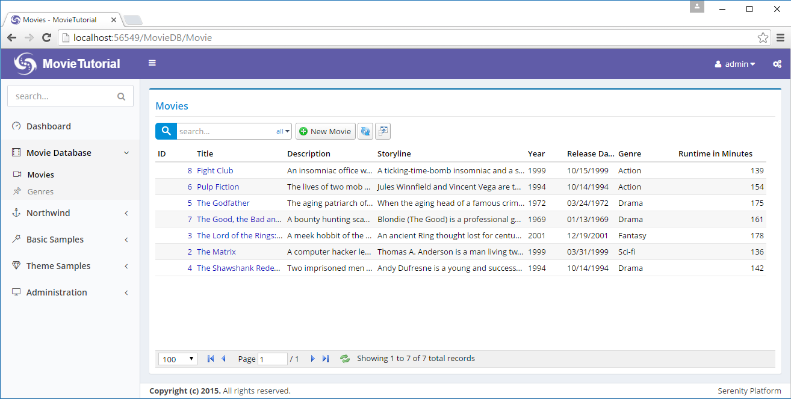
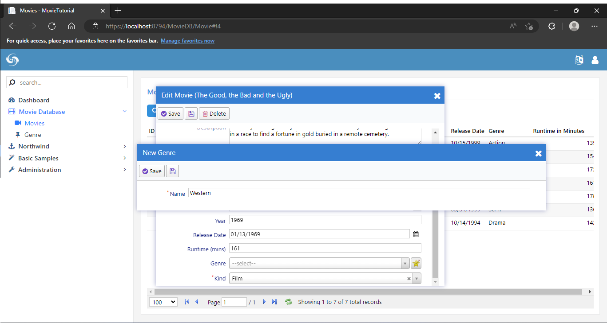
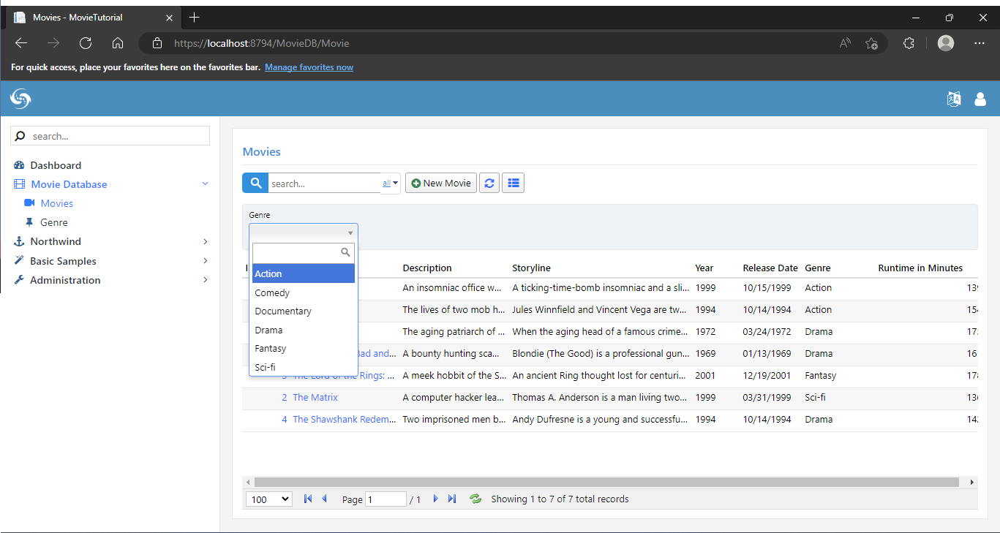

# Adding Movie Genres


### Adding Genre Field

To hold Movie genres we need a lookup table. For *Kind* field we used an enumeration but this time genres might not be that *static* to declare them as an enumeration.

As usual, we start with a migration.

*Migrations/DefaultDB/DefaultDB_20160519_154700_GenreTable.cs*:

```cs
using FluentMigrator;

namespace MovieTutorial.Migrations.DefaultDB
{
    [Migration(20160519_154700)]
    public class DefaultDB_20160519_154700_GenreTable : Migration
    {
        public override void Up()
        {
            Create.Table("Genre").InSchema("mov")
                .WithColumn("GenreId").AsInt32().NotNullable()
                    .PrimaryKey().Identity()
                .WithColumn("Name").AsString(100).NotNullable();

            Alter.Table("Movie").InSchema("mov")
                .AddColumn("GenreId").AsInt32().Nullable()
                    .ForeignKey("FK_Movie_GenreId", "mov", "Genre", "GenreId");
        }

        public override void Down()
        {
        }
    }
}
```

We also added a *GenreId* field to *Movie* table.

> Actually a movie can have multiple genres so we should keep it in a separate *MovieGenres* table. But for now, we think it as single. We'll see how to change it to multiple later.


### Generating Code For Genre Table

Run `dotnet sergen g` again in project directory.

Use following parameters:

- Connection Key: **Default**
- Table Name: **mov.Genre**
- Module Name: **MovieDB**
- Entity Identifier: **Genre**
- Permission Key: **Administration:General**

Rebuild solution and run it. We'll get a new page like this:


As you see in screenshot, it is generated under a new section *MovieDB* instead of the one we renamed recently: *Movie Database*.

This is because *Sergen* has no idea of what customizations we performed on our *Movie* page. We need to move it under *Movie Database* manually.

Open *Modules/Movie/MovieDBNavigation.cs*, cut the navigation link shown below:

```cs
[assembly: NavigationLink(int.MaxValue, "MovieDB/Genre",
    typeof(MyPages.GenresController), icon: null)]
````

And move it to *Modules/Common/Navigation/NavigationItems.cs*:

```cs
//...
[assembly: NavigationMenu(2000, "Movie Database", icon: "icon-film")]
[assembly: NavigationLink(2100, "Movie Database/Movies", 
    typeof(MovieDB.MovieController), icon: "icon-camcorder")]
[assembly: NavigationLink(2200, "Movie Database/Genres", 
    typeof(MovieDB.GenreController), icon: "fa-thumb-tack")]
//...
```


### Adding Several Genre Definitions 

Now let's add some sample genres. I'll do it through migration, to not to repeat it in another PC, but you might want to add them manually through Genre page.

```cs
using FluentMigrator;

namespace MovieTutorial.Migrations.DefaultDB
{
    [Migration(20160519_181800)]
    public class DefaultDB_20160519_181800_SampleGenres : Migration
    {
        public override void Up()
        {
            Insert.IntoTable("Genre").InSchema("mov")
                .Row(new
                {
                    Name = "Action"
                })
                .Row(new
                {
                    Name = "Drama"
                })
                .Row(new
                {
                    Name = "Comedy"
                })
                .Row(new
                {
                    Name = "Sci-fi"
                })
                .Row(new
                {
                    Name = "Fantasy"
                })
                .Row(new
                {
                    Name = "Documentary"
                });
        }

        public override void Down()
        {
        }
    }
}
```


### Mapping GenreId Field in MovieRow

As we did with *Kind* field before, *GenreId* field needs to be mapped in *MovieRow.cs*.

```cs
namespace MovieTutorial.MovieDB
{
    // ...
    public sealed class MovieRow : Row<MovieRow.RowFields>, IIdRow, INameRow
    {
        // ...
        [DisplayName("Kind"), NotNull, DefaultValue(1)]
        public MovieKind? Kind
        {
            get => (MovieKind?)fields.Kind[this];
            set => fields.Kind[this] = (Int32?)value;
        }

        [DisplayName("Genre"), ForeignKey("[mov].Genre", "GenreId"), LeftJoin("g")]
        public Int32? GenreId
        {
            get => fields.GenreId[this];
            set => fields.GenreId[this] = value;
        }

        [DisplayName("Genre"), Expression("g.Name")]
        public String GenreName
        {
            get => fields.GenreName[this];
            set => fields.GenreName[this] = value;
        }

        // ...

        public class RowFields : RowFieldsBase
        {
            // ...
            public Int32Field Kind;
            public Int32Field GenreId;
            public StringField GenreName;
        }
    }
}
```

Here we mapped *GenreId* field and also declared that it has a foreign key relation to *GenreId* field in *[mov].Genre* table using *ForeignKey* attribute.

> If we did generate code for Movie table after we added this Genre table, Sergen would understand this relation by checking foreign key definition at database level, and generate similar code for us.

We also added another field, *GenreName* that is not actually a field in *Movie* table, but in *Genre* table. 

Serenity entities are more like SQL views. You can bring in fields from other tables with joins.

By adding *LeftJoin("g")* attribute to MovieId property, we declared that whenever Genre table needs to be joined to, its alias will be *g*.

So when Serenity needs to select from *Movies* table, it will produce an SQL query like this:

```sql
SELECT t0.MovieId, t0.Kind, t0.GenreId, g.Name as GenreName 
FROM Movies t0
LEFT JOIN Genre g on t0.GenreId = g.GenreId 
```

> This join will only be performed if a field from Genre table requested to be selected, e.g. its column is visible in a data grid.

By adding *Expression("g.Name")* on top of *GenreName* property, we specified that this field has an SQL expression of *g.Name*, thus it is a view field originating from our *g* join.

### Adding Genre Selection To Movie Form

Let's add GenreId field to our form in *MovieForm.cs*:

```cs
namespace MovieTutorial.MovieDB.Forms
{
    //...
    [FormScript("MovieDB.Movie")]
    [BasedOnRow(typeof(Entities.MovieRow), CheckNames = true)]
    public class MovieForm
    {
        //...
        public Int32 GenreId { get; set; }
        public MovieKind Kind { get; set; }
    }
}
```

Now if we build and run application, we'll see that a Genre field is added to our form. The problem is, it accepts data entry as an integer. We want it to use a dropdown.

It's clear that we need to change editor type for GenreId field.


### Declaring a Lookup Script for Genres

To show an editor for *Genre* field, list of genres in our database should be available at client side.

For enumeration values, it was simple, we just run T4 templates, and they copied enum declaration to script side.

Here we can't do the same. Genre list is a database based dynamic list.

Serenity has notion of *dynamic scripts* to make dynamic data available to script side in the form of runtime generated scripts.

> Dynamic scripts are similar to web services, but their outputs are dynamic javascript files that can be cached on client side. 
> 
> The *dynamic* here corresponds to the data they contain, not their behavior. Unlike web services, dynamic scripts can't accept any parameters. And their data is shared among all users of your site. They are like singletons or static variables. 
> 
> You shouldn't try to write a dynamic script (e.g. lookup) that acts like a web service.

To declare a dynamic lookup script for Genre table, open *GenreRow.cs* and modify it like below:

```cs
namespace MovieTutorial.MovieDB
{
    // ...

    [ConnectionKey("Default"), Module("MovieDB"), TableName("[mov].[Genre]")]
    [DisplayName("Genres"), InstanceName("Genres")]
    [ReadPermission("Administration:General")]
    [ModifyPermission("Administration:General")]
    [LookupScript("MovieDB.Genre")]
    public sealed class GenreRow : Row<GenreRow.RowFields>, IIdRow, INameRow
    {
        // ...
    }
```

We just added line with *[LookupScript("MovieDB.Genre")]*.

Rebuild your project, launch it, after logging in, open developer console by *F12*.

Type *Q.getLookup('MovieDB.Genre')*

and you will get something like this:


Here *MovieDB.Genre* is the lookup key we assigned to this lookup script when declaring it with:

> [LookupScript("MovieDB.Genre")]

This step was just to show how to check if a lookup script is available client side.

> Lookup key, *"MovieDB.Genre"* is case sensitive. Make sure you type exact same case everywhere.

### Using LookupEditor for Genre Field

There are two places to set editor type for GenreId field. One is MovieForm.cs, other is MovieRow.cs.

I usually prefer the latter, as it is the central place, but you may choose to set it on a form, if that editor type is specific to that form only.

> Information defined on a form can't be reused. For example, grids use information in XYZColumn.cs / XYZRow.cs while dialogs use information in XYZForm.cs / XYZRow.cs. So it's usually better to define things in XYZRow.cs.

Open MovieRow.cs and add *LookupEditor* attribute to *GenreId* property as shown below:

```cs
    [DisplayName("Genre"), ForeignKey("[mov].Genre", "GenreId"), LeftJoin("g")]
    [LookupEditor("MovieDB.Genre")]
    public Int32? GenreId
    {
        get => fields.GenreId[this];
        set => fields.GenreId[this] = value;
    }

```

After we build and launch our project, we'll now have a searchable dropdown (Select2.js) on our Genre field.


While defining [LookupEditor] we hardcoded the lookup key. It's also possible to reuse information on GenreRow:

```cs
    [DisplayName("Genre"), ForeignKey("[mov].Genre", "GenreId"), LeftJoin("g")]
    [LookupEditor(typeof(GenreRow))]
    public Int32? GenreId
    {
        get => fields.GenreId[this];
        set => fields.GenreId[this] = value;
    }

```

This is functionally equivalent. I'd prefer latter. Here, Serenity will locate the [LookupScript] attribute on GenreRow, and get lookup key information from there. If we had no [LookupScript] attribute on GenreRow, you'd get an error on application startup:

```
Server Error in '/' Application.

'MovieTutorial.MovieDB.GenreRow' type doesn't have a 
[LookupScript] attribute, so it can't be used with a LookupEditor!

Parameter name: lookupType
```

> Forms are scanned at application startup, so there is no way to handle this error without fixing the issue.

### Display Genre in Movie Grid

Currently, movie genre can be edited in the form but is not displayed in Movie grid. Edit MovieColumns.cs to show GenreName (not GenreId).


```cs
namespace MovieTutorial.MovieDB.Columns
{
    // ...
    public class MovieColumns
    {
        //...
        [Width(100)]
        public String GenreName { get; set; }
        [DisplayName("Runtime in Minutes"), Width(150), AlignRight]
        public Int32 Runtime { get; set; }
    }
}
```

Now GenreName is shown in the grid.




### Making It Possible To Define A New Genre Inplace

While setting genre for our sample movies, we notice that *The Good, the Bad and the Ugly* is *Western* but there is no such genre in *Genre* dropdown yet (so I had to choose Drama). 

One option is to open Genres page, add it, and come back to movie form again. Not so pretty...

Fortunately, Serenity has integrated inplace item definition ability for lookup editors.

Open MovieRow.cs and modify *LookupEditor* attribute like this:

```cs
[DisplayName("Genre"), ForeignKey("[mov].Genre", "GenreId"), LeftJoin("g")]
[LookupEditor(typeof(GenreRow), InplaceAdd = true)]
public Int32? GenreId
{
    get => fields.GenreId[this];
    set => fields.GenreId[this] = value;
}

```

Now we can define a new Genre by clicking star/pen icon next to genre field.



> Here we also see that we can use a dialog from another page (GenreDialog) in the movies page. In Serenity applications, all client side objects (dialogs, grids, editors, formatters etc.) are self-contained reusable components (widgets) that are not bound to any page.

It is also possible to start typing in genre editor, and it will provide you with an option to add a new genre.


### How Did It Determine Which Dialog Type To Use

You probably didn't notice this detail. Our lookup editor for genre selection, automatically opened a new *GenreDialog* when you wanted to add a new genre inplace. 

Here, our lookup editor made use of a convention. Because its lookup key is *MovieDB.Genre*, it searched for a dialog class with full names below:

```
MovieDB.GenreDialog
MovieTutorial.MovieDB.GenreDialog
...
...
```

Luckily, we have a GenreDialog, which is defined in *Modules/Genre/GenreDialog.ts* and its full name is *MovieTutorial.MovieDB.GenreDialog*.

```ts
namespace MovieTutorial.MovieDB {

    @Serenity.Decorators.registerClass()
    export class GenreDialog extends Serenity.EntityDialog<GenreRow, any> {
        protected getFormKey() { return GenreForm.formKey; }
        protected getIdProperty() { return GenreRow.idProperty; }
        protected getLocalTextPrefix() { return GenreRow.localTextPrefix; }
        protected getNameProperty() { return GenreRow.nameProperty; }
        protected getService() { return GenreService.baseUrl; }
        protected getDeletePermission() { return GenreRow.deletePermission; }
        protected getInsertPermission() { return GenreRow.insertPermission; }
        protected getUpdatePermission() { return GenreRow.updatePermission; }

        protected form = new GenreForm(this.idPrefix);

    }
}
```

If, lookup key for *GenreRow* and its dialog class didn't match, we would get an error in browser console, as soon as we click the inplace add button:

```
Uncaught MovieDB.GenreDialog dialog class is not found!
```

But this is not the case as they match. In such a case, either you'd have to use a compatible lookup key like "*ModuleName*.*RowType*", or you'd need to specify dialog type explicitly:

```cs
[DisplayName("Genre"), ForeignKey("[mov].Genre", "GenreId"), LeftJoin("g")]
[LookupEditor(typeof(GenreRow), InplaceAdd = true, DialogType = "MovieDB.Genre")]
public Int32? GenreId
{
    get => fields.GenreId[this];
    set => fields.GenreId[this] = value;
}
```

> You shouldn't specify *Dialog* suffix, nor the full namespace, e.g. *MovieTutorial.MovieDB.Genre*, as Serenity automatically searches for them.


### Adding Quick Filter for Genre To Grid

As our list of movies becomes larger, we might need to filter movies based on values of some fields, besides the quick search functionality.

Serenity has several filtering methods. One of them is Quick Filter, which we'll use on Genre field.

Edit *Modules/MovieDB/Movie/MovieColumns.cs* to add a [QuickFilter] attribute on top of GenreName field:

```cs
public class MovieColumns
{
    //...
    public DateTime ReleaseDate { get; set; }
    [Width(100), QuickFilter]
    public String GenreName { get; set; }
    [DisplayName("Runtime in Minutes"), Width(150), AlignRight]
    public Int32 Runtime { get; set; }
}
```

Build and navigate to Movies page. You'll a quick filtering dropdown for genre field is available:



The field that is filtered is actually *GenreId* not *GenreName* that we attached this attribute to. Serenity is clever enough to understand this relation, and determined editor type to use by looking at attributes of *GenreId* property in *GenreRow.cs*.


### Re-runing auto transformation

As we added a new entity to our application, we should rebuild solution.
