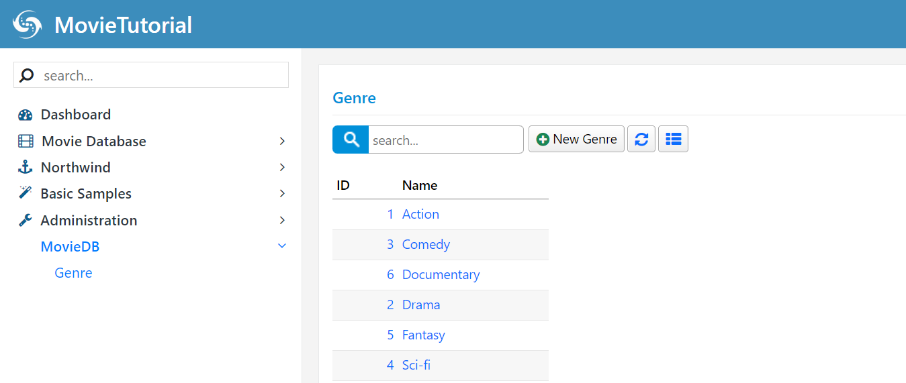
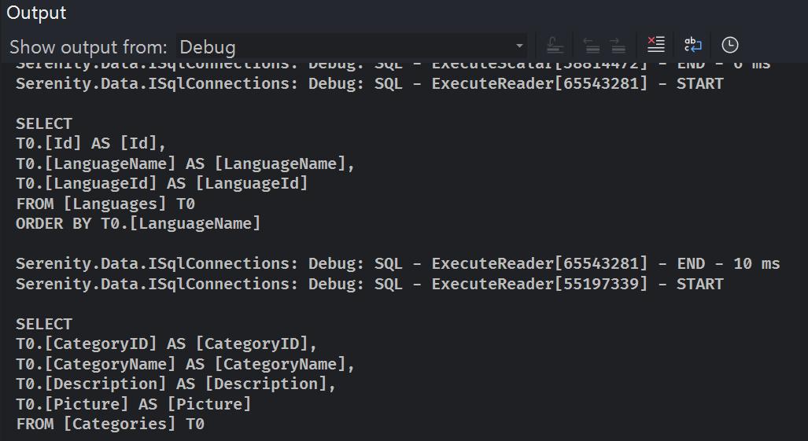
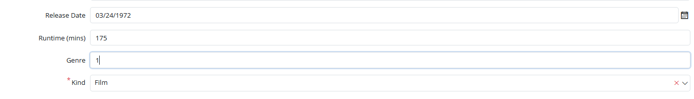
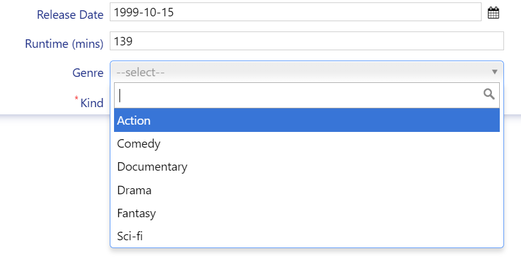
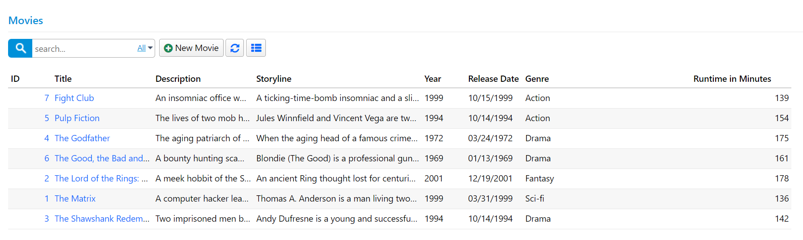
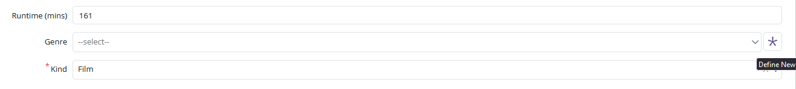
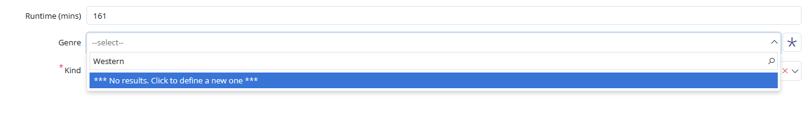
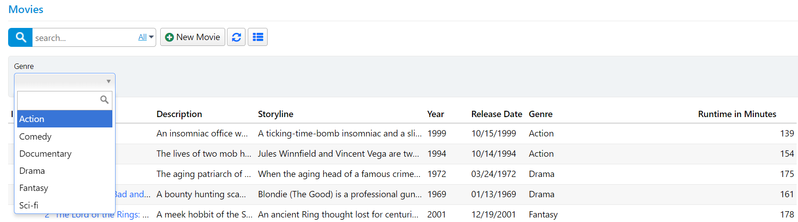

# Adding Movie Genres

## Adding Genre Field

To store movie genres in your database, you'll need a lookup table. While an enumeration is suitable for the "Kind" field, genres might change over time and aren't static. Therefore, it's better to use a table to manage genres. Let's start by creating a migration to generate the Genre table and add a "GenreId" column to the Movie table.

**Migrations/DefaultDB/DefaultDB_20221114_1836_GenreTable.cs**:

```cs
using FluentMigrator;

namespace MovieTutorial.Migrations.DefaultDB;

[DefaultDB, Migration(20221114_1836)]
public class DefaultDB_20221114_1836_GenreTable : AutoReversingMigration
{
    public override void Up()
    {
        Create.Table("Genre")
            .WithColumn("GenreId").AsInt32().NotNullable()
                .PrimaryKey().Identity()
            .WithColumn("Name").AsString(100).NotNullable();

        Alter.Table("Movie")
            .AddColumn("GenreId").AsInt32().Nullable()
                .ForeignKey("FK_Movie_GenreId", "Genre", "GenreId");
    }
}
```

This migration creates the "Genre" table and adds a "GenreId" column to the "Movie" table.

> Note: In reality, a movie can have multiple genres, and in such cases, you would typically use a separate "MovieGenres" table. However, for simplicity, we'll consider a single genre per movie for now. We'll explore how to handle multiple genres later.

## Generating Code for the Genre Table

After running the project to execute the migration, you'll need to generate code for the "Genre" table using Sergen. Run the following command in your project directory:

```sh
dotnet sergen g
```

Specify the following parameters:

- **Connection Key**: Default
- **Table Name**: dbo.Genre
- **Module Name**: MovieDB
- **Class Identifier**: Genre
- **Permission Key**: Administration:General
- **What to Generate**: All

Once you've rebuilt your solution and run it, you'll find a new section in your application named "MovieDB." Within this section, you'll see the "Genres" page, which allows you to manage movie genres.



In the screenshot above, you'll notice that the "Genres" page is located under the "MovieDB" section. This organization might differ from the section you recently renamed as "Movie Database." The reason for this distinction is that *Sergen* isn't aware of the customizations made to your existing navigation items. To rectify the section organization, you'll need to manually move the "Genres" page under the "Movie Database" section.

To accomplish this, navigate to the `Modules/Movie/MovieDBNavigation.cs` file and modify the navigation link for "Genre" as follows:

```csharp
[assembly: NavigationLink(6200, "Movie Database/Genres", typeof(MyPages.GenrePage), icon: "fa-thumb-tack")]
```

By making this adjustment, you ensure that the "Genres" page is placed under the "Movie Database" section, aligning with your desired organization.

## Adding Several Genre Definitions 

Now, let's add some sample genres to your database. While you can do this manually through the Genre page, I'll demonstrate how to do it via migration to avoid the need for repetition on other machines.

```cs
using FluentMigrator;

namespace MovieTutorial.Migrations.DefaultDB;
    
[DefaultDB, MigrationKey(20221114_1844)]
public class DefaultDB_20221114_1844_SampleGenres : AutoReversingMigration
{
    public override void Up()
    {
        Insert.IntoTable("Genre")
            .Row(new { Name = "Action" })
            .Row(new { Name = "Drama" })
            .Row(new { Name = "Comedy" })
            .Row(new { Name = "Sci-fi" })
            .Row(new { Name = "Fantasy" })
            .Row(new { Name = "Documentary" });
    }
}
```

This migration inserts sample genre entries into the "Genre" table in your database. It's a convenient way to populate your genre table with initial data.

By following these steps, you've successfully set up a "Genre" table, generated code for it, and added sample genres to your database.

## Mapping the GenreId Field in MovieRow

Just like we handled the *Kind* field earlier, it's essential to map the *GenreId* field within the `MovieRow.cs` file to establish the relationship between movies and genres.

Here's the code snippet to accomplish this:

```cs
// ...
public sealed class MovieRow : Row<MovieRow.RowFields>, IIdRow, INameRow
{
    const string jGenre = nameof(jGenre);

    // ...

    [DisplayName("Genre"), ForeignKey(typeof(GenreRow)), LeftJoin(jGenre)]
    public int? GenreId { get => fields.GenreId[this]; set => fields.GenreId[this] = value; }

    [DisplayName("Genre"), Expression($"{jGenre}.Name")]
    public string GenreName { get => fields.GenreName[this]; set => fields.GenreName[this] = value; }

    public class RowFields : RowFieldsBase
    {
        // ...
        public Int32Field GenreId;
        public StringField GenreName;
    }
}
```

In the provided code:

- We defined a new `jGenre` constant which will be used as an alias for a Genre table join.

- We've mapped the *GenreId* field using the `[ForeignKey]` attribute. We specified `typeof(GenreRow)` to indicate that this field is related to the `GenreRow` entity. This also informs Serenity to determine the name of the table and its ID property from the `GenreRow` entity. This is a recommended approach as it helps prevent typing errors.

- The `[LeftJoin(jGenre)]` attribute declares that when the Genre table needs to be joined, its alias should be set to `jGenre`. In SQL terms, this corresponds to generating queries with a LEFT JOIN between the Movies and Genre tables. This join is only performed when fields from the Genre table are requested, for instance, if its columns are visible in a data grid. The internally generated query could look like below:

    ```sql
    SELECT t0.MovieId, t0.Kind, t0.GenreId, jGenre.Name as GenreName 
    FROM Movies t0
    LEFT JOIN Genre jGenre on t0.GenreId = jGenre.GenreId 
    ```

- We've added a new field, *GenreName*, which is not present in the Movie table but is derived from the Genre table. By using the `Expression` attribute and specifying `$"{jGenre}.Name"`, we indicate that this field represents an SQL expression originating from the `jGenre` join. We could also use `Origin` attribute instead of the `Expression` attribute like below which is functionally equivalent but using `Origin` and `nameof` is recommended to avoid typos:

   ```sql
    [DisplayName("Genre"), Origin(jGenre, nameof(GenreRow.Name))]
    public string GenreName { get => fields.GenreName[this]; set => fields.GenreName[this] = value; }
   ```

In essence, these code modifications define the relationship between the Movie and Genre tables and ensure that the correct data is retrieved when needed.

Please note that Serene's entities function somewhat like SQL views, enabling you to incorporate fields from other tables through joins. This flexibility allows you to structure your data and relationships efficiently in your application.

Additionally, Serene templates enable SQL query logging by default so that you can see the executed queries in the output console. The `appsettings.Development.json` configuration file contains settings for query logging:

```json
{
    // ...
    "Logging": {
        "LogLevel": {
            "Serenity.Data": "Debug"
        }
    }
    // ...
}
```



## Adding Genre Selection to the Movie Form

Now, let's enhance the Movie form by adding a Genre selection field. To do this, we'll make changes to the `MovieForm.cs` file.

```cs
namespace MovieTutorial.MovieDB.Forms
{
    //...
    public class MovieForm
    {
        //...
        public int GenreId { get; set; }
        public MovieKind Kind { get; set; }
    }
}
```



With these changes, you've added a `GenreId` field to the Movie form. However, if you build and run your application, you'll notice that this field currently accepts data as an integer input. What we actually want is to provide a dropdown selection for movie genres.

To achieve this, we need to specify the editor type for the `GenreId` field.

## Declaring a Lookup Script for Genres

In order to display a dropdown editor for the Genre field, we need to make the list of available genres from our database accessible on the client side. Unlike enumeration values, which can be easily transferred to the client-side by Sergen, a dynamic list like movie genres isn't as straightforward.

Serenity has a feature known as "dynamic scripts," which enables you to make dynamic data, such as lists, available on the client side through runtime-generated scripts. You can learn more about dynamic scripts and lookups in [this topic](../../framework/dynamic-scripts/readme.md).

To declare a lookup script for the Genre table, open the `GenreRow.cs` file and modify it as shown below:

```cs
[LookupScript]
public sealed class GenreRow : Row<GenreRow.RowFields>, IIdRow, INameRow
```

By adding the `[LookupScript]` attribute to the `GenreRow` class, you're specifying that a lookup script is associated with the Genre table.

> Note that lookups are only recommended for small tables that change rarely. For large or frequently modified ones, don't define a LookupScript and prefer `ServiceLookupEditor` which works via List service calls.

After making this change, rebuild your project and launch the application. Once you've logged in, open the developer console by pressing F12 in your browser.

Inside the console, type `Q.getLookup('MovieDB.Genre')`, and you'll receive an output similar to this:


The output displays the lookup data. This step demonstrates how to verify the availability of a lookup script on the client side.

The lookup key is automatically determined based on the module name and the entity class name. 

While you can implicitly specify the lookup key by using `[LookupScript("MovieDB.Genre")]`, it's generally recommended to let Serenity automatically determine the lookup key to prevent potential typing errors.

## Using the LookupEditor for the Genre Field

You have two options to specify the editor type for the `GenreId` field: one is to define it in the `MovieForm.cs` file, and the other is to do it in the `MovieRow.cs` file. While you can set it on the form level, I generally prefer to define it in the row class because it's a more central location, and the information defined at this level can be reused in various parts of your application.

Keep in mind that the information defined on a form is specific to that form and cannot be reused elsewhere. For example, grids use information from `XYZColumn.cs` or `XYZRow.cs`, while dialogs rely on information in `XYZForm.cs` or `XYZRow.cs`. So, it's usually better to define such details in the `XYZRow.cs` file.

Open the `MovieRow.cs` file and add the `[LookupEditor]` attribute to the `GenreId` property as shown below:

```cs
[DisplayName("Genre"), ForeignKey(typeof(GenreRow)), LeftJoin(jGenre)]
[LookupEditor(typeof(GenreRow))]
public int? GenreId { get => fields.GenreId[this]; set => fields.GenreId[this] = value; }
```

In this code, we specify `typeof(GenreRow)` in the `[LookupEditor]` attribute. This tells Serenity to locate the `LookupScript` attribute on the `GenreRow` class and automatically determine the lookup key.

If the `GenreRow` class does not have a `[LookupScript]` attribute, you'll encounter an error when you start the application. The error message will indicate that the `GenreRow` type doesn't have a `[LookupScript]` attribute, which is necessary for using a LookupEditor. Here's an example of the error message you might encounter:

```
Server Error in '/' Application.

'MovieTutorial.MovieDB.GenreRow' type doesn't have a 
[LookupScript] attribute, so it can't be used with a LookupEditor!

Parameter name: lookupType
```

While it is possible to specify the lookup key implicitly like this: `LookupEditor("MovieDB.Genre")`, it's not recommended because it can lead to typing errors. It's best to let Serenity automatically determine the lookup key as shown in the code above.

After building and launching your project, you'll have a searchable dropdown editor (using Select2.js) for the Genre field in your Movie form.



## Displaying Genre in the Movie Grid

To display the movie genre in the Movie grid, you need to modify the `MovieColumns.cs` file. Update the `MovieColumns` class to include the `GenreName` property before the `Runtime` property:

```cs
// ...
public class MovieColumns
{
    // ...
    public string GenreName { get; set; }
    [DisplayName("Runtime in Minutes"), Width(150), AlignRight]
    public int Runtime { get; set; }
}
```

This change will make the `GenreName` visible in the grid, ensuring that you see the genre name instead of the genre ID. Now, when you view the Movie grid, you'll see the GenreName column.



## Allowing In-Place Definition of a New Genre

While setting the genre for your sample movies, you might have noticed that "The Good, the Bad and the Ugly" is a Western, but there is no such genre available in the Genre dropdown yet. In such cases, you'd typically need to open the Genres page, add the missing genre, and then return to the movie form, which can be cumbersome.

However, Serenity provides a convenient way to define a new genre in-place directly from the movie form using lookup editors.

Open the `MovieRow.cs` file and modify the `LookupEditor` attribute for the `GenreId` property as follows:

```cs
[LookupEditor(typeof(GenreRow), InplaceAdd = true)]
public int? GenreId { get => fields.GenreId[this]; set => fields.GenreId[this] = value; }
```

By adding `InplaceAdd = true` to the `LookupEditor` attribute, you enable the ability to define a new genre directly from the form. Now, you'll see a star/pen icon next to the genre field, which allows you to define a new genre without leaving the movie form.



You can also start typing in the genre editor, and it will provide you with the option to add a new genre, making the process more user-friendly.



This feature is quite powerful, as it demonstrates that Serenity applications are composed of self-contained, reusable components, including dialogs, grids, editors, formatters, and more. These components are not tied to any specific page, providing flexibility and modularity to your application.

## How the Dialog Type is Determined

You may not have noticed, but when you wanted to add a new genre in-place using the lookup editor, a new "GenreDialog" was automatically opened. This happened because the lookup editor followed a convention to determine which dialog type to use. 

The lookup editor's lookup key is "MovieDB.Genre," so it searched for a dialog class with full names like this:

- `MovieDB.GenreDialog`
- `MovieTutorial.MovieDB.GenreDialog`

Fortunately, there's a "GenreDialog" class defined in the "Modules/Genre/GenreDialog.ts" file, and its registered full name is "MovieTutorial.MovieDB.GenreDialog":

```ts
// ...
@Decorators.registerClass('MovieTutorial.MovieDB.GenreDialog')
export class GenreDialog extends EntityDialog<GenreRow, any> {
    // ...
}
```

If the lookup key for "GenreRow" and its dialog class didn't match, you'd get an error in the browser console as soon as you clicked the inplace add button:

```
Uncaught MovieDB.GenreDialog dialog class is not found!
```

To ensure the dialog type matches, either use a compatible lookup key like "*ModuleName*.*RowType*" or specify the dialog type explicitly in the `LookupEditor` attribute:

```cs
[LookupEditor(typeof(GenreRow), InplaceAdd = true, DialogType = "MovieDB.Genre")]
public int? GenreId { get => fields.GenreId[this]; set => fields.GenreId[this] = value; }
```

You don't have to specify the "Dialog" suffix or the full namespace. Serenity automatically searches for them as long as they match the project root namespace. This convention simplifies the configuration process, making it more intuitive and straightforward.

## Adding Quick Filter for Genre in the Grid

As your list of movies grows, you may find it necessary to filter movies based on various criteria. In addition to the quick search functionality, Serenity offers several filtering methods. Let's use the Quick Filter method to filter movies by genre.

Edit the `MovieColumns.cs` file and add the `[QuickFilter]` attribute on top of the `GenreName` field as shown below:

```cs
public class MovieColumns
{
    //...
    [Width(100), QuickFilter]
    public string GenreName { get; set; }
}
```

After making this change, build your project and navigate to the Movies page. You'll notice that a quick filtering dropdown for the genre field is now available:



Keep in mind that the field that is filtered is actually `GenreId`, not `GenreName`, even though we attached the `[QuickFilter]` attribute to the `GenreName` field. Serenity is intelligent enough to understand the relationship and determine the correct editor type to use based on the attributes of the `GenreId` property in the `GenreRow.cs` file. This ensures that filtering movies by genre using the genre name works seamlessly.