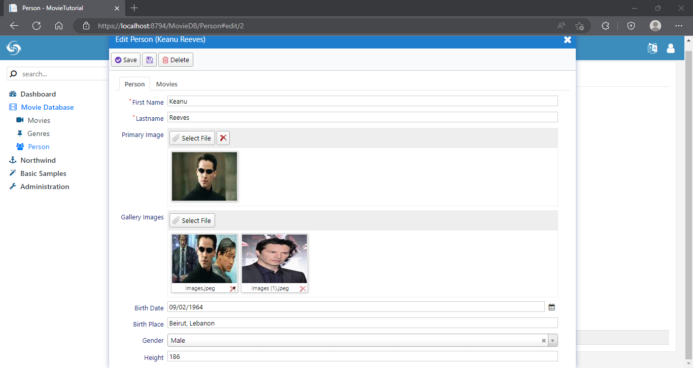

# Adding Primary and Gallery Images

To add a primary image and multiple gallery images to both Movie and Person records, need to start with a migration:

```cs
using FluentMigrator;

namespace MovieTutorial.Migrations.DefaultDB
{
    [Migration(20160603205900)]
    public class DefaultDB_20160603_205900_PersonMovieImages : Migration
    {
        public override void Up()
        {
            Alter.Table("Person").InSchema("mov")
                .AddColumn("PrimaryImage").AsString(100).Nullable()
                .AddColumn("GalleryImages").AsString(int.MaxValue).Nullable();

            Alter.Table("Movie").InSchema("mov")
                .AddColumn("PrimaryImage").AsString(100).Nullable()
                .AddColumn("GalleryImages").AsString(int.MaxValue).Nullable();
        }

        public override void Down()
        {
        }
    }
}
```

Then modify MovieRow.cs and PersonRow.cs:

```cs
namespace MovieTutorial.MovieDB.Entities
{
    // ...
    public sealed class PersonRow : Row, IIdRow, INameRow
    {

        [DisplayName("Primary Image"), Size(100), 
         ImageUploadEditor(FilenameFormat = "Person/PrimaryImage/~")]
        public string PrimaryImage
        {
            get { return Fields.PrimaryImage[this]; }
            set { Fields.PrimaryImage[this] = value; }
        }

        [DisplayName("Gallery Images"), 
         MultipleImageUploadEditor(FilenameFormat = "Person/GalleryImages/~")]
        public string GalleryImages
        {
            get { return Fields.GalleryImages[this]; }
            set { Fields.GalleryImages[this] = value; }
        }

        // ...
        
        public class RowFields : RowFieldsBase
        {
            // ...
            public readonly StringField PrimaryImage;
            public readonly StringField GalleryImages;
            // ...
        }
    }
}
```

```cs
namespace MovieTutorial.MovieDB.Entities
{
    // ...
    public sealed class MovieRow : Row, IIdRow, INameRow
    {
        [DisplayName("Primary Image"), Size(100), 
         ImageUploadEditor(FilenameFormat = "Movie/PrimaryImage/~")]
        public string PrimaryImage
        {
            get { return Fields.PrimaryImage[this]; }
            set { Fields.PrimaryImage[this] = value; }
        }

        [DisplayName("Gallery Images"), 
         MultipleImageUploadEditor(FilenameFormat = "Movie/GalleryImages/~")]
        public string GalleryImages
        {
            get { return Fields.GalleryImages[this]; }
            set { Fields.GalleryImages[this] = value; }
        }

        // ...
        public class RowFields : RowFieldsBase
        {
            // ...
            public readonly StringField PrimaryImage;
            public readonly StringField GalleryImages;
            // ...
        }
    }
}
```

Here we specify that these fields will be handled by *ImageUploadEditor* and *MultipleImageUploadEditor* types.

FilenameFormat specifies the naming of uploaded files. For example, Person primary image will be uploaded to a folder under *App_Data/upload/Person/PrimaryImage/*.

> You may change upload root (*App_Data/upload*) to anything you like by modifying  *UploadSettings* appSettings key in web.config.

`~` at the end of FilenameFormat is a shortcut for the automatic naming scheme `{1:00000}/{0:00000000}_{2}`.

Here, parameter {0} is replaced with identity of the record, e.g. PersonID.

Parameter {1} is identity / 1000. This is useful to limit number of files that is stored in one directory.

Parameter {2} is a unique string like *6l55nk6v2tiyi*, which is used to generate a new file name on every upload. This helps to avoid problems caused by caching on client side.

> It also provides some security so file names can't be known without having a link.

Thus, a file we upload for person primary image will be located at a path like this:

```
> App_Data\upload\Person\PrimaryImage\00000\00000001_6l55nk6v2tiyi.jpg
```

> You don't have to follow this naming scheme. You can specify your own format like `PersonPrimaryImage_{0}_{2}`.

Next step is to add these fields to forms (MovieForm.cs and PersonForm.cs):

```cs
namespace MovieTutorial.MovieDB.Forms
{
    //...
    public class PersonForm
    {
        public String Firstname { get; set; }
        public String Lastname { get; set; }
        public String PrimaryImage { get; set; }
        public String GalleryImages { get; set; }
        public DateTime BirthDate { get; set; }
        public String BirthPlace { get; set; }
        public Gender Gender { get; set; }
        public Int32 Height { get; set; }
    }
}
```

```cs

namespace MovieTutorial.MovieDB.Forms
{
    //...
    public class MovieForm
    {
        public String Title { get; set; }
        [TextAreaEditor(Rows = 3)]
        public String Description { get; set; }
        [MovieCastEditor]
        public List<Entities.MovieCastRow> CastList { get; set; }
        public String PrimaryImage { get; set; }
        public String GalleryImages { get; set; }
        [TextAreaEditor(Rows = 8)]
        public String Storyline { get; set; }
        public Int32 Year { get; set; }
        public DateTime ReleaseDate { get; set; }
        public Int32 Runtime { get; set; }
        public Int32 GenreId { get; set; }
        public MovieKind Kind { get; set; }
    }
}
```

I also modified Person dialog css a bit to have more space:

```css
.s-MovieDB-PersonDialog {
    > .size { width: 700px; height: 600px; }
    .caption { width: 150px; }
    .s-PersonMovieGrid > .grid-container { height: 500px; }
}
```

This is what we get now:



> ImageUploadEditor stores file name directly in a string field, while MultipleImageUpload editor stores file names in a string field with JSON array format.


### Removing Northwind and Other Samples

As i think our project has reached a good state, i'm now going to remove Northwind and other samples from MovieTutorial project.

See following how-to topic:

[How To: Removing Northwind and Other Samples](../../howto/removing_northwind.md)


