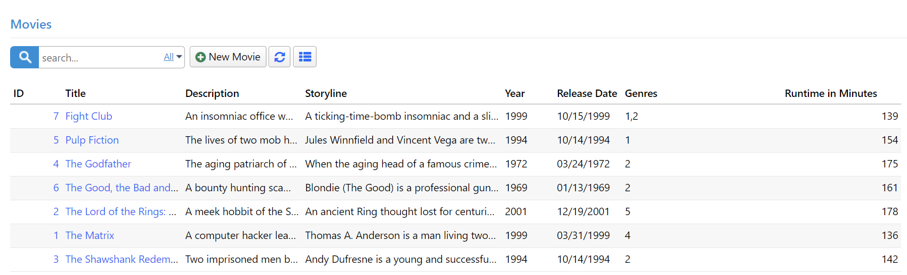

# Allowing Multiple Genre Selection

As requirements change, you may now want to allow the selection of multiple genres for a movie. To achieve this, you need a many-to-many (M-N) mapping table that can link movies to multiple genres.

Let's begin by creating a migration to set up the `MovieGenres` table. Create a new migration file, `Migrations/DefaultDB/DefaultDB_20221115_1405_MovieGenres.cs`, with the following content:

```csharp
using FluentMigrator;

namespace MovieTutorial.Migrations.DefaultDB;

[DefaultDB, Migration(20221115_1405)]
public class DefaultDB_20221115_1405_MovieGenres : Migration
{
    public override void Up()
    {
        Create.Table("MovieGenres").InSchema("mov")
            .WithColumn("MovieGenreId").AsInt32()
                .Identity().PrimaryKey().NotNullable()
            .WithColumn("MovieId").AsInt32().NotNullable()
                .ForeignKey("FK_MovieGenres_MovieId",
                    "mov", "Movie", "MovieId")
            .WithColumn("GenreId").AsInt32().NotNullable()
                .ForeignKey("FK_MovieGenres_GenreId",
                    "mov", "Genre", "GenreId");

        Execute.Sql(
            @"INSERT INTO mov.MovieGenres (MovieId, GenreId) 
                SELECT m.MovieId, m.GenreId 
                FROM mov.Movie m 
                WHERE m.GenreId IS NOT NULL");

        Delete.ForeignKey("FK_Movie_GenreId")
            .OnTable("Movie").InSchema("mov");
        Delete.Column("GenreId")
            .FromTable("Movie").InSchema("mov");
    }

    public override void Down()
    {
    }
}
```

In this migration, we create the `MovieGenres` table with columns `MovieGenreId`, `MovieId`, and `GenreId`. We also insert existing genre information from the `Movie` table into this new table. Finally, we delete the `GenreId` column and its associated foreign key constraint from the `Movie` table.

After running the migration, we need to remove references to the `GenreId` and `GenreName` properties from the codebase.

## Deleting GenreId Mapping in MovieRow

Remove the `GenreId` and `GenreName` properties and their related field objects from `MovieRow.cs`:

```csharp
[DisplayName("Genre"), ForeignKey(typeof(GenreRow)), LeftJoin(jGenre)]
[LookupEditor(typeof(GenreRow), InplaceAdd = true)]
public int? GenreId { get => fields.GenreId[this]; set => fields.GenreId[this] = value; }

[DisplayName("Genre"), Expression($"{jGenre}.Name")]
public string GenreName { get => fields.GenreName[this]; set => fields.GenreName[this]; }

Int32Field GenreId;
StringField GenreName;
```

## Deleting GenreName from MovieColumns

Remove the `GenreName` property from `MovieColumns.cs`:

```csharp
[Width(100), QuickFilter]
public string GenreName { get; set; }
```

## Deleting GenreId in MovieForm

Remove the `GenreId` property from `MovieForm.cs`:

```csharp
public int GenreId { get; set; }
```

After removing these properties, rebuild your project, and you'll have a working "Movies" page.

## Generating Code for MovieGenres Table

To handle the M-N relationship between movies and genres, we need to generate code for the `MovieGenres` table. Run Serene code generation for the `MovieGenres` table using the following parameters:

- Connection Key: **Default**
- Table Name: **mov.MovieGenres**
- Module Name: **MovieDB**
- Entity Identifier: **MovieGenres**
- Permission Key: **Administration:General**
- What to Generate: **Row & Services**

After generating the code, you can delete the `MovieGenresEndpoint.cs` file, or if you choose to keep it, make sure to delete the `ListExcel` method to avoid build errors.

## Adding GenreList Field

Now that one movie can have multiple genres, we need to change the way we store genre information. Instead of a single integer property, we'll use a list of integers, specifically `List<int>`. Add the `GenreList` property to the `MovieRow.cs` file:

```csharp
using System.Collections.Generic;

//...
[DisplayName("Genres"), LookupEditor(typeof(GenreRow), Multiple = true), NotMapped]
[LinkingSetRelation(typeof(MovieGenresRow), "MovieId", "GenreId")]
public List<int> GenreList { get => fields.GenreList[this]; set => fields.GenreList[this] = value; }

public class RowFields : RowFieldsBase
{
    //...
    public ListField<int> GenreList;
}
```

The `GenreList` property has a `[LookupEditor]` attribute just like the previous `GenreId` property but with the added argument `Multiple = true` to enable multiple genre selection. We also use the `[NotMapped]` attribute because there's no corresponding `GenreList` column in the database. This informs Serenity that this property should not be mapped to a database column.

We also add a `[LinkingSetRelation]` attribute to specify the M-N relationship between movies and genres:

```csharp
[LinkingSetRelation(typeof(MovieGenresRow), "MovieId", "GenreId")]
```

- The first argument specifies the type of the M-N mapping row, which is `MovieGenresRow` in this case.
- The second argument specifies the property name of the field in the M-N mapping row (`MovieGenresRow`) that matches the `MovieId` property in the current row.
- The third argument specifies the property name of the field in the M-N mapping row (`MovieGenresRow`) that links multiple genres by their IDs, which corresponds to the `GenreId` property.

The `[LinkingSetRelation]` attribute is crucial for managing this many-to-many relationship.

## Adding GenreList to the Form

Next, modify the `MovieForm.cs` file to include the `GenreList` property:

```csharp
public class MovieForm
{
    //...
    public List<int> GenreList { get; set; }
}
```

Now, you can add multiple genres to a movie using the modified form:


## Displaying Selected Genres in a Column

In the past, when we only had one genre per movie, displaying the selected genre in a column was straightforward – we could achieve this by adding a view field to `MovieRow.cs`. However, this time around, it won't be as simple.

Let's begin by adding the `GenreList` property to `MovieColumns.cs`:

```csharp
public class MovieColumns
{
    // ...
    [Width(200)]
    public List<int> GenreList { get; set; }
}
```

This addition results in the following:



The `GenreList` column now contains a list of integer values, which can be likened to an array in JavaScript. Fortunately, in JavaScript, the `.toString()` method for an array returns items separated by commas, so, for example, for the movie *Fight Club*, we would have *"1,2"*.

However, we would prefer to have genre names instead of genre IDs, as it would make the information clearer. Therefore, we need to *format* these values by converting the Genre IDs into their corresponding Genre names.

## Creating the `GenresFormatter` Class

It's time to create a SlickGrid column formatter. To do this, create a file named `GenresFormatter.ts` next to `MovieGrid.ts`:

```typescript
import { Decorators, Formatter } from "@serenity-is/corelib";
import { Lookup } from "@serenity-is/corelib/q";
import { FormatterContext } from "@serenity-is/sleekgrid";
import { GenreRow } from "@/ServerTypes/MovieDB/GenreRow";

@Decorators.registerFormatter('MovieTutorial.MovieDB.GenresFormatter')
export class GenresFormatter implements Formatter {

    static lookup: Lookup<GenreRow>;
    static promise: Promise<any>;

    format(ctx: FormatterContext) {

        var idList = ctx.value as number[];
        if (!idList || !idList.length)
            return "";
        
        if (!GenresFormatter.lookup) {
            if (!GenresFormatter.promise) {
                GenresFormatter.promise = GenreRow.getLookupAsync().then(lookup => {
                    GenresFormatter.lookup = lookup;
                    ctx.grid?.invalidate();
                }).catch(() => GenresFormatter.promise = null);
            }

            return `<i class="fa fa-spinner"></i>`;
        }

        var byId = GenresFormatter.lookup.itemById;
        return idList.map(x => {
            var z = byId[x];
            return ctx.escape(z == null ? x : z.Name);
        }).join(", ");
    }
}
```

Above, we introduce a new formatter, *GenresFormatter*, and register it with the Serenity type system using the *@Decorators.registerFormatter* decorator. These decorators serve a purpose similar to .NET attributes.

All formatters must implement the Formatter interface, which includes a *format* method that accepts a *ctx* parameter of type *FormatterContext*.

The *ctx* parameter, representing the formatting context, is an object with several members. One of its key properties is *value*, which holds the column value for the current grid row/column being formatted.

Since we know that this formatter will be applied to a column with a `List<int>` value, we begin by casting the value to a *number[]*.

> Note: In JavaScript, there is no Int32 type. Types like Int32, Double, Single in .NET correspond to the number type in JavaScript. Additionally, the generic *`List<>`* type in C# maps to an array in JavaScript.

If the array is either empty or null, it's safe to return an empty string:

```typescript
const idList = ctx.value as number[];
if (!idList || !idList.length)
    return "";
```

Next, we check if we already have a reference to the Genre lookup. For this example, we load the Genre lookup asynchronously to avoid blocking the browser UI thread. Once we load the lookup for the first time, we set it in the `GenresFormatter.lookup` static variable, preventing the need to reload it with each render.

```typescript
if (!GenresFormatter.lookup) {
```

We then verify if there is an existing asynchronous call in progress to load the lookup:

```typescript
if (!GenresFormatter.promise) {
```

If there is no ongoing promise, it means this is the first time, so we attempt to load the Genre lookup asynchronously:

```typescript
GenresFormatter.promise = GenreRow.getLookupAsync().then(lookup => {
    //...
}).catch(() => GenresFormatter.promise = null);
```

Once the promise completes, we set the static lookup variable and trigger a grid re-render:

```typescript
GenresFormatter.lookup = lookup;
ctx.grid?.invalidate();
```

While loading is in progress, we return a spinner icon from the formatter:

```typescript
return `<i class="fa fa-spinner"></i>`;
```

If the lookup is already loaded, it contains a dictionary of *Genre* rows in its *itemById* property:

```typescript
const byId = GenresFormatter.lookup.itemById;
```

We proceed to map the ID values in our *idList* to their corresponding Genre names using the *Array.map* function in JavaScript. This operation is akin to a LINQ Select statement:

```typescript
return idList.map(x => {
    var z = byId[x];
    return ctx.escape(z == null ? x : z.Name);
}).join(", ");
```

If we can find the genre row corresponding to a specific ID, we return its Name value. We also ensure that the genre name is HTML encoded in case it contains invalid HTML characters like `<`, `>`, or `&`. For this encoding, we make use of the ctx.escape function.

## Applying GenresFormatter to the GenreList Column

Now that we've defined a new formatter class, we need to rebuild so that we can reference *GenresFormatter* in server-side code.

After building and transforming, open the `MovieColumns.cs` file and attach this formatter to the `GenreList` property:

```csharp
public class MovieColumns
{
    //...
    [Width(200), GenresFormatter]
    public List<int> GenreList { get; set; }
}
```

With this configuration, you will see Genre names displayed in the Genre column:

