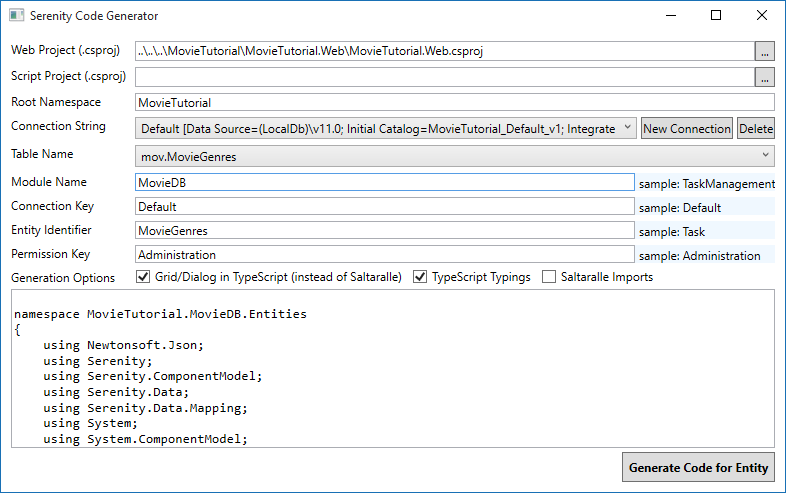
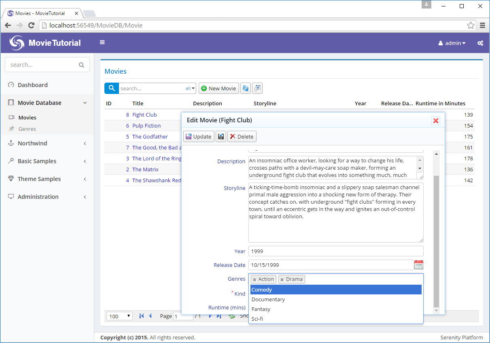
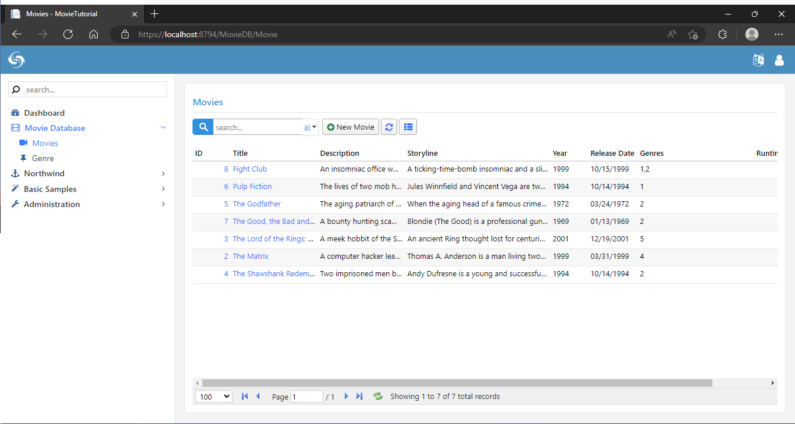
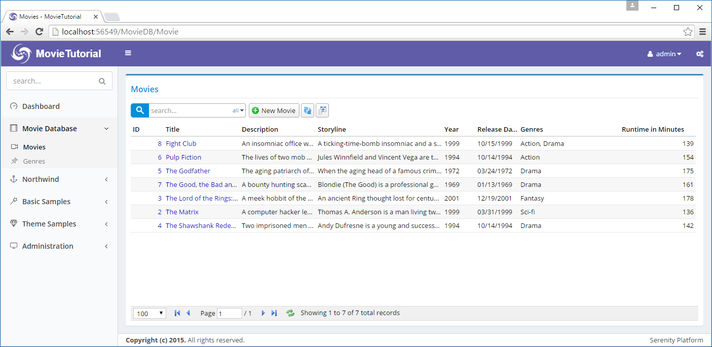

# 允许选择多个流派

需求发生了变更，我们现在想让影片允许选择多个流派。

为此，我们需要一个 m-n 映射表，它将让我们的电影关联到多个流派。


### 创建影片流派（MovieGenres）表

和往常一样，我们从迁移类开始：

**Modules/Common/Migrations/DefaultDB/ DefaultDB_20160528_115400_MovieGenres.cs:**

```
using FluentMigrator;

namespace MovieTutorial.Migrations.DefaultDB
{
    [Migration(20160528115400)]
    public class DefaultDB_20160528_115400_MovieGenres : Migration
    {
        public override void Up()
        {
            Create.Table("MovieGenres").InSchema("mov")
                .WithColumn("MovieGenreId").AsInt32()
                    .Identity().PrimaryKey().NotNullable()
                .WithColumn("MovieId").AsInt32().NotNullable()
                    .ForeignKey("FK_MovieGenres_MovieId", 
                        "mov", "Movie", "MovieId")
                .WithColumn("GenreId").AsInt32().NotNullable()
                    .ForeignKey("FK_MovieGenres_GenreId", 
                        "mov", "Genre", "GenreId");

            Execute.Sql(
              @"INSERT INTO mov.MovieGenres (MovieId, GenreId) 
                    SELECT m.MovieId, m.GenreId 
                    FROM mov.Movie m 
                    WHERE m.GenreId IS NOT NULL");

            Delete.ForeignKey("FK_Movie_GenreId")
                .OnTable("Movie").InSchema("mov");
            Delete.Column("GenreId")
                .FromTable("Movie").InSchema("mov");
        }

        public override void Down()
        {
        }
    }
}
```

我尝试在影片（Movie）表保存保存现有的流派声明，把他们复制到新的影片流派（MovieGenres）表，上面的 *Execute.Sql* 语句就是做这事。

然后，我们应该删除 GenreId 字段，但首先应该删除先前定义的外键 *FK_Movie_GenreId*。


### 删除 GenreId 字段的映射

一旦你生成并打开影片页面，你会得到错误：


这是因为我们行（row）中还有 GenreId 字段的映射，上面的错误来自 AJAX 调用处理电影（Movie）表的列表服务。

> 重复的错误消息来源于 SQL server。生成的动态 SQL 多次使用列名 *MovieId*。

删除 GenreId 和 GenreName 属性以及 *MovieRow.cs* 的相关字段对象：

```cs
// remove this
public Int32? GenreId
{
    get { return Fields.GenreId[this]; }
    set { Fields.GenreId[this] = value; }
}

// remove this
public String GenreName
{
    get { return Fields.GenreName[this]; }
    set { Fields.GenreName[this] = value; }
}

public class RowFields : RowFieldsBase
{
    // and remove these
    public Int32Field GenreId;
    public StringField GenreName;
}
```

在 *MovieColumns.cs* 中删除 GenreName 属性：

```cs
// remove this
[Width(100), QuickFilter]
public String GenreName { get; set; }
```

在 *MovieForm.cs* 中删除 GenreId 属性：

```cs
// remove this
public Int32 GenreId { get; set; }
```

生成项目之后，我们再次有一个可工作的 *影片* 页面。


### 为影片流派（MovieGenres）表生成代码

像往常一样，启动 sergen 并为影片流派（MovieGenres）表生成代码：



我们不打算在一个单独的页面编辑影片的流派，你可以放心地删除以下的生成文件：

```
MovieGenresColumns.cs
MovieGenresDialog.ts
MovieGenresEndpoint.cs
MovieGenresForm.cs
MovieGenresGrid.cs
MovieGenresIndex.cshtml
MovieGenresPage.cs
```

你也可以删除 *site.less* 的 s-MovieDB-MovieGenresDialog 样式。

最后只留下两个文件：*MovieGenresRow.cs* 和 *MovieGenresRepository.cs*。

生成项目之后，记得运行 T4 模板，若遗忘这个步骤，T4 将不会为我们生成与 *MovieGenresForm* 等相关的文件。

### 添加流派列表（GenreList） 字段

由于现在一部电影可能有多个流派，所以不能使用一个 Int32 类型属性保存流派信息，我们需要一个 Int32 类型的列表，例如 `List<Int32>`。因此，我们在 MovieRow.cs 添加 GenreList 属性：

> 可能需要在文件添加 System.Collections.Generic 引用。

```cs

//...
[DisplayName("Kind"), NotNull, DefaultValue(MovieKind.Film)]
public MovieKind? Kind
{
    get { return (MovieKind?)Fields.Kind[this]; }
    set { Fields.Kind[this] = (Int32?)value; }
}

[DisplayName("Genres")]
[LookupEditor(typeof(GenreRow), Multiple = true), ClientSide]
[LinkingSetRelation(typeof(MovieGenresRow), "MovieId", "GenreId")]
public List<Int32> GenreList
{
    get { return Fields.GenreList[this]; }
    set { Fields.GenreList[this] = value; }
}

public class RowFields : RowFieldsBase
{
    //...
    public Int32Field Kind;
    public ListField<Int32> GenreList;
```

我们的属性与 *GenreId* 属性一样添加了 [LookupEditor] 特性，但是有个不一样的地方：这次允许可多选流派。所以，我们设置 *Multiple = true* 作为特性的参数。

GenreList 属性还有 *ClientSide* 标识，该标识在 Serenity 中类似 *Unmapped* 特性，表示该属性不是数据库中的字段。

我们在 *电影（Movie）* 表中并没有 *GenreList* 字段，所以我们应该把它设置为未映射（unmapped）字段。另外，Serenity 会尝试选择该字段，因此我们会得到一个 SQL错误。

下面这行代码，我们使用另一个 *LinkingSetRelation* 新特性：

```cs
[LinkingSetRelation(typeof(MovieGenresRow), "MovieId", "GenreId")]
```

该特性表示此表的一行关联另一表的多行，说明这两个表是 M-N 关系。

第一个参数是 m-n 映射行的类型，在这里是 MovieGenresRow 。

第二个参数是行（MovieGenresRow）字段中匹配该行 ID 属性的属性名称，例如 MovieId。

第三个参数是该行 (MovieGenresRow) 中关联多个流派 id 的字段属性名称，例如 GenreId。

> LinkingSetRelation 具有相关的 Serenity 服务行为（Serenity service behavior），名为 *LinkingSetRelationBehavior*，所有含 *LinkingSetRelation* 特性的属性将自动激活该行为。

> 此行为，将拦截创建、更新、删除、检索和列表的处理服务，并注入代码来填充或更新我们的 *流派列表（GenreList）* 列及其相关 *影片流派（MovieGenres）* 表。

> 我们将在后面的章节谈论 Serenity 的服务行为。

### 在表单中添加流派列表

编辑 *MovieForm.cs* 并添加 *GenreList* 属性：

```cs
  public class MovieForm
  {
      //...
      public List<Int32> GenreList { get; set; }
      public MovieKind Kind { get; set; }
      public Int32 Runtime { get; set; }
  }
```

现在我们可以为影片添加多个流派：




### 在列中显示所选的流派

以前，我们每部影片只有一个流派时，通过将可视字段添加到 MovieRow.cs，就可以在列中显示所选的流派，但这次就不会这么简单。

我们先把 GenreList 属性添加到 *MovieColumns.cs*：

```cs
public class MovieColumns
{
    //...
    [Width(200)]
    public List<Int32> GenreList { get; set; }
    [DisplayName("Runtime in Minutes"), Width(150), AlignRight]
    public Int32 Runtime { get; set; }
}
```

这是我们所得到的：



GenreList 列包含包含一个 Int32 类型的数值列表，该列表对应于 Javascript 数组。庆幸的是，Javascript 数组的 .toString() 方法返回用逗号分隔的项目，所以我们得到了影片 *Fight Club* 对应的流派 “1,2”。

我们更喜欢看到流派的名称而不是流派 ID，所以很显然，我们需要通过对这些值进行格式化来将流派 ID 转换为对应的流派名称。


### 创建 GenreListFormatter

现在是时候写一个 SlickGrid 列的格式化器了，在 GenreListFormatter.ts 旁边创建 MovieGrid.ts：

```ts
namespace MovieTutorial.MovieDB {

    @Serenity.Decorators.registerFormatter()
    export class GenreListFormatter implements Slick.Formatter {
        format(ctx: Slick.FormatterContext) {
            let idList = ctx.value as number[];
            if (!idList || !idList.length)
                return "";

            let byId = GenreRow.getLookup().itemById;

            return idList.map(x => {
                let g = byId[x];
                if (!g)
                    return x.toString();

                return Q.htmlEncode(g.Name);
            }).join(", ");
        }
    }
}
```

我们在这里定义了一个新的格式化器 *GenreListFormatter*，并在 Serenity 类型系统中使用 *@Serenity.Decorators.registerFormatter* 装饰注册它，装饰类似于 .NET 特性。

所有格式化器应该实现 Slick.Formatter 接口，该接口有一个 *format* 方法，此方法有一个 *Slick.FormatterContext* 类型的 *ctx* 参数。

参数 *ctx* 是格式化器上下文，具有一些成员的对象，其中有一个 *value* 成员，它包含当前正在格式化的网格行/列的列值。

因为我们知道将要对一个类型为 `List<Int32>` 的列值使用此格式化器，所以我们开始把值强制转换为 *number[]*。

> 在 Javascript 中没有 Int32 类型。 Int32、Double、Single 等对应 Javascript 的 number 类型。另外，C# 中的泛型 *`List<>`* 对应于 Javascript 数组。

如果数据是空或者为 null，我们就安全地返回一个空字符串。

```ts
let idList = ctx.value as number[];
if (!idList || !idList.length)
    return "";
```

然后我们获得流派检索的引用，在其 *itemById* 属性中有一个 *流派* 字典：

```ts
let byId = GenreRow.getLookup().itemById;
```

接下来，我们开始使用 Javascript 的 *Array.map* 函数把 *idList* 的 ID 值映射为对应的流派名称，这非常类似于 LINQ 的 Select 语句：

```ts
return idList.map(x => { 
```

我们在流派字典中检索 ID，ID 应该都在流派字典中，但我们这里为了安全起见，如果在字典中找不到该流派，就返回其数值。

```ts
let g = byId[x];
if (!g)
    return x.toString();
```

如果我们找到对应 ID 的流派，就返回它的名称，我们还对流派名称使用 HTML 编码，转换其可能含有的无效字符（如`<`, `>` 或 `&`）。

```ts
return Q.htmlEncode(g.Name);
```

> 我们还可以编写一个泛型的格式化器，使其适用于任何类型的列表，但它已经超出了本教程的范围。

### 在流派列表列中使用 GenreListFormatter

我们定义一个新的格式化类，应该生成项目并转换 T4 模板文件，这样我们就可以在服务器端代码中引用 *GenreListFormatter*。

在生成和转换模板之后，打开 MovieColumns.cs 并添加该格式化器到 MovieList 属性：

```cs
public class MovieColumns
{
    //...
    [Width(200), GenreListFormatter]
    public List<Int32> GenreList { get; set; }
    [DisplayName("Runtime in Minutes"), Width(150), AlignRight]
    public Int32 Runtime { get; set; }
}
```

现在我们可以在流派列中看到其名称：



