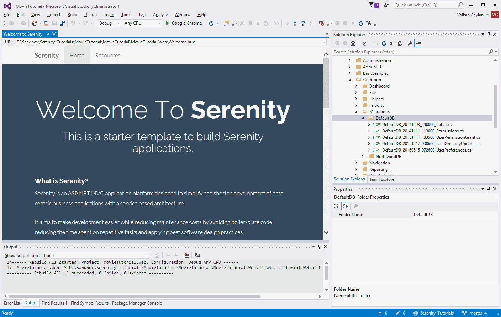

# 创建电影（*Movie*）表

要存储影片，我们需要一张电影（Movie）表。我们可以使用传统的方式创建该表，如使用 SQL Management Studio，但是我们更喜欢使用 *Fluent Migrator* 创建 *迁移类（migration）* 的方式创建表。

> Fluent Migrator 是一个 .NET 迁移框架，它与 Ruby 的 Rails 迁移框架类似。迁移（Migrations）用结构化的方式改变数据库架构（database schema），替代创建大量必须通过开发人员手工运行的 sql 脚本。迁移解决由一个数据库架构演变为多个数据库的问题(例如，开发人员的本地数据库、测试数据库和生产数据库)。数据库架构的更改在一个类中使用 C# 描述，可以把该类签入到版本控制系统中。

> 关于 FluentMigrator 的更多信息，详见 https://github.com/schambers/fluentmigrator。

在 *解决方案资源管理器* 中导航到 *Modules / Common / Migrations / DefaultDB*。




在这里，我们已经有几个迁移类。一个迁移类就像一个操纵数据库结构的 DML 脚本。

以 *DefaultDB_20141103_140000_Initial.cs* 为例，它包含创建 *Northwind* 表和 *Users* 表的初始迁移内容。

在同一文件夹中，创建一个名为 DefaultDB_20160519_115100_MovieTable.cs 的文件。你可以拷贝一个现有的迁移类文件，然后重命名并修改内容。

>迁移类文件名称/类名其实不重要，但建议你保持一致性并且正确地排序。

*20160519_115100* 对应于我们编写迁移类的 yyyyMMdd_HHmmss 格式的时间。它还将作为此迁移的唯一标识。

我们的迁移类文件看起来应该像下面这样：

```cs
using FluentMigrator;
using System;

namespace MovieTutorial.Migrations.DefaultDB
{
    [Migration(20160519115100)]
    public class DefaultDB_20160519_115100_MovieTable : Migration
    {
        public override void Up()
        {
            Create.Schema("mov");

            Create.Table("Movie").InSchema("mov")
                .WithColumn("MovieId").AsInt32()
                    .Identity().PrimaryKey().NotNullable()
                .WithColumn("Title").AsString(200).NotNullable()
                .WithColumn("Description").AsString(1000).Nullable()
                .WithColumn("Storyline").AsString(Int32.MaxValue).Nullable()
                .WithColumn("Year").AsInt32().Nullable()
                .WithColumn("ReleaseDate").AsDateTime().Nullable()
                .WithColumn("Runtime").AsInt32().Nullable();    
        }

        public override void Down()
        {
        }
    }
}
```

> 确保你使用的命名空间是 MovieTutorial.Migrations.DefaultDB，因为 Serene 模板仅在此命名空间下对默认数据库应用迁移。

在 *Up()* 方法中，当应用指定的迁移时，数据库将创建名为 mov 的 schema 。为避免与现有表发生冲突，我们为电影表使用一个独立的 schema。该方法将创建一个名为 *Movie* 的表，其字段有 "MovieId, Title, Description..."。

我们可以实现 *Down()* 方法，以便能够撤消这个迁移(删除电影表和 schema (mov) 等)，但对于这个示例，我们让它空着。

> 不能撤消迁移可能并没有太大影响，但误删除表便会造成更大的损害。

在类的顶部，我们使用 Migration 特性。

```cs
[Migration(20160519115100)]
```

这里指定此迁移的唯一键。迁移应用到数据库后，在一个特定于 FluentMigrator([dbo].[VersionInfo]) 的特殊表中记录该值，因此同一迁移不会被再次应用。

> 迁移的唯一健应该与类名同步(保持一致)，但没有强调迁移唯一键必须是 Int64 编号。

迁移是按唯一键顺序执行的，所以迁移的唯一键要使用一个可排序的日期时间模式，如把 yyyyMMdd 作为迁移唯一键就是个好主意。 

请确保你始终使用相同数量的字符作为迁移的唯一键，如 14位 (20160519115100)。否则你的迁移命令会一团糟，由于使用混乱的顺序迁移，因此你会得到迁移错误。


### 执行迁移

默认情况下，Serene 模板将在应用程序启动时自动运行 *MovieTutorial.Migrations.DefaultDB* 命名空间下的所有迁移。运行迁移代码的是文件 *App_Start/SiteInitialization.cs* 和 *App_Start/SiteInitialization.Migrations.cs*：

** SiteInitialization.Migrations.cs**:
```cs

namespace MovieTutorial
{
    //...
    
    public static partial class SiteInitialization
    {
        private static string[] databaseKeys = new[] { "Default", "Northwind" };

        //...
        private static void EnsureDatabase(string databaseKey)
        {
           //...
        }

        public static bool SkippedMigrations { get; private set; }

        private static void RunMigrations(string databaseKey)
        {
            // ...
            // safety check to ensure that we are not modifying an 
            // arbitrary database. remove these two lines if you want 
            // MovieTutorial migrations to run on your DB.
            if (cs.ConnectionString.IndexOf(typeof(SiteInitialization).Namespace +
                    @"_" + databaseKey + "_v1", 
                        StringComparison.OrdinalIgnoreCase) < 0)
            {
                SkippedMigrations = true;
                return;
            }

            // ...

            using (var sw = new StringWriter())
            {
                // ...
                var runner = new RunnerContext(announcer)
                {
                    Database = databaseType,
                    Connection = cs.ConnectionString,
                    Targets = new string[] { 
                        typeof(SiteInitialization).Assembly.Location },
                    Task = "migrate:up",
                    WorkingDirectory = Path.GetDirectoryName(
                        typeof(SiteInitialization).Assembly.Location),
                    Namespace = "MovieTutorial.Migrations." + databaseKey + "DB"
                };

                new TaskExecutor(runner).Execute();
            }
        }
    }
}
```

> 这里有对数据库名称进行安全性检查，以避免在 Serene 默认数据库 (MovieTutorial_Default_v1) 之外的其他数据库上运行迁移。如果你了解其中的风险，可以删除此检查。例如，如果你把 web.config 中的默认连接更改为你自己的生产数据库，迁移将在生产数据库上运行，你将得到 Northwind 等表，即使之前你的生产数据库没有这些表。

现在按 F5 运行应用程序并在默认数据库中创建电影表。


### 确认迁移类已经运行

使用 Sql Server Management Studio 或 Visual Studio -> Connection To Database，打开数据库 *MovieTutorial_Default_v1 database in server (localdb)\v11.0* 的连接。

> (localdb)\v11.0 是 SQL Server 2012 LocalDB 创建的 LocalDB 实例。

> 如果你还没有安装 LocalDB ，可从 https://www.microsoft.com/en-us/download/details.aspx?id=29062 下载。

> 如果你有 SQL Server 2014 LocalDB，你的服务器名（server name）应该变为 (localdb)\MSSqlLocalDB 或者 (localdb)\v12.0，所以你应该修改 web.config 文件的连接字符串。

> 你也可以使用另外一个 SQL server 实例，只需把连接字符串配置为目标服务器，并删除迁移的安全检查。

你应该在 SQL 对象资源管理器中看到 *[mov].[Movies]* 表。

同样地，当你查看 *[dbo].[VersionInfo]* 表数据时，最后一行的 Version 列应为 20160519115100。它表明已经在此数据库执行该版本(迁移唯一键)的迁移。


> 通常，你不必在每一个迁移后都做这些检查。在这里，我们只是演示如果你将来遇到迁移问题，你应该在到哪里去检查。
