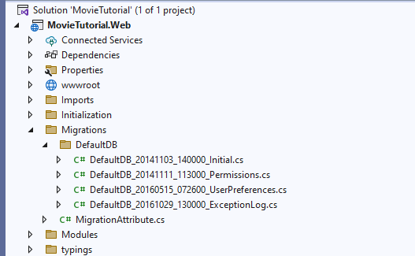
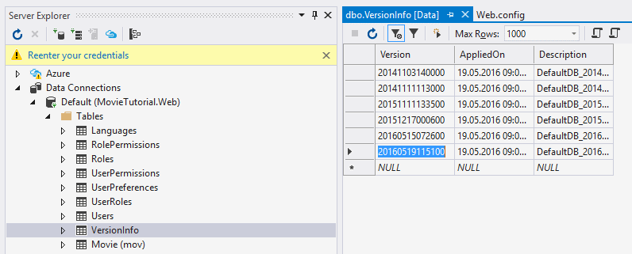

# Creating *Movie* Table

To store list of movies we need a Movie table. We could create this table using old-school techniques like SQL Management Studio but we prefer creating it as a *migration* using *Fluent Migrator*:

> Fluent Migrator is a migration framework for .NET much like Ruby on Rails Migrations. Migrations are a structured way to alter your database schema and are an alternative to creating lots of sql scripts that have to be run manually by every developer involved. Migrations solve the problem of evolving a database schema for multiple databases (for example, the developer’s local database, the test database and the production database). Database schema changes are described in classes written in C# that can be checked into a version control system.

> See https://github.com/schambers/fluentmigrator for more information on FluentMigrator.

### Please Note

As we are using FluentMigrator in our samples, some users assume Serenity doesn't work without it. That's not correct. You don't have to use migrations. Serenity has no direct dependency on migrations.

If you like, instead of using these migrations you may manually create tables in SQL Management Studio.

You could also work with an existing database.

## Locating Migration Folder

Using *Solution Explorer* navigate to *Migrations / DefaultDB*.




Here we already have several migrations. A migration is like a DML script that manipulates database structure.

*DefaultDB_20141103_140000_Initial.cs* for example, contains our initial migration that created *Northwind* tables and *Users* table.

Create a new migration file in the same folder with name *DefaultDB_20160519_115100_MovieTable.cs*. You can copy and change one of the existing migration files, rename it and change contents.

> Migration file name / class name is actually not important but recommended for consistency and correct ordering.

*20160519_115100* corresponds to the time we are writing this migration in yyyyMMdd_HHmmss format. It will also act as a unique key for this migration.

Our migration file should look like below:

```cs
using FluentMigrator;
using System;

namespace MovieTutorial.Migrations.DefaultDB
{
    [Migration(20160519115100)]
    public class DefaultDB_20160519_115100_MovieTable : Migration
    {
        public override void Up()
        {
            Create.Schema("mov");

            Create.Table("Movie").InSchema("mov")
                .WithColumn("MovieId").AsInt32()
                    .Identity().PrimaryKey().NotNullable()
                .WithColumn("Title").AsString(200).NotNullable()
                .WithColumn("Description").AsString(1000).Nullable()
                .WithColumn("Storyline").AsString(Int32.MaxValue).Nullable()
                .WithColumn("Year").AsInt32().Nullable()
                .WithColumn("ReleaseDate").AsDateTime().Nullable()
                .WithColumn("Runtime").AsInt32().Nullable();    
        }

        public override void Down()
        {
        }
    }
}
```

> Make sure you use the namespace *MovieTutorial.Migrations.DefaultDB* as Serene template applies migrations only in this namespace to the default database.

In *Up()* method we specify that this migration, when applied, will create a schema named *mov*. We will use a separate schema for movie tables to avoid clashes with existing tables. It will also create a table named *Movie* with "MovieId, Title, Description..." fields on it.

We could implement *Down()* method to make it possible to undo this migration (drop movie table and mov schema etc), but for the scope of this sample, lets leave it empty.

> Inability to undo a migration might not hurt much, but deleting a table by mistake could do more damage.

On top of our class we applied a Migration attribute.

```cs
[Migration(20160519115100)]
```

This specifies a unique key for this migration. After a migration is applied to a database, its key is recorded in a special table specific to FluentMigrator ([dbo].[VersionInfo]), so same migration won't be applied again.

> Migration key should be in sync with class name (for consistency) but without underscore as migration keys are Int64 numbers.

Migrations are executed in the key order, so using a sortable datetime pattern like yyyyMMdd for migration keys looks like a good idea. 

Please make sure you always use same number of characters for migration keys e.g. 14 (20160519115100). Otherwise your migration order will get messed up, and you will have migration errors, due to migrations running in unexpected order.


### Running Migrations

By default, Serene template runs all migrations in *MovieTutorial.Migrations.DefaultDB* namespace. This happens on application start automatically. 

The code that runs migrations are in *App_Start/SiteInitialization.cs* and *App_Start/SiteInitialization.Migrations.cs* files:

> In Asp.Net Core version, they are under *Initialization/Startup.cs* and *Initialization/DataMigrations.cs* files as there is no App_Start folder in ASP.NET Core.

** SiteInitialization.Migrations.cs (or DataMigrations.cs)**:
```cs

namespace MovieTutorial
{
    //...
    
    public static partial class SiteInitialization
    {
        private static string[] databaseKeys = new[] { "Default", "Northwind" };

        //...
        private static void EnsureDatabase(string databaseKey)
        {
           //...
        }

        public static bool SkippedMigrations { get; private set; }

        private static void RunMigrations(string databaseKey)
        {
            // ...
            // safety check to ensure that we are not modifying an 
            // arbitrary database. remove these two lines if you want 
            // MovieTutorial migrations to run on your DB.
            if (cs.ConnectionString.IndexOf(typeof(SiteInitialization).Namespace +
                    @"_" + databaseKey + "_v1", 
                        StringComparison.OrdinalIgnoreCase) < 0)
            {
                SkippedMigrations = true;
                return;
            }

            // ...

            using (var sw = new StringWriter())
            {
                // ...
                var runner = new RunnerContext(announcer)
                {
                    Database = databaseType,
                    Connection = cs.ConnectionString,
                    Targets = new string[] { 
                        typeof(SiteInitialization).Assembly.Location },
                    Task = "migrate:up",
                    WorkingDirectory = Path.GetDirectoryName(
                        typeof(SiteInitialization).Assembly.Location),
                    Namespace = "MovieTutorial.Migrations." + databaseKey + "DB"
                };

                new TaskExecutor(runner).Execute();
            }
        }
    }
}
```

> There is a safety check on database name to avoid running migrations on some arbitrary database other than the default Serene database (MovieTutorial_Default_v1). You can remove this check if you understand the risks. For example, if you change default connection in web.config to your own production database, migrations will run on it and you will have Northwind etc tables even if you didn't mean to.

Now press F5 to run your application and create Movie table in default database.


### Verifying That the Migration is Run

Using Sql Server Management Studio or Visual Studio -> Connection To Database, open a connection to MovieTutorial_Default_v1 database in server *(localdb)\v11.0*.

> (localdb)\v11.0 is a LocalDB instance created by SQL Server 2012 LocalDB. 

> If you didn't install LocalDB yet, download it from https://www.microsoft.com/en-us/download/details.aspx?id=29062.

> If you have SQL Server 2014 LocalDB, your server name would be (localdb)\MSSqlLocalDB or (localdb)\v12.0, so change connection string in web.config file. 

> You could also use another SQL server instance, just change the connection string to target server and remove the migration safety check.

You should see *[mov].[Movies]* table in SQL object explorer.

Also when you view data in *[dbo].[VersionInfo]* table, Version column in the last row of the table should be *20160519115100*. This specifies that the migration with that version number (migration key) is already executed on this database.



> Usually, you don't have to do these checks after every migration. Here we show these to explain where to look, in case you'll have any trouble in the future.
