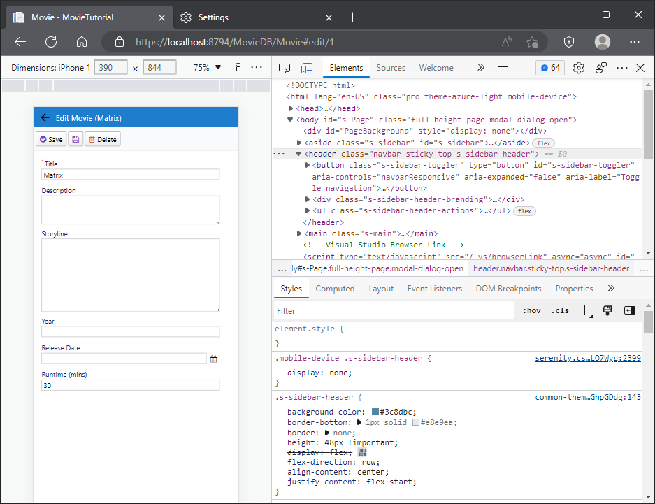

# Customizing Movie UI

## Customizing Field Captions

In our movie grid and form, we have a field named *Runtime*. This field expects an integer number in *minutes*, but its title doesn't indicate this. Let's change its title to "Runtime (mins)".

There are several ways to make this change. Options include server-side form definition, server-side column definition, script grid code, and more. However, for a central and consistent change, let's update the entity itself so that its title changes everywhere.

When Sergen generated code for the Movie table, it created an entity class named MovieRow. You can find it at *Modules/MovieDB/Movie/MovieRow.cs*.

Here's an excerpt from its source code, including our Runtime property:

```cs
//...
public sealed class MovieRow : Row<MovieRow.RowFields>, IIdRow, INameRow
{
    //...
    
    [DisplayName("Runtime")]
    public int? Runtime { get => fields.Runtime[this]; set => fields.Runtime[this] = value; }
    
    //...
}
```

We'll delve into entities (or rows) in more detail later. For now, let's concentrate on our objective: changing the `DisplayName` attribute value to `Runtime (mins)`:

```cs
//...
public sealed class MovieRow : Row<MovieRow.RowFields>, IIdRow, INameRow
{
    //...
    
    [DisplayName("Runtime (mins)")]
    public int? Runtime { get => fields.Runtime[this]; set => fields.Runtime[this] = value; }
    
    //...
}
```

Next, rebuild the solution and run the application. You'll notice that the field title is updated in both the grid and the dialog.

> Column title has `...` in it as column is not wide enough, though its hint shows the full title. We'll see how to handle this soon.


## Overriding Column Title and Width

We're doing well so far. But what if we want to display a different title in the grid (columns) or dialog (form)? We can override it in the corresponding definition file.

> You can refer to [this](./../../attributes/attributes.md) page to see the attributes that can be used on a Column or Form.

Let's start with modifying columns. Next to `MovieRow.cs`, you can find a source file named `MovieColumns.cs`:

```cs
namespace MovieTutorial.MovieDB.Columns;

[ColumnsScript("MovieDB.Movie")]
[BasedOnRow(typeof(MovieRow), CheckNames = true)]
public class MovieColumns
{
    //...

    public int Runtime { get; set; }
}
```

You may have noticed that this column definition is based on the `MovieRow` entity, thanks to the `BasedOnRow` attribute. 

Any attribute you write on properties here will override attributes defined in the entity class.

Let's add a `DisplayName` attribute to the Runtime property:

```cs
namespace MovieTutorial.MovieDB.Columns;

[ColumnsScript("MovieDB.Movie")]
[BasedOnRow(typeof(MovieRow), CheckNames = true)]
public class MovieColumns
{
    //...

    [DisplayName("Runtime in Minutes"), Width(150), AlignRight]
    public int Runtime { get; set; }
}
```

Now, we've set the column caption to `Runtime in Minutes`. In addition, we've added two more attributes:

- One to override the column width to 150px. (Serenity automatically assigns a width to columns based on the field type and character length unless you set it explicitly.)
- Another one to align the column to the right. (You can also use `AlignCenter` or `AlignLeft` for alignment.)

Let's rebuild and run the application again, and you'll observe the following:


Form field title has remained the same, while the column title has changed.

If we wanted to override the form field title instead, we would follow similar steps in the `MovieForm.cs` file.

## Changing Editor Type for Description and Storyline

The Description and Storyline fields can be a bit longer compared to the Title field, so let's change their editor types to a textarea.

Open the `MovieForm.cs` file located in the same folder as `MovieColumns.cs` and `MovieRow.cs`.

```cs
//...
[FormScript("MovieDB.Movie")]
[BasedOnRow(typeof(MovieRow), CheckNames = true)]
public class MovieForm
{
    public string Title { get; set; }
    public string Description { get; set; }
    public string Storyline { get; set; }
    //...
}
```

and add `TextAreaEditor` attributes to both the `Description` and `Storyline` properties:

```cs
//...
[FormScript("MovieDB.Movie")]
[BasedOnRow(typeof(MovieRow), CheckNames = true)]
public class MovieForm
{
    public string Title { get; set; }
    [TextAreaEditor(Rows = 3)]
    public string Description { get; set; }
    [TextAreaEditor(Rows = 8)]
    public string Storyline { get; set; }
    //...
}
```
> Please Note: This is just a sample for modifying forms separately. It is recommended to set editor types in the row property instead of the form.

I've set more editing rows for Storyline (8) compared to Description (3) as Storyline should be much longer.

After rebuilding and running the application, we now have this:


Serene offers various editor types to choose from. Some are automatically selected based on the field data type, while you need to set others explicitly.

> You can also develop your own editor types. You can either build them on existing editor types as base classes or create entirely new ones from scratch. We'll explore this in upcoming chapters.

## Setting Initial Dialog Size With CSS

Now, let's make adjustments to the size of the Movie dialog. Your CSS is located in the `MovieTutorial.Web/wwwroot/Content/site/site.css` file.

To change the dialog size, you can add CSS rules to it.

```css
.s-MovieDB-MovieDialog > .size {
  width: 650px;
  height: 550px;
}

.s-MovieDB-MovieDialog .caption {
  width: 150px;
}
```

These rules are applied to elements with the class `s-MovieDB-MovieDialog`. Our Movie dialog has this class by default, which is generated as "s-" + ModuleName + "-" + ClassName.

The CSS rule for size specifies that this dialog is 650px wide and 550px in height by default.

The caption rule line specifies that field labels should be 150px.

After doing these changes, you can see its effects immediately when you refresh the browser. 


What I meant by 'desktop mode' earlier will become clearer shortly. Serenity dialogs are responsive by default. Let's resize our browser window to a width of about 350px. I'll use the mobile mode of my Chrome browser to switch to an iPhone 12 Pro:



And now, let's switch to an iPad in landscape mode:


So, the height we set here is only meaningful for desktop mode. The dialog will transform into a responsive, device-size-specific mode on mobile, without the need to deal with CSS `@media` queries."

## Changing Page Title

Our page currently has the title `Movie`. Let's update it to `Movies` which feels more natural.

Open the `MovieRow.cs` file again and change the `DisplayName` attribute value on top of the row class to `"Movies"`.

```cs
// ...
[DisplayName("Movies"), InstanceName("Movie")]
public sealed class MovieRow : Row<MovieRow.RowFields>, IIdRow, INameRow
{
```

This name is used when referencing the table and is typically in plural form. This attribute also determines the default page title.

> While it's possible to override the page title in the `MoviePage.cs` file, we prefer to make such changes from a central location to ensure reusability in other parts of the application.

The `InstanceName` corresponds to the singular name and is used in the `New  Movie` (Add) button on the grid and also determines the dialog title (e.g., `Edit Movie`).