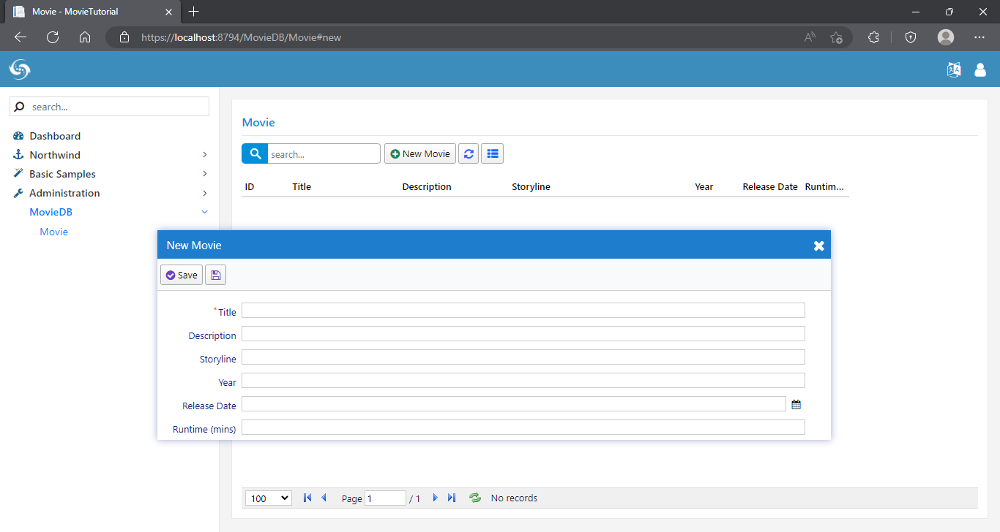
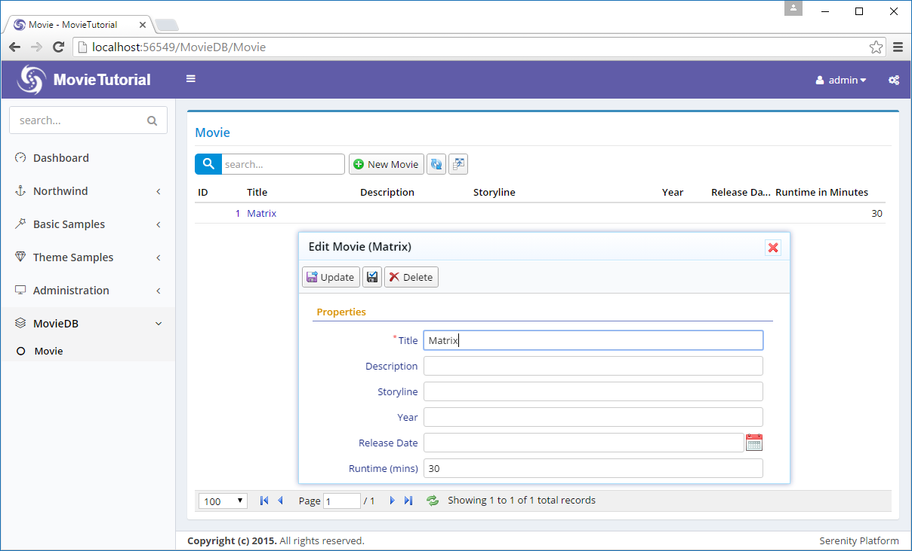
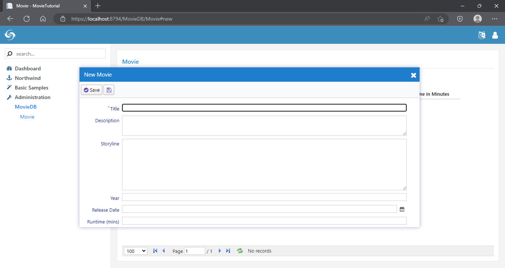
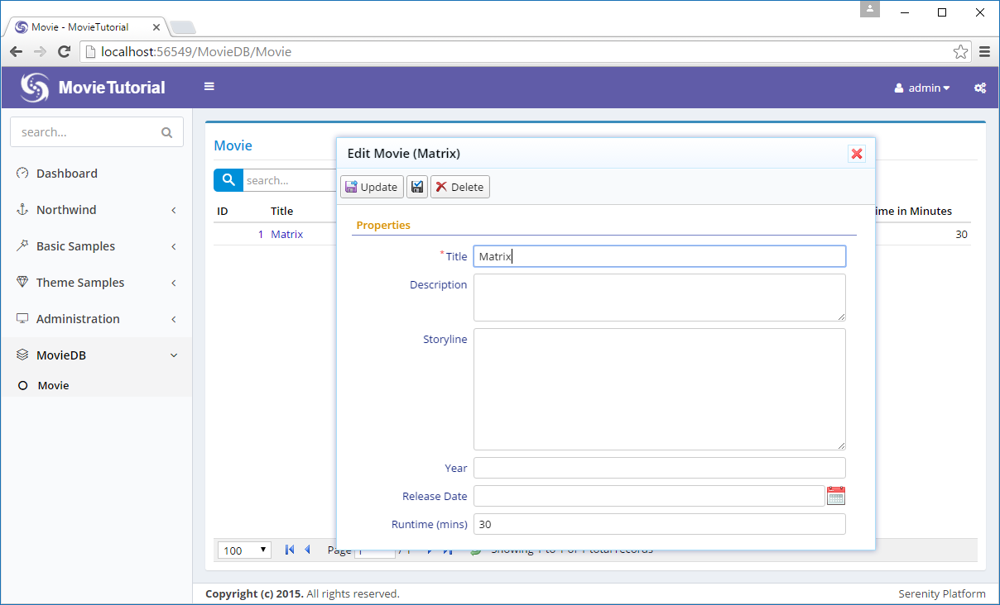
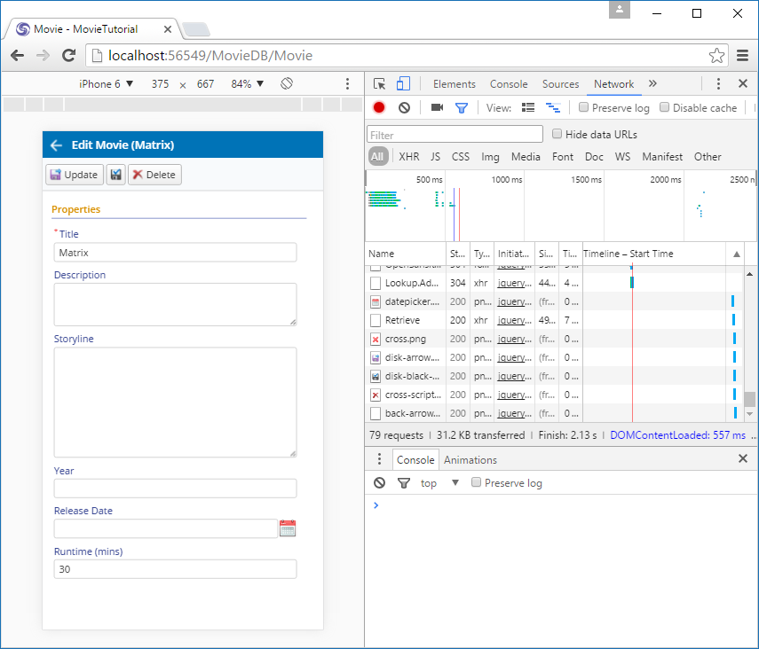
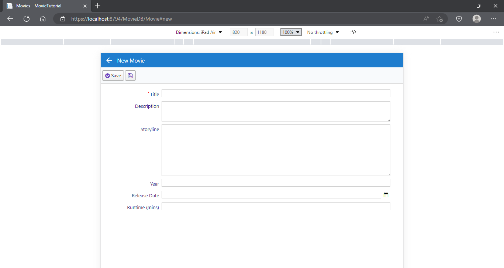

# Customizing Movie Interface


### Customizing Field Captions

In our movie grid and form, we have a field named *Runtime*. This field expects an integer number in *minutes*, but in its title there is no sign of this. Let's change its title to Runtime (mins).

There are several ways to do this. Our options include server side form definition, server side columns definition, from script grid code etc. But let's make this change in the central location, the entity itself, so its title changes everywhere.

When Sergen generated code for Movie table, it created a entity class named MovieRow. You can find it at  *Modules/MovieDB/Movie/MovieRow.cs*.

Here is an excerpt from its source with our Runtime property:

```cs
namespace MovieTutorial.MovieDB.Entities
{
    // ...
    [ConnectionKey("Default"), DisplayName("Movie"), 
     InstanceName("Movie"), TwoLevelCached]
    public sealed class MovieRow : Row, IIdRow, INameRow
    {
        // ...
        [DisplayName("Runtime")]
        public Int32? Runtime
        {
            get { return Fields.Runtime[this]; }
            set { Fields.Runtime[this] = value; }
        }
        //...
    }
}
```

We'll talk about entities (or rows) later, let's now focus on our target and change its DisplayName attribute value to *Runtime (mins)":

```cs
namespace MovieTutorial.MovieDB.Entities
{
    // ...
    [ConnectionKey("Default"), DisplayName("Movie"), InstanceName("Movie"), 
     TwoLevelCached]
    public sealed class MovieRow : Row, IIdRow, INameRow
    {
        // ...
        [DisplayName("Runtime (mins)")]
        public Int32? Runtime
        {
            get { return Fields.Runtime[this]; }
            set { Fields.Runtime[this] = value; }
        }
        //...
    }
}
```

Now build solution and run application. You'll see that field title is changed in both grid and dialog. 

> Column title has "..." in it as column is not wide enough, though its hint shows the full title. We'll see how to handle this soon.




### Overriding Column Title and Width 


So far so good, what if we wanted to show another title in grid (columns) or dialog (form). We can override it corresponding definition file.

Let's do it on columns first. Next to *MovieRow.cs*, you can find a source file named *MovieColumns.cs*:

```cs
namespace MovieTutorial.MovieDB.Columns
{
    // ...

    [ColumnsScript("MovieDB.Movie")]
    [BasedOnRow(typeof(Entities.MovieRow))]
    public class MovieColumns
    {
        [EditLink, DisplayName("Db.Shared.RecordId"), AlignRight]
        public Int32 MovieId { get; set; }
        //...
        public Int32 Runtime { get; set; }
    }
}
```

You may notice that this columns definition is based on the Movie entity (BasedOnRow attribute).

Any attribute written here will override attributes defined in the entity class.

Let's add a DisplayName attribute to the *Runtime* property:

```cs
namespace MovieTutorial.MovieDB.Columns
{
    // ...

    [ColumnsScript("MovieDB.Movie")]
    [BasedOnRow(typeof(Entities.MovieRow))]
    public class MovieColumns
    {
        [EditLink, DisplayName("Db.Shared.RecordId"), AlignRight]
        public Int32 MovieId { get; set; }
        //...
        [DisplayName("Runtime in Minutes"), Width(150), AlignRight]
        public Int32 Runtime { get; set; }
    }
}
```

Now we set column caption to "Runtime in Minutes". 

We actually added two more attributes. 

One to override column width to 150px.

> Serenity applies an automatic width to columns based on field type and character length, unless you set the width explicitly.

And another one to align column to right (AlignCenter, AlignLeft is also available).

Let's build and run again, than we get: 



Form field title stayed same, while column title changed.

> If we wanted to override form field title instead, we would do similar steps in MovieForm.cs


### Changing Editor Type For Description and Storyline

Description and Storyline fields can be a bit longer compared to Title field, so lets change their editor types to a textarea.

Open *MovieForm.cs* in the same folder with *MovieColumns.cs* and *MovieRow.cs*.

```cs
namespace MovieTutorial.MovieDB.Forms
{
    //...
    [FormScript("MovieDB.Movie")]
    [BasedOnRow(typeof(Entities.MovieRow))]
    public class MovieForm
    {
        public String Title { get; set; }
        public String Description { get; set; }
        public String Storyline { get; set; }
        public Int32 Year { get; set; }
        public DateTime ReleaseDate { get; set; }
        public Int32 Runtime { get; set; }
    }
}
```

and add TextAreaEditor attributes to both:

```cs
namespace MovieTutorial.MovieDB.Forms
{
    //...
    [FormScript("MovieDB.Movie")]
    [BasedOnRow(typeof(Entities.MovieRow))]
    public class MovieForm
    {
        public String Title { get; set; }
        [TextAreaEditor(Rows = 3)]
        public String Description { get; set; }
        [TextAreaEditor(Rows = 8)]
        public String Storyline { get; set; }
        public Int32 Year { get; set; }
        public DateTime ReleaseDate { get; set; }
        public Int32 Runtime { get; set; }
    }
}
```

I left more editing rows for Storyline (8) compared to Description (3) as Storyline should be much longer.

After rebuild and run, we have this:



Serene has several editor types to choose from. Some are automatically picked based on field data type, while you need to explicitly set others.

> You can also develop your own editor types. You can take existing editor types as base classes, or develop your own from stratch. We'll see how in following chapters.

As editors became a bit higher, form height exceeded the default Serenity form height (which is about 260px) and now we have a vertical scroll bar. Let's remove it.

### Setting Initial Dialog Size With CSS (Less)

Sergen generated some CSS for our movie dialog in *MovieTutorial.Web/Content/site/site.moviedb.less* file (in Visual Studio it may appear as a child of *site.less* if you have file nesting enabled).

If you open it, you will see this:

```css
@import "site.mixins.less";

.s-MovieDB-MovieDialog {
    > .size { width: 650px; }
    .caption { width: 150px; }
}
```

These rules are applied to elements with *.s-MovieDB-MovieDialog* class. Our Movie dialog has this class by default, which is generated by "s-" + ModuleName + "-" + ClassName. 

The second line of this style class specifies that this dialog is 650px wide by default.

The third line specifies that field labels should be 150px (@l: 150px).

Let's change our initial dialog height to 500px (in desktop mode), so it won't require a vertical scroll bar:

```css
@import "site.mixins.less";

.s-MovieDialog {
    > .size { width: 650px; height: 500px; }
    .caption { width: 150px; }
}
```

For this change to be applied to your dialog, you need to build solution. As the "site.\*.less" files are compiled to a "site.css" file on build. Now build and refresh the page.



What i mean by *desktop mode* above will become clearer soon. Serenity dialogs are responsive by default. Let's resize our browser window to a width about 350px. I'll use mobile mode of my Chrome browser to switch to iPhone 6:




And now an iPad in landscape mode:



So, the height we set here is only meaningfull for desktop mode. Dialog will turn into a responsive, device size specific mode in mobile, without having to mess with CSS @media queries.


### Changing Page Title

Our page has title of *Movie*. Let's change it to *Movies*. 

Open *MovieRow.cs* again. 

```cs
namespace MovieTutorial.MovieDB.Entities
{
    // ...
    [ConnectionKey("Default"), DisplayName("Movie"), InstanceName("Movie"), 
     TwoLevelCached]
    public sealed class MovieRow : Row, IIdRow, INameRow
    {
        [DisplayName("Movie Id"), Identity]
        public Int32? MovieId
```

Change DisplayName attribute value to *Movies*. This is the name that is used when this table is referenced, and it is usually a plural name. This attribute is used for determining default page title. 

> It is also possible to override the page title in *MoviePage.Index.cshtml* file but as before, we prefer to do it from a central location so that this information can be reused in other places.

InstanceName corresponds to singular name and is used in New Record (New Movie) button of the grid and also determines the dialog title (e.g. Edit Movie).

```cs
namespace MovieTutorial.MovieDB.Entities
{
    // ...
    [ConnectionKey("Default"), DisplayName("Movies"), InstanceName("Movie"), 
     TwoLevelCached]
    public sealed class MovieRow : Row, IIdRow, INameRow
    {
        [DisplayName("Movie Id"), Identity]
        public Int32? MovieId
```
