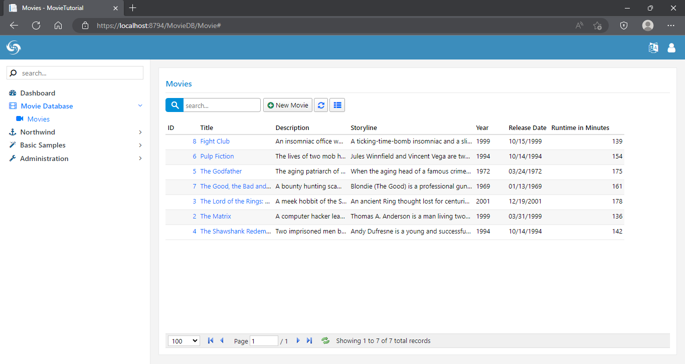
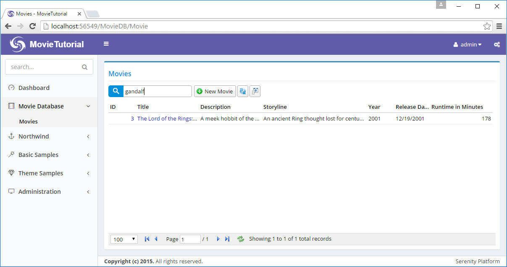
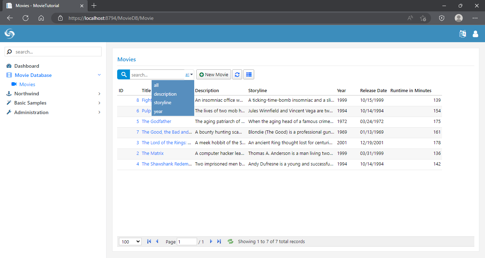

# Customizing Quick Search

### Adding Several Movie Entries

For the following sections, we need some sample data. We can copy and paste some from IMDB.

If you don't want to waste your time entering this sample data, it is available as a migration at the link below:

> https://github.com/volkanceylan/Serenity-Tutorials/blob/master/MovieTutorial/MovieTutorial/MovieTutorial.Web/Modules/Common/Migrations/DefaultDB/DefaultDB_20160519_135200_SampleMovies.cs




If we typed *go* into search box, we would see two movies are filtered: *The Good, the Bad and the Ugly* and *The Godfather*.

If we typed *Gandalf* we wouldn't be able to find anything. 

By default, Sergen determines first textual field of a table as *the name field*. In movies table it is *Title*. This field has a *QuickSearch* attribute on it that specifies that text searches should be performed on it.

> The name field also determines initial sorting order and shown in edit dialog titles. 

Sometimes, first textual column might not be the name field. If you wanted to change it to another field, you would do it in *MovieRow.cs*:

```cs

namespace MovieTutorial.MovieDB.Entities
{
    //...
    public sealed class MovieRow : Row, IIdRow, INameRow
    {
        //...
        StringField INameRow.NameField
        {
            get { return Fields.Title; }
        }
}
```

Code generator determined that first textual (string) field in our table is Title. So it added a INameRow interface to our Movies row and implemented it by returning Title field. If wanted to use Description as name field, we would just replace it.

Here, *Title* is actually the name field, so we leave it as is. But we want Serenity to search also in *Description* and *Storyline* fields. To do this, you need to add *QuickSearch* attribute to these fields too, as shown below:

```
namespace MovieTutorial.MovieDB.Entities
{
    //...
    public sealed class MovieRow : Row, IIdRow, INameRow
    {
        //...
        [DisplayName("Title"), Size(200), NotNull, QuickSearch]
        public String Title
        {
            get { return Fields.Title[this]; }
            set { Fields.Title[this] = value; }
        }

        [DisplayName("Description"), Size(1000), QuickSearch]
        public String Description
        {
            get { return Fields.Description[this]; }
            set { Fields.Description[this] = value; }
        }

        [DisplayName("Storyline"), QuickSearch]
        public String Storyline
        {
            get { return Fields.Storyline[this]; }
            set { Fields.Storyline[this] = value; }
        }
        //...
    }
}
```

Now, if we search for *Gandalf*, we'll get a *The Lord of the Rings* entry:



QuickSearch attribute, by default, searches with *contains* filter. It has some options to make it match by *starts with* filter or match only exact values.

If we wanted it to show only rows that *starts with* typed text, we would change attribute to:

```cs
[DisplayName("Title"), Size(200), NotNull, QuickSearch(SearchType.StartsWith)]
public String Title
{
    get { return Fields.Title[this]; }
    set { Fields.Title[this] = value; }
}
```

> Here this quick search feature is not very useful, but for values like SSN, serial number, identification number, phone number etc, it might be.

If we wanted to search also in year column, but only exact integer values (1999 matches but not 19):

```
[DisplayName("Year"), QuickSearch(SearchType.Equals, numericOnly: 1)]
public Int32? Year
{
    get { return Fields.Year[this]; }
    set { Fields.Year[this] = value; }
}
```

> You might have noticed that we are not writing any C# or SQL code for these basic features to work. We just specify what we want, rather than how to do it. This is what declarative programming is. 

It is also possible to provide user with ability to determine which field she wants to search on.

Open *MovieTutorial.Web/Modules/MovieDB/Movie/MovieGrid.ts* and modify it like:

```ts

namespace MovieTutorial.MovieDB {
    
    @Serenity.Decorators.registerClass()
    export class MovieGrid extends 
          Serenity.EntityGrid<MovieRow, any> {
        //...
        constructor(container: JQuery) {
            super(container);
        }

        protected getQuickSearchFields():
              Serenity.QuickSearchField[] {
            return [
                { name: "", title: "all" },
                { name: "Description", title: "description" },
                { name: "Storyline", title: "storyline" },
                { name: "Year", title: "year" }
            ];
        }
    }
}
```

Once you save that file, we'll have a dropdown in quick search input:



> Unlike prior samples where we modified Server side code, this time we did changes in client side, and modified Javascript (TypeScript) code.


### Running T4 Templates (.tt files)

In prior sample we harcoded field names like *Description*, *Storyline* etc. This may lead to typing errors if we forgot actual property names or their casing at server side (javascript is case sensitive).

Serene contains some T4 (.tt) files to transfer such information from server side (rows etc in C#) to client side (TypeScript) for intellisense purposes.

Before running these templates, please make sure that your solution builds successfully as templates uses your output DLL file (*MovieTutorial.Web.dll*) to generate code.

After building your solution, click on *Build* menu, than *Transform All Templates*.

We can now use intellisense to replace hardcoded field names with compile time checked versions:

```ts
namespace MovieTutorial.MovieDB
{
    //...
    public class MovieGrid extends EntityGrid<MovieRow, any>
    {
        constructor(container: JQuery) {
            super(container);
        }

        protected getQuickSearchFields(): Serenity.QuickSearchField[]
        {
            let fld = MovieRow.Fields;
            return [
                { name: "", title: "all" },
                { name: fld.Description, title: "description" },
                { name: fld.Storyline, title: "storyline" },
                { name: fld.Year, title: "year" }
            ];
        }
    }
    ///...
}
```

What about field titles? It is not so critical as field names, but can be useful for localization purposes (if we later decide to translate it):

```ts
namespace MovieTutorial.MovieDB
{
    //...
    public class MovieGrid extends EntityGrid<MovieRow, any>
    {
        constructor(container: JQuery) {
            super(container);
        }

        protected getQuickSearchFields(): Serenity.QuickSearchField[] {
            let fld = MovieRow.Fields;
            let txt = (s) => Q.text("Db." + 
                MovieRow.localTextPrefix + "." + s).toLowerCase();
            return [
                { name: "", title: "all" },
                { name: fld.Description, title: txt(fld.Description) },
                { name: fld.Storyline, title: txt(fld.Storyline) },
                { name: fld.Year, title: txt(fld.Year) }
            ];
        }
    }
    ///...
}
```

We made use of the local text dictionary (translations) available at client side. It's something  like this:

```json
{
   // ...
   "Db.MovieDB.Movie.Description": "Description",
   "Db.MovieDB.Movie.Storyline": "Storyline",
   "Db.MovieDB.Movie.Year": "Year"
   // ...
}
```

Local text keys for rows are generated from "Db." + ModuleName + "." + RowClassName + "." + FieldName.

Their values are generated from [DisplayName] attributes on your fields by default but might be something else if they are translated.
