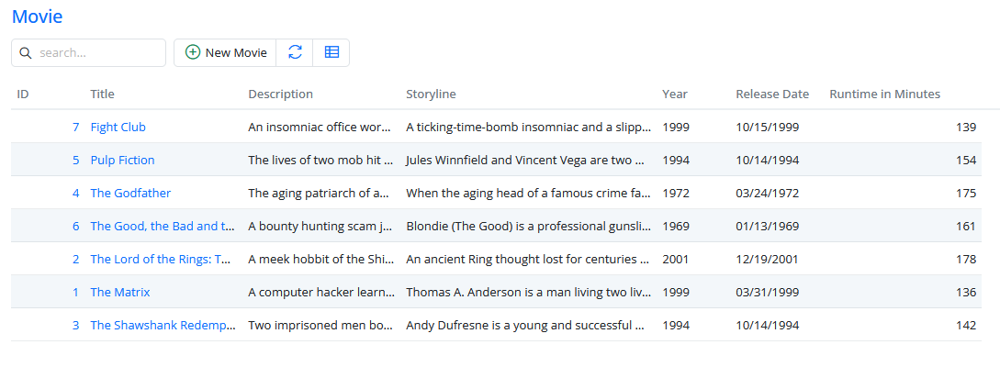
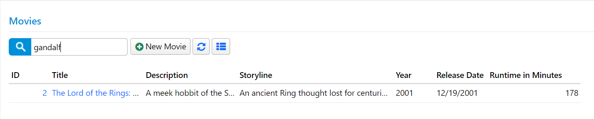
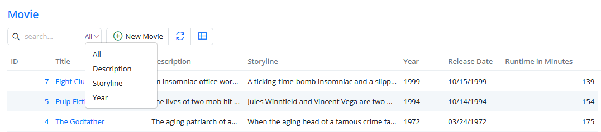

# Customizing Quick Search

## Adding Multiple Movie Entries

To proceed with the upcoming sections, we require some sample data. You have the option to manually enter this data, or you can save time by using the sample data available in a migration file, which can be found [here](https://gist.github.com/volkanceylan/0b3e71de6247ad9963e33889f85003bc).

If you choose to use the migration file, create a new migration with a suitable name, such as `DefaultDB_20221114_1703_MovieData.cs`. In the `Up` method of this migration, paste the code from the provided gist, like this:

```cs
namespace MovieTutorial.Migrations.DefaultDB;

[DefaultDB, Migration(20221114_1703)]
public class DefaultDB_20221114_1703_MovieData : AutoReversingMigration
{
    public override void Up()
    {
        Insert.IntoTable("Movie").InSchema("mov")
            .Row(new
            {
                Title = "The Matrix",
        //...
    }
}
```

After creating the migration, restart your application to execute it.

By adding this movie data, you will have a set of sample entries to work with, as shown in the image:



If we were to enter "go" into the search box, two movies, "The Good, the Bad and the Ugly" and "The Godfather," would be filtered.

However, if we tried searching for "Gandalf," we wouldn't find any results. This is because, by default, Serenity identifies the first textual field in a table as "the name field", which is used for text searches. In the "Movies" table, the name field is "Title", and this field is marked with the `QuickSearch` attribute to enable text searches.

The name field also determines the initial sorting order and is used in edit dialog titles. Sometimes, the first textual column might not be suitable as the name field. In such cases, you can change it by switching the `[NameProperty]` attribute from the current property, such as "Title", to another property, like "Description". However, in our case, "Title" is indeed the name field, so we leave it as is.

If you want Serenity to search in additional fields, like "Description" and "Storyline", you should add the `QuickSearch` attribute to these fields as well. Here's how it's done:

```cs
//...
public sealed class MovieRow : Row<MovieRow.RowFields>, IIdRow, INameRow
{
    //...
    [DisplayName("Title"), Size(200), NotNull, QuickSearch, NameProperty]
    public string Title { get => fields.Title[this]; set => fields.Title[this] = value; }

    [DisplayName("Description"), Size(1000), QuickSearch]
    public string Description { get => fields.Description[this]; set => fields.Description[this] = value; }

    [DisplayName("Storyline"), QuickSearch]
    public string Storyline { get => fields.Storyline[this]; set => fields.Storyline[this] = value; }
    //...
}
```

By adding the `QuickSearch` attribute to the "Description" and "Storyline" fields, you enable text searches in these columns. Now, if you search for "Gandalf", you'll get an entry for "The Lord of the Rings":



The `QuickSearch` attribute, by default, performs a search using a "contains" filter. However, you can adjust its behavior by using different search types. For example, if you want to show rows that start with the typed text, you can modify the attribute like this:

```cs
[DisplayName("Title"), Size(200), NotNull, QuickSearch(SearchType.StartsWith)]
public string Title
```

In this example, the `SearchType.StartsWith` option is used, which filters for values that start with the specified text. This can be useful for matching values like SSN, serial numbers, identification numbers, phone numbers, and more.

If you want to search in the "Year" column but only for exact integer values (e.g., "1999" matches, but not "19"), you can configure it like this:

```cs
[DisplayName("Year"), QuickSearch(SearchType.Equals, numericOnly: 1)]
public int? Year
```

In this case, the `SearchType.Equals` option is used, and we set `numericOnly: 1` to indicate that only exact numeric matches are allowed. This can be useful when you need to search for specific integer values.

The beauty of these features is that you don't need to write complex C# or SQL code to make them work. Instead, you simply specify what you want, leaving the "how to do it" part to Serenity. This approach is known as declarative programming, where you describe your intentions rather than the implementation details.

You can also provide users with the ability to choose which field they want to search on. To do this, open *MovieGrid.ts* and make the following modifications:

```ts
import { Decorators, EntityGrid, QuickSearchField } from '@serenity-is/corelib';
//...
@Decorators.registerClass('MovieTutorial.MovieDB.MovieGrid')
export class MovieGrid extends EntityGrid<MovieRow, any> {
    // ...
    protected getQuickSearchFields(): QuickSearchField[] {
        return [
            { name: "", title: "All" },
            { name: "Description", title: "Description" },
            { name: "Storyline", title: "Storyline" },
            { name: "Year", title: "Year" }
        ];
    }
}
```

After saving this file, a dropdown will appear in the quick search input, allowing users to select the field they want to search on:



Unlike previous examples where we modified server-side code, this time we made changes on the client side by modifying JavaScript (TypeScript) code.

### Code Transformations with Sergen

In the previous example, we hardcoded field names like *Description*, *Storyline*, etc., which can lead to typing errors if the actual property names or their casing on the server-side (JavaScript is case-sensitive) are forgotten.

Sergen generates code to transfer this information from the server-side (C# rows) to the client-side (TypeScript) for IntelliSense purposes on every build.

You can also manually transform the templates by opening a command prompt in the project directory and typing `dotnet sergen t`.

From now on, when we mention "transforming templates," it means either rebuilding the application or running `dotnet sergen t` in rare cases.

After transforming the templates, you can use IntelliSense to replace hardcoded field names with compile-time checked versions:

```ts
//...
export class MovieGrid extends EntityGrid<MovieRow, any> {
    //...
    protected getQuickSearchFields(): QuickSearchField[] {
        const fld = MovieRow.Fields;
        return [
            { name: "", title: "All" },
            { name: fld.Description, title: "Description" },
            { name: fld.Storyline, title: "Storyline" },
            { name: fld.Year, title: "Year" }
        ];
    }
}
```

What about field titles? It is not as critical as field names but can be useful for localization purposes (if you later decide to translate it):

```ts
import { localText } from '@serenity-is/corelib/q';
//..
export class MovieGrid extends EntityGrid<MovieRow, any> {
    // ...
    protected getQuickSearchFields(): QuickSearchField[] {
        const txt = s => localText(`Db.${MovieRow.localTextPrefix}.${s}`);
        const fld = MovieRow.Fields;
        return [
            { name: "", title: "all" },
            { name: fld.Description, title: txt(fld.Description) },
            { name: fld.Storyline, title: txt(fld.Storyline) },
            { name: fld.Year, title: txt(fld.Year) }
        ];
    }
}
```

We used the local text dictionary (translations) available on the client side. It's something like this:

```json
{
   // ...
   "Db.MovieDB.Movie.Description": "Description",
   "Db.MovieDB.Movie.Storyline": "Storyline",
   "Db.MovieDB.Movie.Year": "Year"
   // ...
}
```

Local text keys for row fields are generated from *"Db." + (LocalTextPrefix for Row) + "." + FieldName*.

Their values are generated from [DisplayName] attributes on your fields but might be something else in another culture if they are translated.

LocalTextPrefix corresponds to *ModuleName + "." + RowClassName* by default but can be changed in the Row fields constructor.