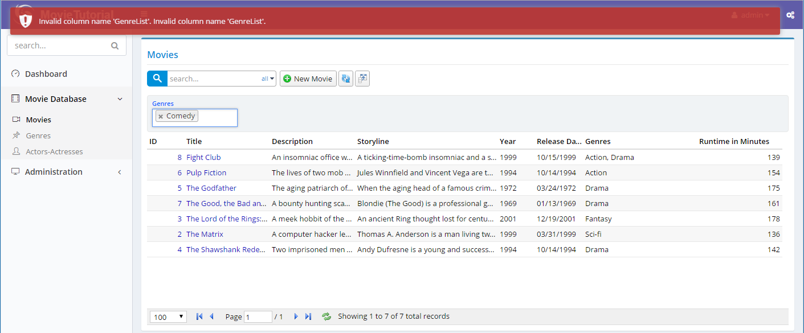

# Filtering with Multiple Genre List

Remember that when we had just one Genre per Movie, it was easy to quick filter, by adding a [QuickFilter] attribute to GenreId field.

Let's try to do similar in MovieColumns.cs:

```cs
[ColumnsScript("MovieDB.Movie")]
[BasedOnRow(typeof(Entities.MovieRow))]
public class MovieColumns
{
    //...
    [Width(200), GenreListFormatter, QuickFilter]
    public List<int>  GenreList { get; set; }
}
```
As soon as you type a Genre into Genres you'll have this error:



> As of Serenity 2.6.3, LinkingSetRelation will automatically handle equality filter for its field, so you won't get this error, and it will just work. And with the Serenity 5.0.46 you also don't need to create handlers and add business into them to use equality filter.

> Anyway, it's still recommended to follow steps below as it's a good sample for defining custom list requests and handling them when required.

ListHandler tried to filter by GenreList field, but as there is no such column in database, we got this error.

Now we need to have to handle it somehow.


### Declaring MovieListRequest Type

As we are going to do something non-standard, e.g. filtering by values in a linking set table, we need to prevent ListHandler from filtering itself on GenreList property.

We could process the request *Criteria* object (which is similar to an expression tree) using a visitor and handle GenreList ourselves, but it would be a bit complex. So I'll take a simpler road for now.

Let's take a subclass of standard *ListRequest* object and add our Genres filter parameter there. Add a *MovieListRequest.cs* file next to *MovieEndpoint.cs*:

```cs
using Serenity.Services;
using System.Collections.Generic;

namespace MovieTutorial.MovieDB
{
    public class MovieListRequest : ListRequest
    {
        public List<int> Genres { get; set; }
    }
}
```

We added a *Genres* property to our list request object, which will hold the optional *Genres* we want movies to be filtered on.


### Modifying Request Handlers/Endpoint for New Request Type

For our list handler and service to use our new list request type, need to do changes in a few places.

Start with *MovieDB/Movie/RequestHandlers/MovieListHandler.cs*:

```cs
using Serenity.Services;
using MyRequest = MovieTutorial.MovieDB.MovieListRequest;
using MyResponse = Serenity.Services.ListResponse<MovieTutorial.MovieDB.MovieRow>;
using MyRow = MovieTutorial.MovieDB.MovieRow;

namespace MovieTutorial.MovieDB
{
    public interface IMovieListHandler : IListHandler<MyRow, MyRequest, MyResponse> {}

    public class MovieListHandler : ListRequestHandler<MyRow, MyRequest, MyResponse>, IMovieListHandler
    {
        public MovieListHandler(IRequestContext context)
             : base(context)
        {
        }
    }
}
```

We changed MyRequest from *Serenity.Services.ListRequest* to *MovieTutorial.MovieDB.MovieListRequest* to use our new type instead of ListRequest.

And another little change in *MovieEndpoint.cs*, which is the actual web service:

```cs
public class MovieEndpoint : ServiceEndpoint
{
    //...
    public ListResponse<MyRow> List(IDbConnection connection, MovieListRequest request,
        [FromServices] IMovieListHandler handler)
    {
        return handler.List(connection, request);
    }

    public FileContentResult ListExcel(IDbConnection connection, MovieListRequest request,
    [FromServices] IMovieListHandler handler,
    [FromServices] IExcelExporter exporter)
    {
    //...
}
```

Now its time to build and transform templates, so our MovieListRequest object and related service methods will be available at client side.


### Moving Quick Filter to Genres Parameter

We still have the same error as quick filter is not aware of the parameter we just added to list request type and still uses the Criteria parameter.

Need to intercept quick filter item and move the genre list to *Genres* property of our *MovieListRequest*.

Edit *MovieGrid.ts*:

```ts
import { Decorators, EntityGrid, LookupEditor, QuickSearchField } from '@serenity-is/corelib';
import { text, first } from '@serenity-is/corelib/q';
import { MovieColumns, MovieRow, MovieService } from '../../ServerTypes/MovieDB';
import { MovieListRequest } from '../../ServerTypes/MovieDB/MovieListRequest';
import { MovieDialog } from './MovieDialog';

@Decorators.registerClass('MovieTutorial.MovieDB.MovieGrid')
export class MovieGrid extends EntityGrid<MovieRow, any> {
   // ...
    protected getQuickFilters() {
        let items = super.getQuickFilters();

        const genreListFilter = first(items, x =>
            x.field == MovieRow.Fields.GenreList);

        genreListFilter.handler = h => {
            const request = (h.request as MovieListRequest);
            const values = (h.widget as LookupEditor).values;
            request.Genres = values.map(x => parseInt(x, 10));
            h.handled = true;
        };

        return items;
    }
}
```

getQuickFilters is a method that is called to get a list of quick filter objects for this grid type. 

By default, grid enumerates properties with [QuickFilter] attributes in MovieColumns.cs and creates suitable quick filter objects for them.

We start by getting list of QuickFilter objects from super class.

```ts
let items = super.getQuickFilters();
```

Then locate the quick filter object for *GenreList* property:

```ts
const genreListFilter = first(items, x =>
    x.field == MovieRow.Fields.GenreList);
```

Actually there is only one quick filter now, but we want to play safe.

Next step is to set the *handler* method. This is where a quick filter object reads the editor value and applies it to request's *Criteria* (if multiple) or *EqualityFilter* (if single value) parameters, just before its submitted to list service.

```ts
genreListFilter.handler = h => {
```

Then we get a reference to current *ListRequest* being prepared:

```ts
const request = (h.request as MovieListRequest);
```

And read the current value in lookup editor:

```ts
const values = (h.widget as LookupEditor).values;
```

Set it in *request.Genres* property:

```ts
request.Genres = values.map(x => parseInt(x, 10));
```

As values is a list of string, we needed to convert them to integer.

Last step is to set *handled* to true, to disable default behavior of quick filter object, so it won't set *Criteria* or *EqualityFilter* itself:

```ts
h.handled = true;
```

Now we'll no longer have *Invalid Column Name GenreList* error but Genres filter is not applied server side yet.


### Handling Genre Filtering In Movie List Handler

Modify *MovieDB/Movie/RequestHandlers/MovieListHandler.cs* like below:

```cs
using Serenity;
using Serenity.Data;
using Serenity.Services;
using MyRequest = MovieTutorial.MovieDB.MovieListRequest;
using MyResponse = Serenity.Services.ListResponse<MovieTutorial.MovieDB.MovieRow>;
using MyRow = MovieTutorial.MovieDB.MovieRow;

namespace MovieTutorial.MovieDB
{
    public interface IMovieListHandler : IListHandler<MyRow, MyRequest, MyResponse> {}

    public class MovieListHandler : ListRequestHandler<MyRow, MyRequest, MyResponse>, IMovieListHandler
    {
        private static MyRow.RowFields fld => MyRow.Fields;

        public MovieListHandler(IRequestContext context)
             : base(context)
        {
        }

        protected override void ApplyFilters(SqlQuery query)
        {
            base.ApplyFilters(query);

            if (!Request.Genres.IsEmptyOrNull())
            {
                var mg = MovieGenresRow.Fields.As("mg");

                query.Where(Criteria.Exists(
                    query.SubQuery()
                        .From(mg)
                        .Select("1")
                        .Where(
                            mg.MovieId == fld.MovieId &&
                            mg.GenreId.In(Request.Genres))
                        .ToString()));
            }
        }
    }
}
```

*ApplyFilters* is a method that is called to apply filters specified in list request's *Criteria* and *EqualityFilter* parameters. This is a good place to apply our custom filter.

We first check if *Request.Genres* is null or an empty list. If so no filtering needs to be done.

Next, we get a reference to *MovieGenresRow*'s fields with alias *mg*.

```
var mg = MovieGenresRow.Fields.As("mg");
```

Here it needs some explanation, as we didn't cover Serenity entity system yet.

Let's start by not aliasing *MovieGenresRow.Fields*:

```cs
var x = MovieGenresRow.Fields;
new SqlQuery()
  .From(x)
  .Select(x.MovieId)
  .Select(x.GenreId);
```

If we wrote a query like above, its SQL output would be something like this:

```sql
SELECT t0.MovieId, t0.GenreId FROM MovieGenres t0
```

Unless told otherwise, Serenity always assigns *t0* to a row's primary table. Even if we named *MovieGenresRow.Fields* as variable *x*, it's alias will still be *t0*.

> Because when compiled, *x* won't be there and Serenity has no way to know its variable name. Serenity entity system doesn't use an expression tree like in LINQ to SQL or Entity Framework. It makes use of very simple string / query builders.

If we want to use *x* as an alias, we'd have to write it explicitly:

```cs
var x = MovieGenresRow.Fields.As("x");
new SqlQuery()
  .From(x)
  .Select(x.MovieId)
  .Select(x.GenreId);
```

...results at:

```sql
SELECT x.MovieId, x.GenreId FROM MovieGenres x
```

In *MovieListHandler*, which is for *MovieRow* entities, *t0* is already used for *MovieRow* fields. So, to prevent clashes with *MovieGenresRow* fields (which is named *fld*), i had to assign *MovieGenresRow* an alias, *mg*.

```cs
var mg = MovieGenresRow.Fields.As("mg");
```

What I'm trying to achieve, is a query like this (just the way we'd do this in bare SQL):

```sql
SELECT t0.MovieId, t0.Title, ... FROM Movies t0
WHERE EXISTS (
   SELECT 1 
   FROM MovieGenres mg 
   WHERE 
     mg.MovieId = t0.MovieId AND
     mg.GenreId IN (1, 3, 5, 7)
)
```

So I'm adding a WHERE filter to main query with Where method, using an EXISTS criteria:

```cs
query.Where(Criteria.Exists(
```

Then starting to write the subquery:

```cs
query.SubQuery()
    .From(mg)
    .Select("1")
```

And adding the where statement for subquery:

```cs
.Where(
    mg.MovieId == fld.MovieId &&
    mg.GenreId.In(Request.Genres))
```

> Here fld actually contains the alias t0 for MovieRow fields.

As *Criteria.Exists* method expects a simple string, i had to use .ToString() at the end, to convert subquery to a string:

> Yes, we should add one overload that accepts a subquery... noted.

```cs
.ToString()));
```

> It might look a bit alien at start, but by time you'll understand that Serenity query system matches SQL almost 99%. It can't be the exact SQL as we have to work in a different language, C#.

Now our filtering for *GenreList* property works perfectly...