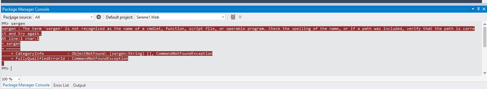
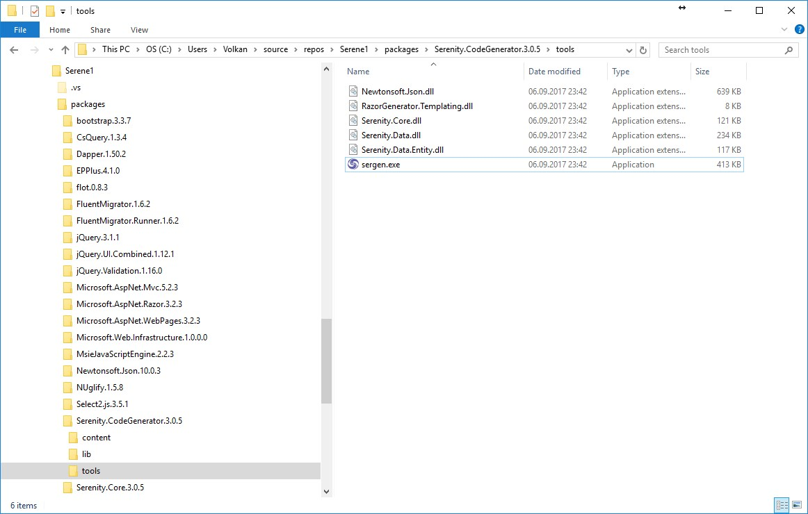
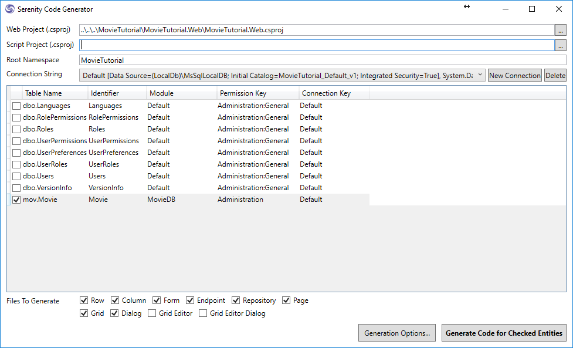

# Generating Code For Movie Table

## Serenity Code Generator (ASP.NET MVC)

> These steps applies only to ASP.NET MVC version, not ASP.NET Core version. Keep reading to see how to run Sergen in ASP.NET Core version.

After making sure that our table exists in the database, we will use Serenity Code Generator (sergen.exe) to generate initial editing interface.

In Visual Studio, open *Package Manager Console* by clicking *View* => *Other Windows* => *Package Manager Console*.

Type *sergen* and press Enter.

#### Resolving Sergen is not Recognized Issue

Sometimes NuGet package manager can't set PATH correctly and you may get an error like below while trying to execute Sergen. 

Unfortunately, this is a bug of Visual Studio / NuGet and is not related to Serenity or Sergen itself.

Most of the times, restarting Visual Studio might resolve the issue. 

If it doesn't, you may open Sergen.exe from Windows Explorer. Right click on *MovieTutorial* solution in Solution Explorer, click *Open In File Explorer*. Sergen.exe is under *packages\Serenity.CodeGenerator.X.Y.Z\tools* directory.

### Sergen UI

### Setting Project Location

When you first run Sergen, Web Project field will be prefilled for you to:

* ..\\..\\..\\MovieTutorial\\MovieTutorial.Web\\MovieTutorial.Web.csproj

If you change this value and other options, and generate your first page, you won't have to set them again. All these options will be saved in *Serenity.CodeGenerator.config* in your solution directory.

This value is required, as Sergen will automatically include generated files to your WEB project.

> Script project field should be empty for v2.1+. This is for users of older Serene, who might still have code that was written with Saltaralle compiler, instead of TypeScript.

### Root Namespace Option

Your root namespace option is set to the Solution name you used, e.g. *MovieTutorial*. If your project name is MyProject.Web, your root namespace is MyProject by default. 

This is critical so make sure you don't set it to anything different, as by default, Serene template expects all generated code to be under this root namespace.

It is also very important to understand that Root Namespace is case sensitive and must exactly match your project name, e.g. not *movietutorial* or *movieTutorial* but *MovieTutorial*.

This option is also saved, so next time you won't have to fill it in.

### Choosing Connection String

Once you set Web project name, Sergen populates connection dropdown with connection strings from your web.config file. We might have *Default* and *Northwind* in there. Choose *Default* one.

### Selecting Table To Generate Code For

Sergen generates code for one table at a time. Once we choose connection string, table dropdown is populated with table names from that database. 

Select *Movie* table.

### Setting Module Name

In Serenity terms, a module is a logical group of pages, sharing a common purpose. 

For example, in Serene template, all pages related to *Northwind* sample belongs to *Northwind* module. 

Pages that are related to general management of site, like users, roles etc. belongs to *Administration* module. 

A module usually corresponds to a database schema, or a single database but there is nothing that prevents you from using multiple modules in a single database / schema, or the opposite, multiple databases in one module.

For this tutorial, we will use *MovieDB* (analogous to IMDB) for all pages.

Module name is used in determining namespace and url of generated pages.

For example, our new page will be under *MovieTutorial.MovieDB* namespace and will use */MovieDB* relative url.

### ConnectionKey Parameter 

Connection key is set to the connection key of selected connection string in web.config file. You usually don't have to change it, just leave default.

### Entity Identifier

This usually corresponds to the table name but sometimes table names might have underscores or other invalid characters, so you decide what to name your entity in generated code (a valid identifier name).

Our table name is *Movie* so it is also a valid and fine C# identifier, so let's leave *Movie* as the entity identifier. Our entity class will be named *MovieRow*.

This name is also used in other class names. For example our page controller will be named *MovieController*.

It also determines the page url, in this sample our editing page will be at URL */MovieDB/Movie*.

### Permission Key 

In Serenity, access control to resources (pages, services etc.) are controlled by permission keys which are simple strings. Users or roles are granted these permissions.

Our Movie page will be only used by administrative users (or maybe later content moderators) so let's leave it as *Administration* for now. By default, in Serene template, only the *admin* user has this permission.

### Generating Code for First Page

After setting parameters as shown in the image above (you only have to set Module Name, others were prefilled), click *Generate Code for Entity* button. 

Sergen will generate several files and include them in MovieTutorial.Web and MovieTutorial.Script projects.

Now you can close Sergen, and return to Visual Studio.

## After Generating Code

As project is modified, Visual Studio will ask if you want to reload changes, click Reload All.

*REBUILD the Solution* and then press *F5* to launch application.

Use *admin* as username, and *serenity* as password to login.

When you are greeted with Dashboard page, you will notice that there is a new section, *MovieDB* on the bottom of left navigation. 

Click to expand it and click Movie to open our first generated page.

Now try adding a new movie, than try updating and deleting it.

Sergen generated code for our table, and it just works without writing a single line of code.

> This doesn't mean i don't like writing code. In contrast, i love it. Actually i'm not a fan of most designers and code generators. The code they produce is usually unmanagable mess. 

> Sergen just helped us here for initial setup which is required for layered architecture and platform standards. We would have to create about 10 files for entity, repository, page, endpoint, grid, form etc. Also we needed to do some setup in a few other places.

> Even if we did copy paste and replace code from some other page, it would be error prone and take about 5-10 mins.

> The code files Sergen generates has minimum code with the absolute basics. This is thanks to the base classes in Serenity that handles the most logic. Once we generate code for some table, we'll probably never use Sergen again (for this table), and modify this generated code to our needs. We'll see how.